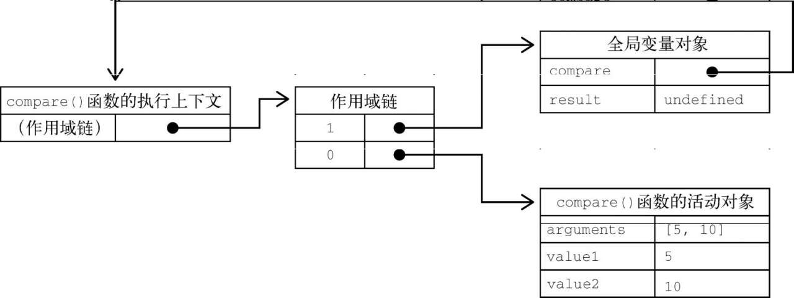
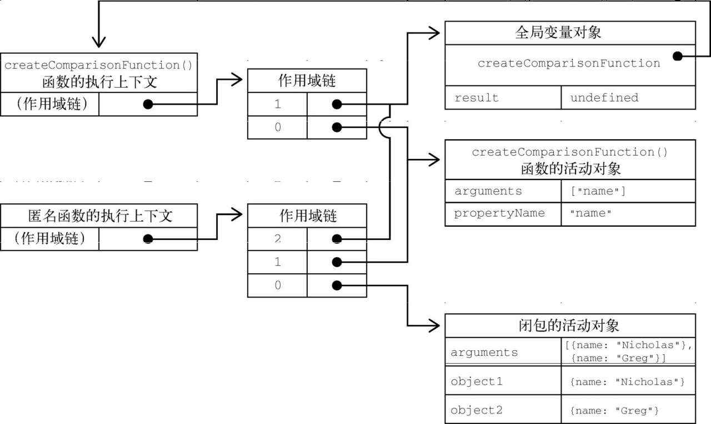

- [函数名](#函数名)
- [理解参数](#理解参数)
	- [arguments](#arguments)
	- [箭头函数中的参数。](#箭头函数中的参数)
- [没有重载](#没有重载)
- [默认参数值](#默认参数值)
	- [默认参数作用域域暂时性锁区](#默认参数作用域域暂时性锁区)
- [函数扩展与收集](#函数扩展与收集)
	- [扩展参数](#扩展参数)
	- [收集参数](#收集参数)
- [函数声明与函数表达式](#函数声明与函数表达式)
- [函数作为值](#函数作为值)
- [函数内部](#函数内部)
	- [arguments](#arguments-1)
	- [this](#this)
	- [caller](#caller)
	- [new.target](#newtarget)
- [函数属性与方法](#函数属性与方法)
- [函数表达式](#函数表达式)
- [递归](#递归)
- [尾调用优化](#尾调用优化)
	- [尾调用优化的条件](#尾调用优化的条件)
	- [尾调用优化的代码(一些助于理解的例子)](#尾调用优化的代码一些助于理解的例子)
- [闭包](#闭包)
	- [this对象](#this对象)
	- [内存泄露](#内存泄露)
- [立即调用的函数表达式(IIFE:immediately Invoked Function Expression)](#立即调用的函数表达式iifeimmediately-invoked-function-expression)
- [私有变量](#私有变量)
	- [特权方法](#特权方法)
	- [静态私有变量](#静态私有变量)
	- [模块模式](#模块模式)
	- [代码增强模式](#代码增强模式)
# 函数名
函数名就是指向函数的指针。

ES6 所有函数对象都会暴露一个name属性。通常保存一个函数标识符。若函数没有名称则会显示空字符串，若是使用Function函数构造的则会标识为“anonymou”
``` js
function foo() { }
let bar = function () { }
let baz = () => { }
console.log(foo.name); // foo
console.log(bar.name); // bar
console.log(baz.name); // baz
console.log((() => { }).name); // (空字符串)
console.log(new Function().name); // anonymou
```
若函数是获取函数，设置函数，或者使用bind()实例化，那么标识符前会加上一个前缀。
``` js
function foo() { }
console.log(foo.bind(null).name); // bound foo
let dog = {
	years: 1,
	get age() {
		return this.years
	},
	set age(newValue) {
		this.years = newValue
	}
}
let propertyDescriptor = Object.getOwnPropertyDescriptor(dog, 'age')
console.log(propertyDescriptor);
console.log(propertyDescriptor.get.name); // get age 
console.log(propertyDescriptor.set.name); // set age
```
# 理解参数
ES函数的参数与大多数语言不相同。传入参数个数，或者这些参数的数据类型均不关心，解释器也不会报错。

ES函数的参数在内部表现为一个数组。函数被调用时总会接受一个数组，但并不关心数组中包含什么。在使用function关键字定义函数(非箭头函数)时，可以在函数内部访问arguments对象，从中取得传进来的参数值。

## arguments
arguments是一个类数组对象（不是Array的实例）,使用中括号访问其中元素。使用length属性获取参数个数。
``` js
// 下面二个函数的调用时是相同的。ES6中的命名参数不会创建让之后的调用必须匹配的函数签名，因为根本不存在验证命名参数的机制。
function sayHi(name, message) {
	console.log("hello" + name + ',' + message);
}
function sayHi() {
	console.log("hello" + arguments[0] + ',' + arguments[1]);
}
```
可通过length属性检查传入的参数个数。
``` js
function howManyArgs() {
	console.log(arguments.length);
}
howManyArgs('string', 35) // 2
howManyArgs() // 0
howManyArgs(12) // 1
```
arguments对象可以和命名参数一起使用
``` js
function doAdd(num1, num2) {
	if (arguments.length === 1) {
		console.log(num1 + 10);
	} else if (arguments.length === 2) {
		console.log(arguments[0] + num2);
	}
}
doAdd(1) // 11
doAdd(1, 1) // 2
```
argumens对象的值会始终与对应的命名参数同步。 当并不意味着二者是访问同一个内存地址，它们在内存中的位置还是分开的，只不过会保持同步。
``` js
function doAdd(num1, num2) {
	arguments[1] = 10
	console.log(num1 + num2);
}
doAdd(1, 1) // 11
doAdd(1) // NaN
```
如果只传入一个参数，再修改argument[1]的值，并不会反映到第二个参数。这是因为arguments对象长度是根据传入的参数个数，而非定义函数时给出的命名参数个数确定的。对于命名参数而言，若是没有传入这个参数，则这个参数的值为undefined。
``` js
function doAdd(num1, num2) {
	arguments[1] = 10
	console.log(num2);
}
doAdd(1) // undefined
```
> 严格模式下，重写为定义的arguments对象会导致语法错误。
## 箭头函数中的参数。
若是函数使用箭头语法定义，那么传给函数的参数将不能使用arguments关键字访问，只能通过定义的命名参数访问。
``` js
// 箭头函数中的参数
function foo() {
	console.log(arguments[0]);
}
foo(5) // 5

let bar = () => {
	console.log(arguments[0]);
}
bar(5) // ReferenceError:arguments is not defined  node环境下为空对象
```
箭头函数中没有arguments对象，但可以再包装函数中将它提供给箭头函数
``` js
// 包装箭头函数
function foo() {
	let bar = () => {
		console.log(arguments[0]);
	}
	bar()
}
foo(5) // 5
```
> ES中所有参数都按值传递。不可能按照引用传递参数。若是将对象作为参数传递，则传递的值就是这个对象的引用。
# 没有重载
ES函数不能像传统编程那样重载。因为ES函数没有签名（参数是包含零个或多个值的数组表示的）

若是在ES中定义两个同名函数，则后定义的会覆盖先定义的.但可以检查参数的类型和属性，进行模拟重载。
``` js
function addSomeNumber(num) {
	return num + 100
}
function addSomeNumber(num) {
	return num + 200
}
console.log(addSomeNumber(10)); // 210
```
# 默认参数值
在ES6以前，实现默认参数的一种常用方式，是检测某个参数是否等于undefined。

ES6以后，可显示定义默认参数。
``` js
function makeKing(name = "Niko") {
	console.log(name);
}
makeKing('Richard') // Richard
makeKing() // Niko
```
给函数传undefined相当于没有传值，因此可以利用多个独立的默认值
``` js
function age(name = "Nico", age = "18") {
	console.log(`${name} is ${age} years old`);
}
age('Richard') // Richard is 18 years old
age(undefined, 40) // Nico is 40 years ol
```
在使用默认参数时，arguments对象不反映参数的默认值，只反映传给函数的参数。
``` js
function makeking(name = "henry") {
	name = "louis";
	console.log(`king ${arguments[0]}`);
}
makeking() // king undefined
makeking('louis') // king loui
```
默认参数值并不限于原始值或对象类型，也可以使用调用函数返回的值。计算默认值的函数，只有在调用函数但未传相应参数时才会调用。
``` js
let ages = [11, 12, 13, 14, 15, 16, 17]
let ageIndex = 0
function genAge() {
	return ages[ageIndex++]
}
function getAge(name = "Nico", age = genAge()) {
	return `${name} is ${age} years old`
}
console.log(getAge()); // Nico is 11 years old
console.log(getAge('Richard', 40)); // Richard is 40 years old
console.log(getAge()); // Nico is 12 years old
console.log(getAge()); // Nico is 13 years old
```
## 默认参数作用域域暂时性锁区
给多个参数定义默认值实际上跟使用let关键字顺序声明变量一样。
``` js
// 多个参数默认值作用域
function makeKing(name = "Henry", numberals = "Ⅶ") {
	return `king ${name} ${numberals}`
}
// 上面默认参数的构造过程可以看成下式
function makeKing() {
	let name = 'Henry'
	let numberals = 'Ⅶ'
	return `king ${name} ${numberals}`
}
```
因为是按照顺序初始化的，因此后面定义的参数可以引用前面的参数。
``` js
function makeKing(name = "Henry", numberal = name) {
	return `king ${name} ${numberal}`
}
console.log(makeKing()); // king Henry Henry
```
参数初始化顺序遵循“暂时性死区”规则（类似let声明变量）,因此前面定义的参数无法应用后面定义的参数。
``` js
function makeKing(name = numberal, numberal = "Ⅶ") {
	return `king ${name} ${numberal}`
}
console.log(makeKing()); // ReferenceError
```
参数存在自己的作用域中，因此不能引用函数体的作用域
``` js
function makeKing(name = "Henry", numerals = defaultNumerals) {
	let defaultNumerals = "Ⅶ"
	return `king ${name} ${numerals}`
}
console.log(makeKing()); // ReferenceError
```
# 函数扩展与收集
ES6新增扩展操作符，即可用于定义函数参数， 也可以用于调用函数时传参(因为弱类型和参数长度可变的特点)。
## 扩展参数
``` js
let values = [1, 2, 3]
function getSum() {
	let sum = 0
	for (let i = 0; i < arguments.length; ++i) {
		sum += arguments[i]
	}
	return sum
}
// 若是不是扩展操作符，需要使用apply()方法
console.log(getSum.apply(null, values)) // 6
// 使用扩展操作符
console.log(getsum(...values)); // 6

// 因为数组长度已知，所以使用扩展操作符传参的时候，并不妨碍在其前后传其他参数。包括使用扩展操作符传其他参数。
console.log(getSum(-1, ...values)); // 5
console.log(getSum(...values, -1)); // 5
console.log(getSum(...values, ...[-1, -2, -3])); // 0
```
对函数中的arguments对象而言，并不知晓扩展操作符的存在，其还是获取传入参数的每一个值的
``` js
let values = [1, 2, 3]
function countArg() {
	console.log(arguments.length);
}
countArg(...values) // 3
countArg(...values, -1) // 4
countArg(...values, ...[2, 3, 4]) // 6
```
当然扩展操作符，不仅可以通过arguments消费,也可以用于命名参数和默认参数。
``` js
let getSum = (a, b, c = 1) => {
	return a + b + c
}
console.log(getSum(...[1, 2])); // 4
console.log(getSum(...[1, 2, 3])); // 6
```
## 收集参数
在构思函数定义时，可以使用扩展操作符将不同长度的独立参数组合为一个数组
``` js
// 收集参数
function getSum(...values) {
	return values.reduce((pre, cur) => pre + cur, 0)
}
console.log(getSum(1, 2, 3)); // 6
```
收集参数的前面如果还有命名参数，则只会收集其余参数。若没有则会得到空数组。因为收集参数的结果可变，所以只能作为最后一个参数
``` js
// function getProdcut(...values, lastValue) { } // SyntaxError
function getProduct(firstValue, ...values) {
	console.log(values);
}
getProduct() // []
getProduct(1) // []
getProduct(1, 2) // [ 2 ]
getProduct(1, 2, 3) // [ 2, 3 ]
```
箭头函数虽不支持arguments,但支持收集参数的定义方式,因此可以实现与arguments一样的逻辑。
``` js
let getSum = (...values) => {
	return values.reduce((x, y) => x + y, 0)
}
console.log(getSum(1, 2, 3)); //  6
```
另外，使用收集参数并不影响arguments对象，它仍然反映调用时传给函数的参数。
``` js
function getSum(fistValue, ...values) {
	console.log(arguments.length); // 3
	console.log(arguments);  // [Arguments] { '0': 1, '1': 2, '2': 3 }
	console.log(values); // [ 2, 3 ]
}
getSum(1, 2, 3)
```
# 函数声明与函数表达式
JavaScript引擎再加载数据时对二者是区别对待的。JavaScript引擎再任何代码执行之前，会先读取函数声明，并在执行上下问中生成函数定义。而函数表达式则必须等到代码执行到它那一行，才会在执行上下文中生成函数定义

函数声明,其会在任何代码执行之前先被读取并添加到执行上下文(函数声明提升)。在执行代码前，JavaScript会先执行一遍扫描，将发现的函数声明提升到源代码树的顶部。
``` js
console.log(sum(10, 10)); // 20
function sum(num1, num2) {
	return num1 + num2
}
```
若是将函数声明改为等价的函数表达式，那么执行时就会出错。因为函数定义包含在一个变量初始化语句中，而不是函数声明中，也就是说并没有运行到函数声明那行。
``` js
console.log(sum(10, 10)); // ReferenceError
let sum = function (num1, num2) {
	return num1 + num2
}
// var 声明同样会遇到问题
console.log(sum(10, 10)); // ReferenceError
var sum = function (num1, num2) {
	return num1 + num2
}
```
> 除了是否提升的区别外，这两种语法时等价的。 另外，在使用函数表达式初始化变量时，也可以给函数一个名称。
# 函数作为值
函数名在ES中就是变量，所以函数可以用在任何可以使用变量的地方。这以为着函数不仅可以作为参数传值，也可以在一个函数中返回另一个函数。

参数传递
``` js
function callSOmeFunction(someFunction, someArgument) {
	return someFunction(someArgument)
}

function add10(num) {
	return num + 10
}
let result = callSOmeFunction(add10, 10)
console.log(result1); // 20
```
函数也可直接返回，并且十分有用。比如创建一个sort()的比较函数。
``` js
function createComparisonFunction(propertyName) {
	return function (object1, objcect2) {
		let value1 = object1[propertyName]
		let value2 = objcect2[propertyName]
		if (value1 < value2) {
			return -1
		} else if (value1 > 1) {
			return 1
		} else {
			return 0
		}
	}
}
let data = [
	{ name: 'Nico', age: 40 },
	{ name: 'Richard', age: 18 }
]
data.sort(createComparisonFunction('Nico'))
console.log(data[0].name); // Nico
data.sort(createComparisonFunction('age'))
console.log(data[0].name); // Richard
```
# 函数内部
在ES5中，函数内部存在两个特殊对象：arguments和this。ES6新增了new.target属性
## arguments
arguments时一个类数组对象。包含调用时传入的所有参数。这个对象只有以function关键字创建时才会有。虽然主要用于包含函数参数，当arguments对象还有一个callee属性 ，是一个指向arguments对象所在函数的指针。
``` js
// 阶乘函数
function factorial(num) {
	if (num <= 1) {
		return 1
	} else {
		return num * factorial(num - 1)
	}
}
console.log(factorial(3));
let factorial1 = factorial
factorial = 1
console.log(factorial1(3)); // TypeError factorial is not a function
```
上面例子定义没什么问题，但是这个函数若要正确执行就必须保证函数名时factorial，从而导致紧密耦合。使用callee属性，就看可以像函数逻辑与函数名解耦。
``` js
function factorial(num) {
	if (num <= 1) {
		return 1
	} else {
		return num * arguments.callee(num - 1)
	}
}
console.log(factorial(3)); // 6
let factorial1 = factorial
factorial = 1
console.log(factorial1(3)); // 6
```
## this
this对象在标准函数和箭头函数中有不同的行为。

在标准函数中，this引用的时将函数作为方法调用的上下文对象。
``` js
global.color = 'red'
let o = {
	color: 'blue'
}
function sayColor() {
	console.log(this.color);
}
sayColor() // red
o.sayColor = sayColor
o.sayColor() // blue
// 定义在全局上下文中的函数sayColor()引用了this对象。这个this到底应用哪个对象必须到函数被调用才能被确定。
```
在箭头函数中，this引用的是箭头函数的上下文。
``` js
window.color = 'red'
let o = {
	color: 'blue'
}
let sayColor = () => console.log(this.color);
sayColor() // red
o.sayColor = sayColor
o.sayColor() // red
```
若是在事件回调或定时回调中调用某个函数，this指向并非想要的对象。此时很适合使用箭头函数
``` js
function King() {
	this.royaltyName = "Henry"
	setTimeout(() => {
		console.log(this.royaltyName);
	}, 100);
}
function Queen() {
	this.royaltyName = "Nico"
	setTimeout(function () { console.log(this.royaltyName); }, 100);
}
new King() // Henry
new Queen() // undefined
```
> 函数名只是保存指针的变量，因此sayColor和o.sayColor是同一个函数，只是执行上下文不同
## caller
这个属性调用当前函数的函数，若在全局作用域中调用的则为null
``` js
function outer() {
	inner()
}
function inner() {
	console.log(arguments.callee.caller);  
}
outer() // [Function: outer]
```
> 严格模式下访问arguments.callee会报错. ES5也定义了caller,但在严格模式下访问它会报错,非严格模式下始终是undefined.

> 严格模式下,不能给函数的caller属性赋值,否则会导致错误.
## new.target
ES中的函数始终可以作为构造函数实例化一个新对象,也可以作为普通函数被调用.ES6新增检测函数是否使用new关键字调用的new.target属性.如果函数是正常调用的,则new.target的值是undefined;若使用new关键案子调用,则new.target将引用被调用的构造函数.
``` js
// new.target
function King() {
	if (!new.target) {
		throw `king must be instantiated using 'new'`
	}
	console.log(new.target); // [Function:King]
	console.log(`king instantiated using 'new'`);
}
new King() // king instantiated using 'new'
King() // king must be instantiated using 'new'
```
# 函数属性与方法
ES中函数是对象,每个函数都有两个属性:length和prototype.length属性保存函数定义的命名参数的个数.
``` js
function sayName(name) {
	console.log(name);
}
function sum(num1, num2) {
	return num1 + num2
}
function sumMul(...values) {
	return values
}
console.log(sayName.length); // 1
console.log(sum.length); // 2
console.log(sumMul.length); // 0 <--为什么是0呢?
```
[prototype](./10-对象.md)中有详细说明. prototype是保存引用类型所有实例方法的地方.在ES5中,prototype是不可枚举的.

apply()和call().着两个方法会以指定的this值来调用函数.

apply()接受两个参数:函数内this的值和一个参数数组.第二个参数可以是Array的实例,也可以是arguments对象(类数组对象).
``` js
function sum(num1, num2) {
	return num1 + num2
}
function callSum1(num1, num2) {
	return sum.apply(this, arguments)
}
function callSum2(num1, num2) {
	return sum.apply(this, [num1, num2])
}
console.log(callSum1(10, 10)); // 20
console.log(callSum2(10, 10)); // 20
```
> 严格模式下,调用函数时如果没有指定上下文对象,则this值不会指向window.除非使用aooly()或call()把函数指定给一个对象,否则this的值会变成undefined

call()方法与apply()的作用一样,只是传惨的形式不同.第一个参数与apply()一样. 剩下的参数则是要逐个传递.
``` js
function sum(num1, num2) {
	return num1 + num2
}
function callSum(num1, num2) {
	return sum.call(this, num1, num2)
}
console.log(callSum(10, 10)); // 20
```
apply()和call()厉害地方在于控制函数调用上下文即函数体内this值的能力.
``` js
window.color = 'red'
let o = {
	color: 'blue'
}
function sayColor() {
	console.log(this.color);
}
sayColor() // red
sayColor.call(this) // red
sayColor.call(window) // red
sayColor.call(o) // blue
```
bind(),该方法会创建一个新的函数实例,其this值会被绑定到传给bind()的对象.该方法对箭头函数无效哦.
``` js
window.color = 'red'
var o = {
	color: 'blue'
}
const sayColor = function () {
	console.log(this.color);
}
let objectSayColor = sayColor.bind(o)
objectSayColor() // blue
```
对函数而言继承的方法toLocaleString()和toString()始终返回函数的代码(具体格式因浏览器格式而异).valueOf()则返回函数本身
``` js
console.log(sayColor.toString());
console.log(sayColor.toLocaleString());
console.log(sayColor.valueOf());
```
# 函数表达式
函数表达式看起来就是一个普通的变量定义与赋值.即创建一个函数再将它赋值给一个变量functoinName.若是创建过程中没有添加函数标识符则创建的是匿名函数,有时也被称作lambda函数.

函数声明与函数表达式之间的区别,关键是理解提升.
``` js
// 一个危险的写法,因为不同浏览器处理以下代码的方式不一致. <--IE和Edge是一致的
condition = true
if (condition) {
	function sayHi() {
		console.log('Hi!');
	}
} else {
	function sayHi() {
		console.log('Hello!');
	}
}
sayHi()
```
若是将上面的函数声明换成函数表达式就没有问题了
# 递归
如之前的阶乘中使用的递归相同
``` js
function factorial(num) {
	if (num <= 1) {
		return 1
	} else {
		return num * arguments.callee(num - 1)
	}
}
console.log(factorial(3)); // 6
```
由于严格模式下无法访问arguments.callee.因此可以使用命名函数表达式达到目的
``` js
let factorial = function f(num) {
	if (num <= 1) {
		return 1
	} else {
		return num * f(num - 1)
	}
}
let anotherFactorital = factorial
factorial = null
console.log(anotherFactorital(3)); // 6
```
# 尾调用优化
ES6规范新增了一项内存管理优化机制,让JavaScript引擎在满足条件时可以重用栈帧.具体来说,着像优化非常适合"尾调用",即外部函数的返回值时一个内部函数的返回值. 例如:
``` js
function outerFunction() {
	return innerFunction() // 尾调用
}
```
在ES6优化之前,执行这个例子会在内存中发生如下操作.
1. 执行到outerFunction,入栈.
2. 执行至return,必须先计算innerFunction
3. 执行到innerFunction,第二个入栈
4. 执行innner至return,计算返回值
5. 返回值传回outerFunction,出栈
6. outerFunction返回值,出栈
在ES6优化后
1. 执行outerFunctoin,入栈
2. 执行至return。为求值，需要先求innerFunction
3. 引擎发现第一个堆栈弹出也没问题，因为两个函数的返回值相同
4. 弹出outerFunction的堆帧
5. 执行到innerFunction函数体,栈帧入栈。
6. 执行innerFunction，计算其返回值
> 显然第二种会更节省堆栈空间。目前还没有能查看是否进行优化的方法
## 尾调用优化的条件
其条件是确实外部栈帧无存在的必要了。涉及条件如下
+ 代码在严格模式下运行
+ 外部函数的返回值是对尾调用函数的调用
+ 尾调用函数返回后不需要执行额外的逻辑
+ 尾调用不是引用外部函数作用域中自由变量的闭包

不符合尾调用优化的例子
``` js
"use strict"
// 尾调用没有返回
function outerFunction() {
	innerFunction()
}
// 尾调用没有直接返回
function outerFuncion() {
	let innerFunctionResult = innerFunction()
	return innerFunctionResult
}
// 尾调用返回后必须转型为字符串,多了一步额外逻辑
function outerFunction() {
	return innerFunction().toString()
}
// 尾调用是一个闭包
function outerFunction() {
	let foo = 'bar'
	function innerFunction() { return foo }
	return innerFunction()
}
```
符合尾调用优化的例子
``` js
"use strict"
// 栈帧销毁前执行参数计算
function outerFunction(a, b) {
	return innerFunction(a + b)
}
// 初始返回值不涉及栈帧
function outerFunction(a, b) {
	if (a < b) {
		return a;
	}
	return innerFunction(a + b)
}
// 两个内部函数都在尾部
function outerFunction() {
	return condition ? innerFunctionA() : innerFunctionB()
}
```
这个优化对于递归尾调用的效果十分明显
> 之所以要求严格模式，因为非严格模式下函数调用中允许使用f.arguments和f.caller,而它们都会引用外部函数的栈帧。显然这样就无法优化了，因此尾调用必须在严格模式下生效，以防止引用这些属性。
## 尾调用优化的代码(一些助于理解的例子)
显然不符合尾调用调条件。因为返回语句中有相加操作
``` js
function fib(n) {
	if (n < 2) {
		return n;
	}
	return fib(n - 1) + fib(n - 2)
}
```
一种优化的方法,满足尾调用的所有条件
``` js
"use strict"
function fib(n) {
	return fibImpl(0, 1, n)
}
function fibImpl(a, b, n) {
	if (n === 0) {
		return a
	}
	return fibImpl(b, a + b, n - 1)
}
```
# 闭包
闭包指的是那些引用了另一个函数作用域中变量的函数。通常是在函数嵌套中实现的。

调用函数时的过程：调用一个函数时，会为这个函数创建一个执行上下文(包含这个函数所需信息的一个对象)，并创建一个作用域链(在执行上下文中)。然后用arguments和其他命名参数来初始化这个函数的活动对象(在作用域链最前端)。

举个例子
``` js
function compare(value1,value2) {
	if(value1 < value2) {
		return -1
	}else if(value1 > value2) {
		return 1
	}else {
		return 0
	}
}
```
在定义compare函数时，会为其创建作用域链，预装载全局变量对象，保存在内部的[[scope]]中。在调用这个函数时，会创建相应执行上下文，然后通过复制函数内部的[[scope]]来创建其作用域。接着会创建函数的活动对象并将其推入作用域前端(在这个例子中，就是全局作用域前面)。作用域链其实是一个包含指针的列表。 

本例中创建结束后的结构如下图所示。

函数内部的代码在访问变量时，会使用给定的名称从作用域链中查找变量。函数执行完毕后，局部活动对象会被销毁，内存中就指剩下全局作用域了。 不过闭包就不同了。

在一个函数内部定义的函数会将其包含函数的活动对象加到自己的作用域中。如下例：
``` js
function createComparisonFunction(propertyName) {
	return function (object1, objcect2) {
		let value1 = object1[propertyName]
		let value2 = objcect2[propertyName]
		if (value1 < value2) {
			return -1
		} else if (value1 > 1) {
			return 1
		} else {
			return 0
		}
	}
}
```
在createComparisonFunction()执行完毕后，内部返回匿名函数会将其包含函数的活动对象添加到自己的作用域中，因此createComparisonFunction，执行完毕后不会被销毁。下图为代码执行后结果。

createComparisonFunction()活动对象不会被销毁，只有其匿名函数被销毁时，才会被销毁
``` js
let compareNames = createCompareFunction('name')
let result = compareNames({name:'Nico',name:'Matt'})
compareNames = null // 此时才接触对函数的引用，原先的create...函数才会销毁
```
> 因为闭包会保留它们包含函数的作用域，因此比其他函数更占用内存。因此过度使用闭包，会导致内存过度占用，因此建议在十分必要时使用
## this对象
在闭包中使用this会使代码变得很复杂。若不是箭头函数，则会this会在运行时绑定到执行函数的上下文。全局中this等于window（严格模式为undefined）。若是作为某个对象的方法调用，this指向这个对象。**匿名函数在这种情况下，不会绑定到某个对象，也就是说会绑定到全局对象windown(严格undefined)**。下例，可看出代码复杂性：
``` js
window.identity = 'The window'
let o = {
	identity: 'My Object',
	getIdentyFunc() {
		return function () {
			return this.identity
		}
	}
}
console.log(o.getIdentyFunc()()); // The window
```
每个函数被调用时会自动创建两个特殊变量：this和arguments。内部函数永远无法直接访问外部函数的这两个变量，此时若想使用o内部的this。可以将复制一个this的指针。想要获取arguments也是类似的。
``` js
window.identity = 'The window'
let o = {
	identity: 'My Object',
	getIdentyFunc() {
		const that = this
		return function () {
			return that.identity
		}
	}
}
console.log(o.getIdentyFunc()()); // My Object
```
this在闭包中的变化. 第二行看起来是对一个函数的引用，但根据规范与第一种写法是相同的。但是第三次进行了赋值，然后再进行了调用，因为赋值表达式时函数本身的内容，所以this值不再与任何对象绑定。
``` js
global.identity = 'The window'
let o = {
	identity: 'My Object',
	getIdentyFunc() {
		console.log(this.identity);
	}
}
o.getIdentyFunc(); // My Object
(o.getIdentyFunc)(); // My Object
(o.getIdentyFunc = o.getIdentyFunc)() // The window
```
## 内存泄露
在IE9之前JScirpt和COM对象使用了不同的垃圾回收机制。若在这些版本的IE中将HTML保存在闭包中，则这些元素是不会被销毁的。 如下，创建了一个循环引用。 匿名函数引用assignHander()的活动对象，阻止了element的引用计数的清零。
``` js
function assignHandler() {
	let element = document.querySelector('div')
	element.onclick = () => console.log(element.id);
}
```
修改代码来避免上诉情况,将闭包内的element.id改为id消除循环引用。又因为闭包包含着函数的活动对象（其中存在element）所以还要将element置为null
``` js
function assignHandler() {
	let element = document.querySelector('div')
	let id = element.id
	element.onclick = () => console.log(id);
	element = null
}
```
# 立即调用的函数表达式(IIFE:immediately Invoked Function Expression)
IIFE可以模拟块级作用域，即在一个函数表达式内部声明变量，然后立即调用这个函数。
``` js
(function () {
	for (var i = 0; i < 10; i++) {
		console.log(i);
	}
})()
console.log(i); // ReferenceError
```
说明IIFE用途的一个实际例子，就是可以用它锁定参数值。比如点击后进行进行打印其index。 
``` js
let divs = document.querySelectorAll('div')
// 无法达到目的
for (var i = 0; i < divs.length; i++) {
	divs[i].addEventListener('click', function () {
		console.log(i); // 打印出来都是2
	})
}

// 使用IIFE
for (var i = 0; i < divs.length; i++) {
	divs[i].addEventListener('click', (function (frozenCounter) {
		return function () {
			console.log(frozenCounter);
		}
	})(i))
}
```
在ES6后，因为let存在块级作用域，因此可以很简单的实现这个效果，就不用借用闭包来实现了。
# 私有变量
严格来说，JavaScript没有私有成员的概念，所有对象属性都是公有的。不过，有私有变量的概念。任何定义在函数或块中的变量，都可以认为是私有的，因为这个函数或者块的外部无法访问其中的变量。私有变量包括：函数参数，局部变量，以及函数内部定义的其他函数。
## 特权方法
能够访问函数私有变量的公有方法。在对象上有两种方式创建特权方法。第一种是在构造函数中实现：在创建实例后，就无法直接访问provateVariable和privataFunction(),唯一的办法是使用publicMethod().
``` js
function MyObject() {
	let privateVariable = 10
	function privateFunction() { // 这个是闭包耶
		return false
	}
	this.publicMethod = function () {
		privateVariable++
		return privateFunction()
	}
}
let myObject = new MyObject()
console.log(myObject.privateVariable); // undefined
console.log(myObject.publicMethod()); // false
```
在下面代码中，构造函数定义了两个特权方法。通过这两个方法可以访问其私有变量name。
``` js
// 在构造函数中定义私有变量和特权方法
function Person(name) {
	this.getName = function () {
		return name
	}
	this.setName = function (newValue) {
		name = newValue
	}
}
let person = new Person("Nico")
console.log(person.getName()); // Nico
person.setName('John')
console.log(person.getName()); // John
```
使用构造函数来实现私有变量的隔离，会导致每次调用构造函数都会重新创建一套变量和方法。无法实现复用，使用静态私有变量实现特权方法可以避免这个问题。
## 静态私有变量
特权方法也可以通过使用私有作用域定义私有变量和函数来实现，这个模式如下所示：
``` js
(function () {
	// 私有变量和私有函数
	let privateVariable = 10;
	function privateFunction() {
		return false
	}
	// 构造函数
	MyObject = function () { }  // 无关键字，全局变量,且使用函数表达式（因为函数声明并不是必须的，在此处）
	// 公有和特权方法
	MyObject.prototype.publicMethod = function () {
		privateVariable++
		return privateFunction()
	}
})()
const myObject = new MyObject()
console.log(myObject.publicMethod()); // false
```
这个模式与上个模式的主要区别在于，私有变量和私有函数是由实例共享的。因为特权方法定义在原型上，所以同样由实例共享。特权方法作为一个闭包始终引用着包含它的作用域
``` js
(function () {
	let name = ''
	Person = function (value) {
		name = value
	}
	Person.prototype.getName = function () {
		return name
	}
	Person.prototype.setName = function (newValue) {
		name = newValue
	}
})()
let person1 = new Person("Nico")
console.log(person1.getName()); // Nico
person1.setName('John')
console.log(person1.getName()); // John
ertopf'g
let person2 = new Person('Matt')
console.log(person2.getName()); // Matt
console.log(person1.getName()); // Matt
```
像这样创建私有变量可以利用原型更好的重用代码，只是每个实例没有了自己的私有变量。因此要根据需求来判断将私立变量放在实例中，还是作为静态私有变量。
> 使用闭包和私有变量会导致作用域链变长，作用域链越长，则查找变量所需的事件越多。
## 模块模式
在一个单例对象上实现了私有变量和特权方法的隔离和封装。单例对象（singleton）就是只有一个实例的对象。JavaScript是通过对象字面量来创建单例对象的
``` js
let singleton = {
	name: value,
	method() {
		// ...方法的代码
	}
}
```
模块模式是在单例对象基础上加以拓展，使其通过作用域链来关联私有变量和特权方法。模块模式(工厂模式+私有变量？)的样板代码如下：
``` js
let singleton = function(){
	// 私有变量和私有函数
	let privateVariable = 10;
	function privateFunction() {
		return false
	}
	// 特权/公有方法和属性
	return {
		publicProperty:true,
		publicMethod() {
			privateVariable++
			return privateFunction()
		}
	}
}()
```
下面的代码创建了一个application对象来管理组件。 components是静态私有变量。 return的对象字面量里包括访问私有变量的特权方法。
``` js
let application = function () {
	// 私有变量和私有函数
	let components = new Array()
	// 初始化
	components.push(new BaseComponent())
	// 公共接口
	return {
		getComponentCount() {
			return components.length
		},
		registerComponent(component) {
			if (typeof component == 'object') {
				components.push(component)
			}
		}
	}
}
```
## 代码增强模式
在对象返回之前先对其进行加强
``` js
let singleton = function () {
	let privateVariable = 20
	function privateFunction() {
		return false
	}
	let object = new CustonType()
	object.publicProperty = true
	object.publicMethod = function () {
		privateVariable++
		return privateFunction()
	}
	return object
}
```
若application对象必须是BaseComponent的实例则可以用对象增强模式，将要返回的对象进行new个构造函数
``` js
let application = function () {
	// 私有变量的私有函数
	let components = new Array()
	// 初始化
	components.push(new BaseComponent())
	// 创建局部变量保存实例
	let app = new BaseComponent()
	// 公共接口
	app.getComponents = function () {
		return components.length
	}
	app.registerComponents = function (component) {
		if (typeof component === 'object') {
			components.push(component)
		}
	}
	return app
}
```