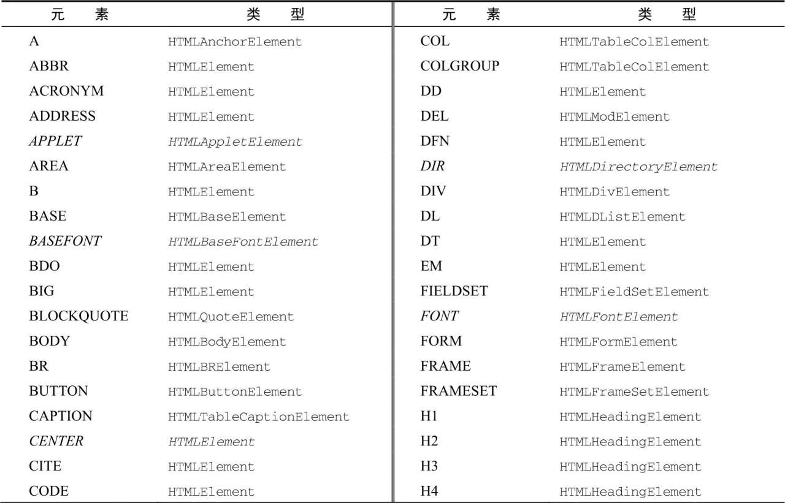
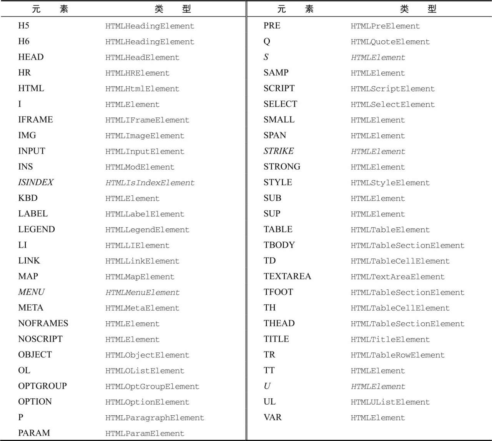

- [节点层级](#节点层级)
	- [Node类型](#node类型)
		- [nodeName和nodeValue](#nodename和nodevalue)
		- [节点关系](#节点关系)
		- [操纵节点](#操纵节点)
		- [其他方法](#其他方法)
	- [Document类型](#document类型)
		- [文档子节点](#文档子节点)
		- [文档信息](#文档信息)
		- [定位元素](#定位元素)
		- [特殊集合](#特殊集合)
		- [DOM兼容性测试](#dom兼容性测试)
		- [文档写入](#文档写入)
	- [Element类型](#element类型)
		- [HTML元素](#html元素)
		- [取得属性](#取得属性)
		- [设置属性](#设置属性)
		- [attributes属性](#attributes属性)
		- [创建元素](#创建元素)
		- [元素后代](#元素后代)
# 节点层级
任何HTML或XML都可以用DOM表示为一个节点构成的层级结构。

其中document节点表示每个文档的根节点。根节点的唯一子节点是\<html>元素，称之为文档元素(documentElement).文档元素是文档最外层的元素，所有其他元素都存在于这个元素之内。

HTML中的每段标记都可以表示为这个属性结构的一个节点。元素节点表示HTML元素，属性节点表示属性<--还有属性节点？>,文档类型节点表示文档类型，注释节点表示注释。DOM中总共有12种节点类型，这些类型都继承一种基本类型。
## Node类型
DOM Level1描述了名为Node的接口，这个接口是所有DOM节点类型都必须实现的。Node接口在Javascript中被实现为Node类型。在Javascript中，所有节点类型都继承Node类型，因此所有类型都共享相同的基本属性和方法。

每个节点都有nodeType属性，表示该节点的类型。节点类型由定义在Node类型上的12个数值常数表示
+ Node.ELEMENT_NODE（1）
+ Node.ATTRIBUTE_NODE（2）
+ Node.TEXT_NODE（3）
+ Node.CDATA_SECTION_NODE（4）
+ Node.ENTITY_REFERENCE_NODE（5）
+ Node.ENTITY_NODE（6）
+ Node.PROCESSING_INSTRUCTION_NODE（7）
+ Node.COMMENT_NODE（8）
+ Node.DOCUMENT_NODE（9）
+ Node.DOCUMENT_TYPE_NODE（10）
+ Node.DOCUMENT_FRAGMENT_NODE（11）
+ Node.NOTATION_NODE（12）

节点类型可以通过与这些常量(也可以直接用整数)比较来确定
``` js
someNode = document.body
if (someNode.nodeType == Node.ELEMENT_NODE) {
	console.log("Node is an element");
}
```
浏览器并不支持所有节点类型。开发者最常用到的是元素节点和文本节点
### nodeName和nodeValue
nodeName与nodeValue保存着有关节点的信息。这两个属性的值完全取决于节点类型。在使用这两个属性前，最好先检测节点类型。
``` js
// 先检查元素是不是元素，如果是则进行赋值。 对元素而言，nodeName始终等于元素的标签名，而nodeValue则始终为null
someNode = document.body
if (someNode.nodeType == 1) {
	value = someNode.nodeName
	console.log(value); // Body
	console.log(someNode.nodeValue); // null
}
```
### 节点关系
文档中的所有节点都与其他节点有关系。这些关系可以形容为家族关系。

每个节点都有一个childNodes属性，其中包含一个NodeList的实例。NodeList是一个类数组对象，用于存储可以按位置存取的有序节点。NodeList对象独特的地方在于，它其实是一个对DOM结构的查询，因此DOM结构的变化会自动的在NodeList中反映出来。

可以使用中括号和item()方法访问NodeList中的元素
``` js
const body = document.body
const firstChild = body.childNodes[0]
const secondChild = body.childNodes.item(1)
const count = body.childNodes.length
console.log(firstChild, secondChild, count); //#text div 4
```
因为其是一个类数组对象，所以可以通过Array.prototype.slice()将NodeList对象转换为数组。
``` js
const arrayOfNodes = Array.prototype.slice.call(bodyNode.childNodes, 0)
console.log(arrayOfNodes); // [text, div, text, script]
```
当然ES6的Array.from()静态方法，会比上面的方法更简洁。
``` js
const arrayOfNodes = Array.from(bodyNode.childNodes)
console.log(arrayOfNodes); // [text, div, text, script]
```
每个节点都有一个parentNode属性，指向其DOM树的父元素。childNodes中的所有节点都有同一个父元素。使用previousSibling和nextSibling可以在这个列表的节点间导航。 这个列表中第一个节点的previousSibling和最后一个节点的nextSibling属性也是null.
``` js
if (bodyNode.nextSibling === null) {
	console.log('last node in list'); // last node in list
}
if (bodyNode.previousSibling === null) { // #text
	console.log('fist node in list');
}
```
父节点和它的第一个最后一个节点也有专门属性：firstChild和lastChild分别指向childNodes中的第一个和最后一个子节点。如果只有一个节点，则这两者是指向同一个节点的。 若没有子节点则二者为null。 需要注意的是someNode.firstChild的值始终等于someNode.childNodes[0]<--因为是动态获取的吧。

通过前面的一些方法，几乎可以访问到文档树中的任何节点。

hasChildNodes()和ownerDocuments
``` js
// 查询是否有子节点
bodyNode.hasChildNodes() // true
// 所有节点节点都共享的关系。ownerDocument属性是一个指向代表整个文档节点的指针。
console.log(bodyNode.ownerDocument); // #document
```
### 操纵节点
因为所有关系指针都是只读的，所以DOM提供了一些操纵节点的方法。最常用的方法是appenChild(),用于在childNodes列表末尾添加节点。添加新节点相关的关系指针，包括父节点和之前的最后一个子节点。
``` js
let newNode = document.createElement('p')
newNode.innerHTML = '测试'
bodyNode.appendChild(newNode)
```
如果把文档中已经存在的节点传给
``` js
let test = document.querySelector('#test')
console.log(bodyNode.lastChild === test); // false
bodyNode.appendChild(test)
console.log(bodyNode.lastChild === test); // true
```
如果要把节点放到childNodes中的特定位置而不是末尾，则可以使用insertBefor()方法。这个方法接受两个参数：要插入的节点和参照节点。调用这个方法后，要插入的节点会变成参照节点的前一个同胞节点,并被返回。如果参照节点是null,则insertBefore()于appendChild()效果相同。
``` js
let newNode = document.createElement('div')
newNode.innerHTML = '测试'
let test = document.querySelector('#test')
bodyNode.insertBefore(newNode, test) // 插入到test节点之前了
```
appendChild()和insertBefore()在出入节点时不会删除任何已有节点。相对的，replaceChild()方法接受两个参数：要插入的节点和替换的节点。要替换的节点会被返回并从文档书中完全移除。

replaceChild()插入一个节点后，所有关系指针都会从替换的节点复制过来。虽然被替换的节点从技术上来说仍被同一个文档所拥有，但文档中已经没有它的位置。
``` js
let newNode = document.createElement('div')
newNode.innerHTML = '测试'
let test = document.querySelector('#test')
let returnNode = bodyNode.replaceChild(newNode, test)  // test被newNode替换，且返回test节点
console.log(returnNode === test); // true
```
removeChild()移除节点。该方法接受一个参数：要移除的节点

同replaceChild()相同，通过removeChild()被移除的节点从技术上说仍被一个文档所拥有，但文档中已经没有它的位置了<--这啥意思,删除和替换后此节点还存在文档中吗？
``` js
let firstChild = bodyNode.firstElementChild
const returnNode = bodyNode.removeChild(firstChild) // 删除第一个元素节点
console.log(firstChild === returnNode); // true
```
> 上面的4个方法都用于操纵某个节点的子元素，因此必须先取得父节点。并非节点类型都有子节点，若是在不支持子节点的节点上调用方法，则会抛出错误。
### 其他方法
所有节点类型还共享了两个方法。第一个cloneNode(),会返回与调用它的节点一模一样的节点。cloneNode()方法接受boolean，表示是否进行深复制。复制返回的文档所在，但未指定父节点，所以称为孤儿节点(orphan)
+ true: 进行深复制，即复制节点及其整个子DOM树
+ false：浅复制，只会复制调用该方法的节点。
``` js
const ul = document.querySelector('ul')
const deepList = ul.cloneNode(true)
console.log(deepList.childNodes.length); // 7
const shallowList = ul.cloneNode()
console.log(shallowList.childNodes.length); // 0
```
> cloneNode()方法不会复制添加到DOM节点的Javascript属性，比如时间处理程序。这个方法只复制HTML属性，以及可选地复制子节点。

normalize()。这个方法处理文档子树中的文本节点。 由于解析器实现的差异，或DOM操作等原因，可能出现并不包含文本的文本节点，或文本节点之间互为同胞关系。在节点上调用normalize()方法会检测这个节点所有后代。会删除空文本节点，合并同胞文本节点。
## Document类型
Document类型是JavaScript中表示文档节点的类型。在浏览器中，文档对象docuemnt是HTMLDocument的实例，表示整个HTML页面。document是window对象的属性，因此是一个全局对象。Document类型的节点有以下特征：
+ nodeType等于9
+ nodeName值为"#document"
+ nodeValue值为null
+ parentNode值为null
+ ownerDocument值为null
+ 子节点可以是DocumentType(最多一个)、Element(最多一个)、ProcessingInstruction或Comment类型

Document类型可以标识HTML页面或其他XML文档，但最常用的还是通过HTMLDocument的实例获取document对象。document对象可用于获取获取关于页面的信息以及操纵器外观和底层结构。
### 文档子节点
document.Element属性，始终指向HTML页面中的\<html>元素,也可以直接用childNodes获取（但是不太方便）
``` js
console.log(document.documentElement); // 指向html节点
console.log(document.childNodes[1] === document.documentElement); // true
```
document还有一个body元素，因为body是开发者常用的元素。

Document类型另一种可能节点是DocumentType。<! doctype>标签是文档中独立的部分，其信息可以通过doctype属性来访问。
``` js
console.log(document.doctype); // <!DOCTYPE html>
```
另外，\<html>元素外的注释也是文档的子节点。他们的类型是Comment.不过由于浏览器实现不同，这些注释不一定能被识别，或者表现可能不一致。

一般来说appendChild()、removeChild()和replaceChild()方法不会用在document对象上。因为文档类型是只读的，而且只能由一个Element类型的子节点(即\<html>)。
### 文档信息
document作为HTMLDocument的实例，还有一些标准Document对象上没有的属性。这些属性提供浏览器所加载页面的信息。其中第一个属性是title，包含\<title>元素中的文本，通常显示在浏览器窗口和标签页的标题栏。 通过这个属性可以读写页面的标题，修改后的标题也会反映在浏览器标题上。不过修改title属性并不会改变\<title>属性
``` js
let originalTitle = document.title
// 修改文档标题
document.title = 'title test'
```
三个属性URL，domain和referre.其中URL包含当前页面完整的URL，domian包含页面的域名，而referrer包含连接到当前页面的那个页面URL，若是无页面来源，则referrer属性包含空字符串。所有这些信息都可以在请求的HTTP头部信息中获取，只是JavaScript中通过这几个属性暴露出来。

加入是百度的首页 www.baidu.com
``` js
let url = document.URL // "https://www.baidu.com/"
let domain = document.domian  // "www.baidu.com"
let referrer = document.referrer // ""
```
在这些属性中只有domain属性是可以设置的。处于安全考虑，给domain属性设置的值是由限制的。如果URL包含子域名如'p2p.wrox.com'则可以设置为'wrox.com'。不能给这个属性设置URL中不包含的值。
``` js
document.domain = 'baidu.com' // 成功
document.domain = 'www.zhihu.com' // 报错
```
当页面中包含来自某个不同自于的窗格(\<frame>)或内嵌窗格(\<iframe>)时，设置document.domain是有用的。因为跨源通信存在安全隐患，所以不同子域的页面间不发通过Javascript通信。此时，在每个页面上把docuemnt.domain设为相同的值，这些页面就可以访问对方的Javascript对象了。

浏览器对domian属性还有一个限制，就是这个属性一旦放松就不能再收紧。可以详细域名向范围更大的域名改变，不能反过来。<--有待验证
### 定位元素
getElementById(),getElementsByTagNames()用来获取某个或某组元素的引用。

getElementById()接受一个参数，即要获取元素的ID。找到返回元素，没找到返回null。 区分大小写

如果页面中出现多个具有相同ID的元素，则会返回在文档中第一个出现的元素。
``` js
let test = document.getElementById('test')
console.log(test); // <div id="test">测试节点</div>
let test_1 = document.getElementById('Test')
console.log(test_1); // null
```
getElementByTagName()接受一个元素标签名，返回包含零个或多个元素的NodeList(也是实时的列表)。
``` js
const lis = document.getElementsByTagName('li')
console.log([...lis]);//  HTMLCollection(3) [li, li, li]
const li = lis[0].cloneNode()
lis[0].parentNode.appendChild(li)
console.log([...lis]);//  (4) [li, li, li, li] 是动态的
```
通过name可以获取某个元素。对HTMLCollection对象而言，中括号即可以接受数值索引，也可以接受字符串索引，在后台数值索引会调用item()，字符串索引会调用namedItem()
``` js
const lis = document.getElementsByTagName('li')
const li = lis.namedItem('second-li')
console.log(li); // <li name="second-li">2</li>
console.log(lis['second-li'] === li); // true
```
要取得文档中的所有元素，可以给getElementByTagNames()传入*(通配符)。
``` js
const allElements = document.getElementsByTagName('*')
console.log(allElements); // 包含页面内所有元素的THMLCollection对象,顺序为在页面中出现的顺序
```
> 对于document.getElementsByTagName()方法，规范要求区分标签大小写。实际上是不区分的（为了兼容性）。但如果是在XML页面则区分大小写。

getElementsByName() 返回具有给定name属性的所有元素。常用于单选按钮，因为同一字段的单选按钮必须具有相同的name属性。
### 特殊集合
document对象上还暴露了几个特殊集合，这些集合也都是HTMLCollection的实例。这些集合是访问文档中公共部分的快捷方式
``` js
document.anchors  // 带name的<a》元素 废弃
document.applets // 废弃 
document.forms
document.images
document.links // 带href的<a》元素
```
这些特殊集合始终存在于HTMLDocum对象上，与所有HTMLCollection对象一样，会实时更新。
### DOM兼容性测试
由于DOM有多个level和多个部分，因此确定浏览器实现了DOM的那些部分是有必要的。document.implementation属性是一个对象，其中提供了与浏览器DOM实现相关的信息和能力。DOM Level 1在document.implementation上只定义了一个方法，hasFeature().接受两个参数：特性名称和DOM版本。若浏览器支持的特性和版本，则返回ture。
``` js
let hasXmlDom = document.implementation.hasFeature('XML', '1.0') // true 废弃
```
> 该方法以废弃，返回值不可靠。因为实现不一致。虽然主流浏览器仍支持这个方法，但无论检测什么都一律返回true
### 文档写入
document对象有一个古老的能力，即向网页输出流中写入内容。write(),writeln(),open(),close().其中write()和writeln()接受字符串参数，然后将字符串写入网页中。其中writeln()会在末尾追加一个换行符
``` js
document.write('<span>' + (new Date()).toString() + '</span>')
document.writeln('<strong>' + (new Date()).toString() + '</strong>')
```
为了避免错误，不要在写入时直接使用\<script>标签
``` js
<script>
	document.write("<script>" + "</script>") // 错误 ")
</script>
```
修改为下式就不会错误了
``` js
<script>
	document.write("<script>" + "<\/script>")
</script>
```
前面都是在页面渲染期间通过document.write()写入内容,若是在页面加载后再调用，则会重写整个内容。

open()和close()方法分别用于打开和关闭网页输出流。再调用write()和writeln()时，这两个方法都不是必须的。
> 严格的XHTML文档不支持文档写入。对于内容类型为application/xml+xhtml的页面，这些方法无法使用。
## Element类型
除了Document类型，Element类型就是Web开发中最常用的类型了。Element标识XML或HTML元素，对外暴露出元素标签名、子节点和属性的能力。Element类型的节点具有以下特征：
+ nodeType等于1
+ nodeName值为元素的标签名
+ nodeValue值为null
+ parentNode值为Document或Element对象
+ 子节点可以Element、Text、Comment、ProcessingInstruction、CDATASectoin、EnityReference类型。
可以通过nodeName或tagName属性来获取元素的标签名。这两个属性返回同样的值(添加后一个属性是为了不让人误会)。
``` js
const test = document.querySelector('#test')
console.log(test.tagName); // DIV
console.log(test.tagName === test.nodeName); // true
```
例子中的元素标签名为div,ID为"test". 注意，div.tagName实际返回的是"DIV"而不是"div"。在HTML中，元素标签名始终以全大写标识。在XML中标签名始终与源代码的大小写保持一致。若是不缺脚本在HTML还是XML，最好将标签名转换为小写形式，以便于比较
``` js
const test = document.querySelector('#test')
if (test.tagName.toLowerCase() === 'div') {
	console.log('XML文档也可识别');
}
```
### HTML元素
所有HTML元素都通过HTMLElement类型标识，包括其直接实例和间接实例。另外，HTMLElement直接继承Element并增加了一些属性。每个属性都对应下列属性之一，他们是所有HTML元素上都有的标准属性：
+ id,元素在文档中的唯一标识符
+ title，包括元素的额外信息，通常以提示条形式展示
+ lang,元素内容的语言代码（很少用）
+ dir,语言的书写方向（"ltr"左至右，"rtl"右至左，很少用）,左右对齐的问题。
+ className, 相当于class属性，用于指定元素的CSS类。(因为class是ECMAScirpt的关键字，所以不能直接使用这个名字)
``` js
const div = document.getElementById('myDiv')
console.log(div.id); // myDiv
console.log(div.className); // bd
console.log(div.title); // body Text
console.log(div.lang); // en
console.log(div.dir); // ltr

div.id = 'otherId'
div.className = 'test'
div.title = 'some other title'
div.lang = 'zh_cn'
div.dir = 'rtl'

console.log(div.id); // otherId
console.log(div.className); // test
console.log(div.title); // some other title
console.log(div.lang); // zh_cn
console.log(div.dir); // rtl
```
并非所有属性的修改都会对页面产生影响。如id和lang的修改对用户是不可见的。

所有HTML元素都是HTMLElement或其子类型的实例。下表列出了所有HTML元素以及其对应的类型（斜体表示已经废弃的元素）



### 取得属性
每个元素都有零个或者多个属性，通常用于为元素或其内容附加更多信息。与属性相关的DOM方法主要有三个：getAttribute(),setAttribute(),removeAttribute().这些方法主要用操作属性。

注意传给getAttribute()的属性名与它们实际的属性名一样。因此需要传class。如果给定属性不存在，则getAttribute()返回null
``` html
	<div id="myDiv" class="bd" title="body Text" lang="en" dir="ltr" my_spical_attribute="hello!" style="text-align: center;">HTML元素属性</div>
```
``` js
const div = document.getElementById('myDiv')
console.log(div.getAttribute('id')); // myDiv
console.log(div.getAttribute('class')); // bd
console.log(div.getAttribute('dir')); // ltr
```
getAttribute()方法也能取得自定义属性的值
``` js
console.log(div.getAttribute('my_spical_attribute')); // hello!
```
注意，属性名不区分大小写，因此"ID"和"id"被认为是同一个属性。另外根据HTML5规范的要求，自定义属性名前缀data-以方便验证。

元素所有属性也可以通过相应DOM元素对象的属性来取得。这些属性即包括HTMLElement上定义的直接映射的5个属性，还有其他非自定义属性也被添加DOM对象属性。

通过DOM对象访问的属性中有两个返回的值和使用getAttribute()取得值不一样。

首先是style属性，这个属性用于为元素设定CSS样式。使用getAttribute()获取的是字符串，而DOM访问，返回的是一个对象
``` js
console.log(div.getAttribute('style'));  // text-align: center;
console.log(div.style); // CSSStyleDeclaration {...}
```
第二个属性是一类，即时间处理程序（或者称为事件属性），比如onclick。在元素上使用事件属性时，属性的值是一段JavaScript代码。如果使用getAttribute()访问事件属性，则返回的是字符串形式的源代码。而通过DOM对象的属性访问事件属性时返回的则是一个JavaScript函数（未指定则是null）.这是因为因为onclick及其他事件属性时可以接受函数作为值的。

考虑到以上差异，开发者在进行DOM编程时通常会放弃使用getAttribute()而只使用对象属性。getAttritbute()主要用于取得自定义属性的值。
``` js
const div = document.getElementById('myDiv')
div.onclick = function (e) {
	console.log(e);
}
console.log(div.onclick); // 函数代码
console.log(div.getAttribute("onclick")); // null ?
console.log(div.attributes); // 内部确实时没有onclick属性
```
### 设置属性
setAttribute()。该方法接受两个参数：要设置的属性名和属性的值。如果属性以存在则替换，否则创建。

setAttrubute()使用与HTML属性，也适用于自定义数学属性。另外使用setAttribute()方法设置的属性名会规范为小写形式，因此"ID"会变成"id"
``` js
const div = document.getElementById('myDiv')
div.setAttribute('id', 'someOtherId')
div.setAttribute('class', 'test')
```
因为元素属性也是DOM对象属性，因此可以直接给DOM对象属性赋值。
``` js
const div = document.getElementById('myDiv')
div.align = 'center'
```
注意在DOM对象上添加的自定义属性，并不会让它变成元素的属性。
``` js
div.mycolor = 'red'
console.log(div.getAttribute('mycolor')); // null
```
removeAttribute()从元素中删除属性。这样不单单时清除属性的值，而是会将整个属性完全从元素中去掉。
``` js
console.log(...div.attributes);
div.removeAttribute('align') 
console.log(...div.attributes); // align属性被删去
```
### attributes属性
Element类型是唯一使用attributes属性的DOM节点类型。attributes属性包含一个NamedNodeMap实例，是一个类似NodeList的"实时"集合。元素中的每个属性都表示为一个Attr节点,并保存在这个NamedNodeMap实例对象中。这个对象包含以下方法：
+ getNamedItem(name),返回nodeName属性等于name的节点。
+ removeNamedItem(name),删除nodeName属性等于name的节点。
+ setNamedItem(node),向列表中添加node节点，以其nodeName为索引.
+ item(pos),返回索引位置pos处的节点。

attributes属性中的每个节点的nodeName是对应属性的名字，nodeValue是属性的值。
``` js
const div = document.querySelector('#myDiv')
console.log(div.attributes);
console.log(div.attributes.getNamedItem('id').nodeValue); // myDiv
console.log(div.attributes['id'].nodeValue); // myDiv
console.log(div.attributes[0]); // myDiv
```
同样也可以设置属性的值。
``` js
const div = document.querySelector('#myDiv')
div.attributes.getNamedItem('class').nodeValue = 'test'
```
removeNamedItem()方法于元素上的removeAttribute()方法类似，也是删除指定名字的属性。二者唯一不同的是，removeNamedItem()返回被删除属性的Attr节点
``` js
let oldAttr = div.attributes.removeNamedItem('class')
console.log(oldAttr); // class="test"
```
setNamedItem()方法很少使用，接受一个属性节点，然后给元素添加一个新属性。
``` js
div.attributes.setNamedItem(oldAttr) // 这个oldAttr必须是一个属性节点
```
一般而言不会使用attributes的方法对属性进行改变等。

attribus属性最有用的场景是需要迭代元素上所有属性的时候。如下例，将DOM结构结构序列化为XML和HTML字符串。但不同浏览器返回的属性顺序可能不一样。且HTML和XML代码中属性出现的顺序也不一定于attributes中的顺序一致。
``` js
function outputAtteributes(element) {
	let pair = []
	for (const attribute of element.attributes) {
		pair.push(`${attribute.nodeName}=${attribute.nodeValue}`)
	}
	return pair.join(" ")
}
const div = document.querySelector('#myDiv')
console.log(outputAtteributes(div)); // id=myDiv class=bd title=body Text lang=en dir=ltr my_spical_attribute=hello! style=text-align: center;
```
### 创建元素
document.createElement()创建元素。接受元素标签名，在HTML中不区分大小写，在XML中区分大小写.

可以新建的DOM对象进行属性添加，子元素添加等。
``` js
const div = document.createElement('div')
console.log(div.ownerDocument); // 新建新元素的同时，会将其ownerDocument属性设置为document
div.id = 'myNewDiv'
div.className = "test"
```
新建的元素需要添加至文档树，才会浏览器内显示。添加后会立即渲染，之后的改动都会在浏览器中反映出来。
``` js
div.innerHTML = '测试元素'
bodyNode.appendChild(div)
```
### 元素后代
元素可以拥有多个子元素或后代元素。childNodes属性包含元素的所有子节点，这些子节点可能是其他元素、文本节点、注释或处理指令。不同浏览器在识别节点时的表现有明显不同。

在解析下面代码时，ul会包含7个子元素(Edg/91.0.864.67),其中3个是li元素，还有四个Text节点.
``` html
	<ul>
		<li>1</li>
		<li name="second-li">2</li>
		<li>3</li>
	</ul>
```
``` js
const ul = document.querySelector('ul')
console.log(ul.childNodes); // NodeList(7) [text, li, text, li, text, li, text]
```
若是将元素间的空格删掉，则所有浏览器解析代码时，都包含3个节点。
``` html
<ul><li>1</li><li name="second-li">2</li><li>3</li>
```
考虑到存在文本节点的情况,因此通常在执行某个操作之后需要先检测下节点的nodeType
``` js
// 只对元素节点进行操作
for (const li of ul.childNodes) {
	if (li.nodeType == 1) {
		console.log(li);
	}
}
```
