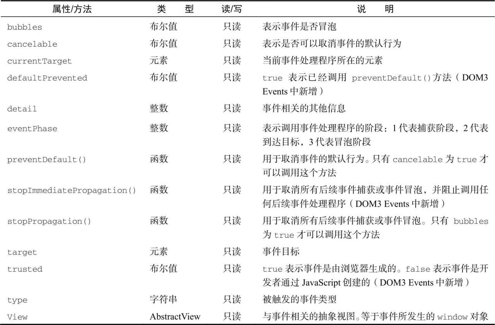
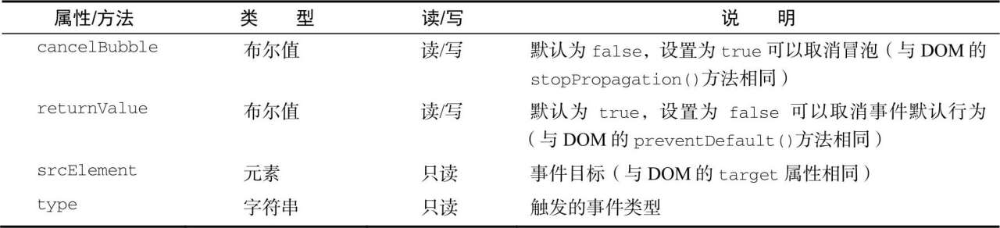
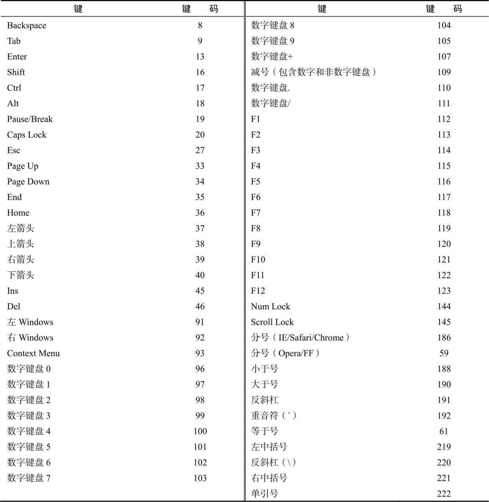

- [事件流](#事件流)
	- [事件冒泡](#事件冒泡)
	- [事件捕获](#事件捕获)
	- [DOM事件流](#dom事件流)
- [事件处理程序](#事件处理程序)
	- [HTML事件处理程序](#html事件处理程序)
	- [DOM0事件处理程序](#dom0事件处理程序)
	- [DOM2事件处理程序](#dom2事件处理程序)
	- [IE事件处理程序](#ie事件处理程序)
	- [跨浏览器事件处理程序](#跨浏览器事件处理程序)
- [事件对象](#事件对象)
	- [DOM事件对象](#dom事件对象)
	- [IE事件对象](#ie事件对象)
	- [跨浏览器事件对象](#跨浏览器事件对象)
- [事件类型](#事件类型)
	- [用户界面事件](#用户界面事件)
		- [load事件](#load事件)
		- [unload事件](#unload事件)
		- [resize事件](#resize事件)
		- [scroll事件](#scroll事件)
	- [焦点事件](#焦点事件)
	- [鼠标和滚轮事件](#鼠标和滚轮事件)
		- [客户端坐标](#客户端坐标)
		- [页面坐标](#页面坐标)
		- [屏幕坐标](#屏幕坐标)
		- [修饰键](#修饰键)
		- [相关元素](#相关元素)
		- [鼠标按键](#鼠标按键)
		- [额外事件](#额外事件)
		- [mousewheel事件](#mousewheel事件)
		- [触摸屏设备](#触摸屏设备)
		- [无障碍问题](#无障碍问题)
	- [键盘与输入事件](#键盘与输入事件)
		- [键码](#键码)
		- [字符编码](#字符编码)
		- [DOM3 的变化](#dom3-的变化)
		- [textInput](#textinput)
		- [设备上的键盘事件](#设备上的键盘事件)
	- [合成事件](#合成事件)
	- [变化事件](#变化事件)
	- [HTML5事件](#html5事件)
		- [contextmenu](#contextmenu)
		- [beforunload事件](#beforunload事件)
		- [DOMContentLoaded事件](#domcontentloaded事件)
		- [readystatechange事件](#readystatechange事件)
		- [pageshow与pagehide事件](#pageshow与pagehide事件)
		- [haschange事件](#haschange事件)
# 事件流
事件冒泡和事件捕获流。 完全相反的两种事件接受的方法
## 事件冒泡
事件从最具体的元素(文档中最深的节点)开始触发，初步向上传播.如下代码，在点击div后会逐步向上传播div->body->html->document
``` html
<html lang="en">
<body>
	<div></div>
</body>
</html>
```
所有现代浏览器都支持事件冒泡，只是在实现方式上会有一些变化。早期IE会跳过html。而现代浏览器中的事件会一直冒泡到window对象
## 事件捕获
事件捕获恰好与事件冒泡相反，最不具体的元素先收到事件，最具体的元素后收到事件。如上代码则会从document->html->body->div的顺序传播。

现代浏览器均支持事件捕获。实际上所有的浏览器都是从window对象开始捕获事件的，而DOM2 Events规范规定从document开始。

> 由于旧版本浏览器不支持，因此实际中几乎不会使用事件捕获。通常建议使用事件冒泡，特殊情况下使用事件捕获。
## DOM事件流
DOM2 Events规范规定事件流分为3个阶段：事件捕获、到达目标和事件冒泡。事件捕获最先发生，未提前拦截事件提供可能。 然后实际的目标元素接受到事件。最后一个阶段是冒泡，最迟要在这个阶段响应事件。

如前文例子，在事件捕获阶段document-> html -> body 传播，注意在该阶段实际的目标元素(本例中是div)不会接受到事件。下一阶段，也就是div触发事件时，通常会被认为是冒泡阶段的一部分。

大多数支持DOM事件流的浏览器实现了一个小小的拓展。虽然DOM2 Events规范明确捕获阶段不命中事件目标。但现在浏览器都会在捕获阶段在事件目标上触发事件。最终结果是在事件目标上有两个机会来处理事件。
# 事件处理程序
## HTML事件处理程序
特定元素支持的每个事件都可以使用事件处理程序的名字以HTML属性的形式来指定。 此时的属性值必须是能够执行的Javascript代码。如下
``` html
<input type="text" value="click me" onclick="console.log('clicked')">
```
因为属性的值是Javascript代码，所以不能在未经转义的情况下使用HTML语法字符，如&,",<,>等(其实是可以使用的，只是引号存在问题而已)。如果确实要使用这些字符，则需要改动代码为下例子
``` html
<input type="text" value="click me" onclick="console.log('&quot;clicked&quot')">
```
在HTML中定义的事件处理程序可以包含精确的动作指令，也可以调用在页面其他地方定义的脚本，比如：
``` js
<input type="text" onclick="showMessage()">
<script>
	function showMessage() {
		console.log('hello world');
	}
</script>
```
以这种方式指定的事件处理程序有一些特殊的地方。首先，会创建一个函数来封装属性的值。这个函数有一个特殊的局部变量event，其实保存的就是event对象
``` html
<!-- 输出click -->
<input type="text" onclick="console.log(event.type)"> 
```
有了这个对象，就不用开发者另外定义其他变量，也不用从包装函数的参数列表中去取了。

在这个函数中，this相当于事件的目标元素，如下所示：
``` html
<!-- 输出"Click Me" -->
<input type="button" value="Click Me" onclick="console.log(this.value)">
```
这个动态创建的包装函数还有一个特别有意思的地方，就是其作用域链被扩展了。在这个函数中，document和元素自身的成员都可以被当成局部变量来访问。这是通过使用with实现的：
``` js
function() {
	with(document){
		with(this){
			// 属性值 <- 事件对应的属性值
		}
	}
}
```
这意味着事件处理程序可以更方便地访问自己的属性。下面的代码于前面的示例功能一样：
``` html
<!-- 输出"Click Me" -->
<input type="button" value="Click Me " onclick="console.log(value)">
```
如果这个元素是一个表单输入框，则作用域中还会表单元素，事件处理程序对应的函数等价于如下：
``` js
function() {
	with(docuemnt){
		with(this.form) {
			with(this){
				// 属性值
			}
		}
	}
}
```
本质上，经过这样的扩展，事件处理程序的代码就不必应用表单元素，而直接访问同一表单中的其他成员了。如下
``` html
<form method="post">
	<!-- 打印button的value -->
	<input type="text" name="username" value="" onclick="console.log(button.value)">
	<!-- 打印上面的value -->
	<input type="button" value="Echo Username" onclick="console.log(username.value)" name="button">
</form>
```
在HTML中指定事件处理程序还有一些问题。第一个问题是时机问题。如HTML元素已经显示在页面上，且用户都交互了，但是事件处理程序还无法执行，此时就会发生错误。为此，大多数HTML事件处理程序会封装在try/catch块中，以便在这种情况下静默失败，如下例所示：
``` js
<script>
	function showMessage() {
		console.log('hello world');
	}
</script>
<input type="button" value="Click Me" onclick="try {showMessage()} catch(ex){}">
```
另一个问题对事件处理程序作用域链的扩展在不同浏览器中可能导致不同的结果。不同Javascript引擎中标识符解析的规则存在差异，因此访问无限定的对象成员可能导致错误。

使用HTML指定事件处理程序的最后一个问题是HTML与Javascript强耦合。使得修改事件处理程序，则必须修改两个地方。<-- 获取DOM，再添加事件，并没有方便太多吧。
## DOM0事件处理程序
在Javascript中指定处理程序的传统方式是把一个函数赋给DOM元素的一个事件处理程序属性。也就是通过获取操作对象后添加事件处理程序。如下
``` html
	<input type="button" id='myBtn' value="Click myBtn">
	<script>
		const btn = document.querySelector('#myBtn')
		btn.onclick = function () {
			console.log('click me');
		}
	</script>
```
需要注意的是，通过上诉的方法添加事件处理程序，需要在JavaScript代码运行后才会有效果。也就是说在用户点击按钮可能会出现没反应的情款，因为js代码还未运行。

像这样使用DOM0方式为事件处理程序赋值时，所附函数是为元素的方法。因此，事件处理程序会在元素的作用域中运行，即this等于元素。 以这种方式添加事件处理程序是注册在事件流的冒泡阶段。
``` html
	<form method="POST">
		<input type="text" value="value" name="input">
		<input type="button" id="myBtn2" value="click" name="button">
	</form>
	<script>
		const myBtn2 = document.querySelector('#myBtn2')
		myBtn2.onclick = function (event) {
			console.log(event);
			console.log(this); // input#myBtn2 element
			console.log(input.value); // 报错，这样就无法获取同一个form的其他元素了
		}
	</script>
```
通过将事件处理程序属性的值设置为null，可以移除通过DOM0方式添加的事件处理程序，如下
``` js
btn.onclick = null // 移除事件处理程序
```
> 如果事件处理程序实在HTML中指定的，则onclcick属性的值是一个包装相应HTML事件处理程序属性值的函数。这些事件处理程序也可以通过在JavaScript中将相应属性设置为null来移除。
## DOM2事件处理程序
DOM2 Events为事件处理程序的赋值和移除定义了两个方法：addEventLisener()remove-EventListener()。这两个方法暴露在所有DOM节点上，它们接受三个参数:事件名、事件处理程序、事件处理程序和一个布尔值，true表示在捕获阶段调用事件处理程序，false(默认值)表示在冒泡阶段调用事件处理程序。如下例：
``` html
	<input type="button" value="click me" id="btn3">
	<script>
		const btn3 = document.querySelector('#btn3')
		btn3.addEventListener('click', () => {
			console.log(this); // window
		})
		btn3.addEventListener('click', function () {
			console.log(this.id); // btn3
		})
	</script>
```
添加了两个事件处理程序，前面的会先触发，然后再打印"btn3"

通过addEventListener()添加的事件处理程序只能使用removeEventlistener()并传入与添加时相同的参数来移除。这意味着使用addEventListener()添加的匿名函数无法移除。如下
``` html
	<input type="button" value="removeEventListener" id="btn4">
	<script>
		const btn4 = document.querySelector('#btn4')
		btn4.addEventListener('click', function () {
			console.log(this.id);
		}, 'false')
		btn4.removeEventListener('click', function () { // 没有效果
			console.log(this.id);
		}, 'false')
	</script>
```
二者代码是相同的，当其实并不是同一个Function实例。若是要使用removeEventListener()，可以像如下代码：
``` html
<input type="button" value="removeEventListener correct" id="btn5">
<script>
	const btn5 = document.querySelector('#btn5')
	const hander = function () {
		console.log(this.id);
	}
	btn4.addEventListener('click', hander, 'false')
	btn4.removeEventListener('click', hander, 'false')
</script>
```
大多数情况下，事件处理程序会被添加至事件流的冒泡阶段，主要原因是跨跨浏览器兼容性好。把事件处理程序注册到捕获阶段通常用于在事件到达其指定目标之前拦截事件。如果不需要拦截，则不要使用事件捕获。
## IE事件处理程序
IE事件了与DOM类似的方法，即attachEvent()和detachEvent().这两个方法接受两个同样的参数：事件处理程序的名字和事件处理函数。因为IE8以及更早版本只支持事件冒泡，所以使用attachEvent()添加的事件处理程序会添加到冒泡阶段。
> 好像现代浏览器并不支持attachEvent方法,估计IE8以下才能使用此方法
``` html
	<input type="button" value="IE attachEvent" id='btn6'>
	<script>
		var btn6 = document.querySelector("#btn6")
		btn6.attachEvent('onclick', function () {
			console.log('click');
		})
	</script>
```
在IE中使用attachEvent()与使用DOM0方式的主要区别是事件处理程序的作用。使用DOM0方式时，事件处理程序中的this值等于目标元素。而使用attachEvent()，事件处理程序是在全局作用域中运行的，因此this等于window.
``` html
	<input type="button" value="this" id="btn">
	<script>
		var btn = document.getElementById('btn')
		btn.attachEvent('onclick', function () {
			console.log(this === window); // true
		})
	</script>
```
与addEventListener()一样，使用attachEvent()方法也可以给一个元素添加多个事件处理程序。有趣的是，与DOM方法不同，这里的事件处理程序会以添加它们的顺序方向触发。
``` html
	<input type="button" value="this" id="btn">
	<script>
		var btn = document.getElementById('btn')
		btn.attachEvent('onclick', function () {
			console.log(this === window); // true
		})
		btn.attachEvent('onclick', function () {
			console.log('define after');
		})
		// define after
		// click
	</script>
```
通过给detachEvent()提供相同参数，可以移除事件。
## 跨浏览器事件处理程序
为了以跨浏览器兼容的方式处理事件，可以通过能力检测，来进行处理。如下EventUtil对象，添加了跨浏览器的addHandler()和removeHandler()方法,同时为了使得事件处理的代码具有最大的兼容性，只需要让代码运行在冒泡阶段运行即可。
``` js
var EventUtil = {
	addHander:function(element,type,handler) {
		if(element.addEventListner) {
			element.addEventListner(type,handler,false)
		}else if(element.attachEvent) {
			element.attachEvent("on"+type,handler)
		}else {
			element["on"+type] = handler
		}
	},
	removeHandler:function(element,type,handler) {
		if(element.removeEventListenerl) {
			element.removeEventListenerl(type,handler,false)
		}else if(element.detachEvent) {
			element.detachEvent("on" + type,handler)
		}else {
			element["on"+type] = null
		}
	}
}
```
# 事件对象
DOM发生事件时，所有相关信息都会收集并存储在一个名为event的对象中。这个对象包含了一些基本信息。
## DOM事件对象
在DOM合规的浏览器中，event对象时传给事件处理程序的唯一参数。不管以哪种方式(DOM0或DOM2)指定事件处理程序，都会传入event对象。如下展示了两种方式下使用事件对象：
``` html
	<input type="button" id="btn" value="event object">
	<script>
		const btn = document.querySelector('#btn')
		btn.onclick = function (event) {
			console.log(event.type); // click
		}
		btn.addEventListener('click', (event) => {
			console.log(event.type); // click
		})
	</script>
```
当然在通过HTML属性指定的事件处理程序中，同样可以使用变量event应用事件对象
``` html
	<!-- 打印click -->
	<input type="button" value="event object html" onclick="console.log(event.type)"> 
```
如前所述，事件对象包含与特定事件相关的属性和方法。不同事件生成的事件对象也会包含不同的属性和方法。不过，所有事件对象都会包含下表列出的这些公共属性和方法。


在事件处理程序内部，this对象始终等于currentTarget的值，而target只包含事件的实际目标。如果事件处理程序直接添加在了意图的目标。则this，currentTarget和target的值是一样的。如下例，三者就相等：
``` html
	<input type="button" value="this target currentTarget" id="btn2">
	<script>
		const btn2 = document.querySelector('#btn2')
		btn2.onclick = function (event) {
			console.log(event.target === this); // true
			console.log(event.currentTarget === this); // true
		}
	</script>
```
上面的代码检测了currentTarget和target的值是否等于this。因为click事件的目标是按钮，所以3个相等。如果这个事件处理程序是添加到按钮的父节点上，那么它们的值就不一样了。比如下面的例子在body上添加了单击处理程序
``` html
	<input type="button" value="this target currentTarget body" id="btn3">
	<script>
		const body = document.body
		body.onclick = function (event) {
			console.log(event.currentTarget === document.body);
			console.log(this === document.body);
			console.log(event.target === document.getElementById('btn3'));
		}
		// 在点击 btn3 后三个均打印 true
	</script>
```
在点击按钮后，this，currentTarget都等于document.body，这是因为他是注册事件处理程序的元素。而target属性等于按钮本身，这是因为那才是click事件真正的目标。由于按钮本身并没有注册事件处理程序，因此click事件冒泡到document.body,从而触发了在它上面注册的处理程序。

type属性在一个处理程序处理多个事件时很有用。比如下面的处理程序中就使用event.type:
``` html
	<input type="button" value="event.type" id="btn4">
	<script>
		const btn4 = document.getElementById("btn4")
		const handler = function (event) {
			switch (event.type) {
				case "click":
					console.log('Clicked');
					break
				case "mouseover":
					event.target.style.backgroundColor = "red"
					break
				case "mouseout":
					event.target.style.backgroundColor = ''
					break
			}
		}
		btn4.onclick = handler
		btn4.onmouseover = handler
		btn4.onmouseout = handler
	</script>
```
preventDefault()方法阻止特定事件的默认动作。比如，链接的默认行为就是在单击时被导航到href属性指定的URL。如果想阻止这个导航行为，可以在onclick事件处理程序中取消
``` js
	<a href="www.baidu.com" id="link">百度</a>
	<script>
		const link = document.getElementById('link')
		link.onclick = function (event) {
			event.preventDefault();
		}
	</script>
```
stopPropagation()方法用于立即阻止事件流在DOM结构中传播，取消后续事件捕获或冒泡。例如在前文body添加的事件的代码后，添加以下代码：(阻止冒泡，阻止捕获)
``` html
<!-- ...body的代码 --> 
	<input type="button" value="stop propagation" id="btn5">
	<script>
		const btn5 = document.getElementById('btn5')
		btn5.onclick = function (evnet) {
			console.log("clicked");
			evnet.stopPropagation(); //阻止了事件传播，body的click事件不会触发。
		}
	</script>
```
eventPhase属性可用于确定事件流当前所处的节点。如果事件处理程序在冒泡阶段被调用则，eventPhase等于1，如果事件处理程序在目标上被调用，则eventPhase等于2；如果事件处理程序在冒泡阶段被调用，则eventPhase等于3.不过要注意，虽然"到达目标"实在冒泡阶段发生的，但其eventPhase仍等于2. 如下：
> event对象旨在事件处理程序执行期间存在，一旦执行完毕，就会被销毁。
## IE事件对象
与DOM事件对象不同，IE事件对象可以基于事件处理程序被指定的方式以不同的方式来访问。如果事件处理程序是使用DOM0方式指定的，则event对象只是window对象的一个属性(看样子其他浏览器中也会在window中存event)，如下所示：
``` html
	<input type="button" value="click" id="btn">
	<script>
		var btn = document.getElementById('btn')
		btn.onclick = function () {
			const event = window.event
			console.log(event.type); // click
		}
	</script>
```
若是事件处理程序是使用attachEvent()指定的，则event对象会作为唯一的参数传给处理函数，如下所示：
``` html
	<input type="button" value="click attach" id="btn2">
	<script>
		var btn2 = document.getElementById('btn2')
		btn2.attachEvent('onclick', function (event) {
			console.log(event.type);
		})
	</script>
```
使用attachEvent()，event对象仍然是window对象的属性，只是出于方便也将其作为参数传入。

如果使用HTML属性方式指定事件的事件处理程序，则event对象同样可以通过变量event访问。
``` html
<input type="button" value="HTML" onclick="console.log(event.type)">
```
IE事件对象也包含导致其创建特定事件相关的属性和方法，其中很多与相关的DOM属性和方法对应。与DOM事件对象一样，基于触发的事件类型不同，event对象中包含的属性和方法也不一样。 不过所有IE事件对象都会包含下列公共属性和方法


由于事件处理程序的作用域取决于指定它的方式，因此this值并不总是等于事件目标。为此更好的方式是使用事件对象的srcElement属性代替this。下面的例子表明，不同事件对象上的srcElement属性中保存的都是事件目标：
``` html
	<input type="button" value="srcElement" id="btn3">
	<script>
		var btn3 = document.getElementById('btn3')
		btn3.onclick = function () {
			console.log(window.event.srcElement === this); // true
		}
		btn3.attachEvent("onclick", function (event) {
			console.log(window.event.srcElement === this); // false
		})
	</script>
```
returnValue属性等价于DOM preveDefault()方法，都是用于取消给定事件默认的行为。只不过这里是设置returnValue的值为false。
``` js
	<a href="https://www.baidu.com" id="link">百度</a>
	<script>
		var link = document.querySelector('#link')
		link.onclick = function () {
			window.event.returnValue = false
		}
	</script>
```
cancelBubble属性与DOMstopPropagation()方法的用途相同，都可以阻止事件冒泡。因为IE8之前不支持捕获阶段，因此只会前者只会取消冒泡。而后者机会取消捕获也会取消冒泡
``` html
	<input type="button" value="cancelBubbte" id="btn4">
	<script>
		var btn4 = document.querySelector('#btn4')
		btn4.onclick = function () {
			console.log("clicked");
			window.event.cancelBubble = true
		}
		document.body.onclick = function () {
			console.log('body clicked');
		}
	</script>
```
## 跨浏览器事件对象
虽然DOM与IE的事件对象并不相同，但它们有足够的相似性来实现跨浏览器方案。DOM事件对象中包含IE事件对象的所有信息和能力。本章之前的EventUtil对象可以像下面一样再添加一些方法
``` js
var EventUtil = {
	//... 之前的代码
	getEvent: function (event) {
		return event ? event : window.event
	},
	getTarget:function(event) {
		return event.target || event.srcElement
	},
	preventDefault: function(event) {
		if(event.preventDefault) {
			event.preventDefault
		}else {
			event.returnValue = false
		}
	},
	stopPropagation:function(event) {
		if(event.stopPropagation){
			event.stopPropagation()
		}else {
			event.cancelBubble = true
		}
	}
}
```
# 事件类型
DOM3 Events定义了如下事件类型:
+ 用户界面事件(UIEvent):涉及与BOM交互的通用浏览器事件。
+ 焦点事件(FocusEvent):再元素获得和失去焦点时触发。
+ 鼠标事件(MouseEvent):使用鼠标在页面上执行某些操作时触发。
+ 滚轮事件(WheelEvent):使用鼠标滚轮(或类似设备)时触发。
+ 输入事件(InputEvent):像文档中输入文本时触发。
+ 键盘事件(KeyBoardEvent):使用键盘在页面上执行某些操作时触发.
+ 合成事件(compositionEvent):在使用某种IME(input Method Editor,输入法编辑器)输入字符时触发。

除了以上这些事件类型外，HTML5还定义了另一组事件，而浏览器通常在DOM和BOM上实现专有事件。
## 用户界面事件
用户界面时间或UI事件不一定与用户操作有关。这类事件在DOM规范出现之前，就已经以某种形式存在了，保留它们是为了向后兼容。UI事件主要有以下几种：
+ DOMActivate: 有元素被用户通过鼠标或键盘操作激活时触发(比click或keydown更加通用).这个事件在DOM3 Events中被废弃。因为浏览器实现之间存在差异，所以不要使用它。
+ load:在window上当页面加载完成后触发，在窗套(<frameset\>)上当所有窗格(<frame\>)都加载完毕后触发，在元素上当图片加载完成后触发，在<object\>元素上当对应对象加载完毕后触发。
+ unload: 在window上当页面完全卸载后触发，在<frameset\>上所有<frame\>都卸载完成后触发，在<object\>元素上相应对象卸载完毕后触发。
+ abord: 在<object\>元素上当相应对象加载完成前被用户提前终止下载时触发。
+ error: 在window上当Javascript报错时触发，在元素上当无法加载指定图片时触发，在<object\>元素上无法加载响应对象时触发，在<framset\>上一个或多个<frame\>无法完成加载时触发。
+ select: 在文本框(<input\>或textarea)上当用户选择了一个或多个字符时触发。
+ resize: 在window或窗格上窗口或窗格被缩放时触发
+ scroll: 当用户滚动包含滚动条的元素时在元素上触发。<body\>元素包含已加载页面的滚动条。

大多数HTML事件都与window对象和表单控件有关。

除了DOMActivate，这些事件在DOM2 Event中都被归为HTML Events
### load事件
在window对象上load事件会在整个页面(包括所有外部资源如图片，Javascript和CSS文件)加载完成后触发。可以通过两种方式指定load事件处理程序。第一种是Javascript方式
``` js
window.addEventListener('load', () => {
	console.log('loaded');
})
```
使用上诉方法，事件处理程序会接受到一个event对象。这个对象没有提供关于这个类型事件的额外信息，虽然在DOM合规的浏览器中，event.target会被设置为document，但在IE8之前的版本中，不会设置这个对象的srcElement属性。

第二种指定load事件处理程序的方式是向<body\>元素添加onload属性，如下所示：
``` html
<body onload="console.log('loaded')"></body>
```
> 根据DOM2 Event，load事件应该在document而非window上触发，但是为了向后兼容，所有浏览器都在window上实现了load事件。

图片也会触发load事件，包括DOM中的图片和非DOM中的图片。可以在HTML中指定onload属性
``` html

```
该例子会在图片加载完毕后输出一条消息，同样也可以使用addEventListener()指定处理程序, 需要确保页面已经加载完毕再进行操作，否则在加载之前进行操作document.body会报错。需要注意的是，下载图片并不一定要将图片添加到DOM，只要设置src属性就会立即开始下载了。 这里关键是要在赋值src属性前指定事件处理程序 <-- 看上去并不需要呀，在赋值之后再添加事件处理程序也行呀？
``` js
window.addEventListener('load', () => {
	console.log('loaded');
	const image = document.createElement('img')
	document.body.appendChild(image)
	image.addEventListener('load', (event) => {
		console.log(event.target.src);
	})
	image.src = './smile.png'
})
```
同样的技术也适用于DOM0的image对象。在DOM出现之前，客户端都使用image对象也先加载图片。 可以像使用前面的元素使用Image对象，只是不能把后者添加到DOM树。下面的例子使用新Image对象实现了图片预加载 <-- 如果不能添加的话，有什么意义呢？：
``` js
window.addEventListener('load', () => {
	let img = new Image()
	img.addEventListener('load', () => {
		console.log('new Image loaded');
	})
	img.src = './smile.png'
})
```
有些浏览器会把Image对象实现为元素，但并非所有浏览器都是如此。
> 在IE8或早期版本中，如果图片没有添加到DOM文档中了，则load事件发生时不会生成event对象。对未添加到文档中的元素以及image对象来说都是如此。
还有一些元素也以非标准的方式支持load事件。<script\>元素会在Javascript文件加载完成后触发load事件，从而可以动态监测。要下载JavaScript文件必须同时指定src属性，并添加到文档中。因此指定事件处理程序和指定src属性的顺序并不重要。
``` js
window.addEventListener('load', () => {
	const script = document.createElement('script')
	script.addEventListener('load', (event) => {
		console.log('loaded');
	})
	script.src = "./06-example.js"
	document.body.appendChild(script)
})
```
这里的event对象的target属性在大多数浏览器中是<scirpt\>节点。IE8及更早的版本的不支持<scirpt\>触发load事件。

IE和Opera支持<link\>元素触发load事件，因此支持动态检测样式表是否加载完成。同<script\>标签相同，在指定href属性，并添加到文档之前不会下载样式表(若是没有添加rel属性，也不会下载样式表)
``` js
window.addEventListener('load', () => {
	const link = document.createElement('link')
	link.type = "text/css"
	link.rel = "stylesheet"
	link.addEventListener('load', (event) => {
		console.log('outside css loaded');
	})
	link.href = './07-example.css'
	document.getElementsByTagName('head')[0].appendChild(link)
})
```
### unload事件
与load事件相对应的是unload事件，unload事件会在文档卸载完成后触发。unload事件一般是从一个页面导航到另一个页面时触发，最常用于清理引用，以免内存泄漏。 <--刷新就可以看到了，就一瞬间,但是发生页面跳转的时候，似乎是无法看到的。
``` js
window.addEventListener('unload', (event) => {
	console.log('Unloaded!');
})
```
第二种方式是通过给body添加onunload属性
``` js
<body onload="console.log('loaded')" onunload="console.log('body unload')">
```
无论以上哪种方式，在处理程序中，都不能使用页面加载后才有的对象，此时访问DOM或修改页面外观都会导致报错。<--不知道为啥无法使用window.open()
### resize事件
当浏览器窗口被缩放到新高度或宽度时，会触发resize事件。这个事件在window上触发，因此可以通过Javascript在window上，或者为body添加onresize属性来指定事件处理程序。
``` js
window.addEventListener('resize', (event) => {
	console.log('Resized');
})
```
类似于在其他window上发生的事件，此时会生成event对象，且这个对象的target属性时document。

最好不要在这个事件中执行过多计算，否则可能会由于执行过于频繁而导致浏览器相应变慢。
> 浏览器在最大化和最小化时也会触发resize事件。
### scroll事件
scroll事件发生window上，但实际上反映的是页面中相应元素的变化。混则模式下，可以通过<boody\>元素检测scrollLeft和scrollTop属性的变化。而在标准模式下，这些变化发生在<html\>上(除早期Safari以外)。下面的代码演示如何处理这些差异：
``` js
window.addEventListener('scroll', (event) => {
	if (document.compatMode == 'CSS1Compat') {
		console.log(document.documentElement.scrollTop);
	} else {
		console.log(document.body.scrollTop);
	}
})
```
## 焦点事件
焦点事件在页面元素获得或失去焦点时触发。这些事件可以与document.hasFoucus()和document.activeElement一起为开发者提供用户在页面中的导航的信息。焦点事件有以下6种：
+ blur：当元素失去焦点时触发。这个事件不冒泡，所有浏览器都支持
+ DOMFouchsIn:当元素获得焦点时触发。这个事件是focus的冒泡版。Opera是唯一支持这个事件的浏览器，DOM3 Events废弃了DOMFoucsIn。推荐focusin
+ DOMFoucsOut:当元素失去焦点触发。这个事件是blur的通用版。Opera是唯一支持这个事件的主流浏览器。DOM3 Event废弃了DOMFoucusOut，推荐focusout
+ focus:当元素获得焦点时触发。这个事件不冒泡，所有浏览器都支持。
+ focusin: 当元素获得焦点时触发。这个事件是focus的冒泡版。
+ focusout: 当元素失去焦点时触发。这个事件是blur的通用版。

焦点事件中的两个主要事件是focus和blur，这两个事件在Javascript早期就得到了浏览器的支持。但二者最大的问题是不冒泡。

当焦点从页面中的一个元素移到另一个元素上时，会依次发生如下事件。
1. focusout在失去焦点的元素上触发
2. focusin在获得焦点的元素上触发
3. blur在失去焦点的元素上触发
4. DOMFocusOut在失去焦点的元素上触发
5. focus在获得焦点的元素上触发
6. DOMFoucsIn在获得焦点的元素上触发

其中blur、DOMFoucsOut和focusout的事件目标是失去焦点的元素，而focus、DOMFocusIn和focusin的事件目标时获得焦点的元素。

在Edge(chormium)中 blur -> focusout -> DOMFocusOut -> focus -> focusin -> DOMFocusIn
## 鼠标和滚轮事件
鼠标事件是Web开发中最常用的一组事件.DOM3 Events定义了9种鼠标事件。
+ click: 在用户单击鼠标主键或按键盘回车键时触发。这主要是基于无障碍的考虑，让键盘和鼠标都可以触发onclick事件处理程序
+ dblclick：在用户双击鼠标主键时触发。
+ mousedown：在用户按下任意鼠标键时触发。这个事件不能通过键盘触发。
+ mouseenter：在用户把鼠标光标从元素外部移到元素内部时触发。这个事件不冒泡，也不会在光标经过后代元素时触发。
+ mouseleave: 在用户把鼠标光标从内部移到元素外部触发。这个事件不冒泡,也不会在光标经过后代元素时触发.
+ mousemove: 在鼠标光标在元素上移动时反复触发。这个事件不能通过键盘触发.
+ mouseout: 在用户把鼠标光标从一个元素移到另一个元素上时触发。移到的元素可以是原始元素的外部元素，也可以是原始元素的子元素。这个事件不能通过键盘触发。
+ mouseup: 在用户释放鼠标键时触发。这个事件不能通过键盘触发。

页面中所有元素都支持鼠标事件。除了mouseenter和mouseleave，所有鼠标事件都会冒泡，都可以被取消，而这会影响浏览器的默认行为。

由于事件之间存在关系，因此取消鼠标事件的默认行为也会影响其他事件。

比如，click事件触发的前提是mousedown事件触发后，紧接着又在同一个元素上触发了mouseup事件。如果mousedown或mouseup中任意一个事件被取消了，那么click事件就不会触发。 类似的，两次click会导致dblckick事件触发。只要任何逻辑阻止了两个click事件，则dblclick事件就不会触发，以上四个事件永远会按照以下顺序触发：
1. mousedown
2. mouseup
3. click
4. mousedown
5. mouseup
6. click
7. dblclick

click和dblclick在触发前都依赖其他事件触发，而mouedown和mouseup则不会受其他事件影响。

IE8及更早版本的实现中有个问题，这会导致双击事件跳过第二次mousedown和click事件。相应顺序变成了：
1. mousedown
2. mouseup
3. clcik
4. mouseup
5. dblclick

鼠标事件在DOM3 Events中对应的类型是"MouseEvent",而不是"MouseEvents"

鼠标事件上还有一个名为滚轮事件的子类别。滚轮事件只有一个事件mousewheel，反映的是鼠标滚轮或带滚轮的类似设备上滚轮的互动。

### 客户端坐标
鼠标事件都是在浏览器视口中的某个位置上发生的。着写信息被保存在event对象的clentX和clientY属性中。这两个属性表示事件发生时鼠标光标在视口中的坐标。客户端坐标不考虑页面滚动，这两个值并不代表鼠标在页面上的位置。
``` html
	<div id="myDiv"></div>
	<script>
		const myDiv = document.querySelector('#myDiv')
		myDiv.addEventListener('click', (event) => {
			console.log(`Client coordinates: ${event.clientX},${event.clientY}`);
		})
	</script>
```
### 页面坐标
通过pageX和pageY可以获取页面坐标。
``` js
myDiv.addEventListener('click', (event) => {
	console.log(`Page coordinates: ${event.pageX},${event.pageY}`);
})
```
IE及更早的版本没有在event对象上暴露页面坐标。不过可以通过客户端坐标和滚动信息计算出来
``` js
var myDiv = document.querySelector('#myDiv')
myDiv.addEventListener('click', function (event) {
	var pageX = event.pageX,
		pageY = event.pageY
	if (pageX === undefined) {
		pageX = event.clientX + (document.body.scrollLeft || document.documentElement.scrollLeft)
	}
	if (pageY === undefined) {
		pageY = event.clientY + (document.body.scrollTop || document.documentElement.scrollTop)
	}
	console.log('Page coordinates: ' + pageX + ',' + pageY);
})
```
IE8以下要求还挺多
``` js
var myDiv = document.querySelector('#myDiv')
myDiv.addEventListener('click', function (event) {
	var pageX = event.pageX,
		pageY = event.pageY
	if (pageX === undefined) {
		pageX = event.clientX + (document.body.scrollLeft || document.documentElement.scrollLeft)
	}
	if (pageY === undefined) {
		pageY = event.clientY + (document.body.scrollTop || document.documentElement.scrollTop)
	}
	console.log('Page coordinates: ' + pageX + ',' + pageY);
})
```
### 屏幕坐标
鼠标事件不仅是在浏览器窗口中发生的，也是在整个屏幕上发生的。可以通过event对象的screeX和screenY属性获取鼠标光标在屏幕上的坐标。
``` js
var myDiv = document.querySelector('#myDiv')
myDiv.addEventListener('click', (event) => {
	console.log(`Screen coordinates: ${event.screenX}, ${event.screenY}`);
})
```
### 修饰键
虽然鼠标事件主要通过鼠标触发的，但有时候要确定用户想要实现的操作，还要考虑键盘按键的状态。键盘上的修饰符Shift,Ctrl,Alt和Meta经常用于修改鼠标事件的行为。DOM规定了4个属性来表示这几个修饰键的状态:shiftKey,ctrlKey,altKey和metaKey。这几个属性会在各自对应的修复符被按下时包含布尔值true,没有被按下时包含false。在鼠标事件发生时，可以通过这几个属性来检测修饰符是否被按下。如下例子，在click事件发生时检测每个修饰符的状态：
``` html
	<div id="myDiv2"></div>
	<script>
		let div = document.querySelector('#myDiv2')
		div.addEventListener('click', (event) => {
			const keys = new Array()
			if (event.shiftKey) {
				keys.push('shift')
			}
			if (event.ctrlKey) {
				keys.push('ctrl')
			}
			if (event.altKey) {
				keys.push('alt')
			}
			if (event.metaKey) {
				keys.push('meta')
			}
			console.log("Keys:" + keys.join(', '));
		})
	</script>
```
> 现代浏览器支持所有者4个修饰符。IE8及更早版本不支持metaKey属性。
### 相关元素
对mouseover和mouseout事件而言，还存在与事件相关的其他元素。这两个事件都涉及从一个元素的边界之内把光标移到另一个元素的边界之内。对mouseover事件来说，事件的主要目标是获得贯标的元素，相关元素是失去光标的元素，类似的，对mouseout事件来说，事件的主要目标是失去光标的元素，而相关元素是获得光标的元素。如下
``` html
<body>
	<div id="myDiv3"></div>
</body>
```
若是从div移出，div会触发mouseout事件，相关元素是body。 而body触发mouseover事件。相关元素<div\>。

DOM通过event对象的relatedTarget属性提供了相关元素的信息。 这个属性只有在mouseover和mouseout事件发生才包含值。其他所有事件的这个属性的值都是null。 IE8及更早版本不支持relatedTarget属性，但还提供了其他可以的可以访问到相关元素的属性。在mouseover事件触发时，IE会提供fromElement属性，其中包含相关元素。而在mouseout事件触发时，IE会提供toElement属性，其中包含相关元素。
``` html
  <!-- 当从myDiv3移到myDiv4时 -->
	<div id="myDiv3"></div>
	<div id="myDiv4"></div>
	<script>
		const div3 = document.querySelector('#myDiv3')
		const div4 = document.querySelector('#myDiv4')
		div3.addEventListener('mouseout', (event) => {
			console.log(event.relatedTarget); // div#myDiv3
		})
		div4.addEventListener('mouseover', (event) => {
			console.log(event.relatedTarget); // div#myDiv3
		})
	</script>
```
### 鼠标按键
只有在元素上单击鼠标主键(或按下键盘上的回车键)时click事件才会触发。因此按键信息并不是必须的。对mousedown和mouseup事件来说，event对象上会有一个button属性，表示按下后释放的是哪个按键。DOM为这个button属性定义3个值:0表示鼠标主键，1表示鼠标中键，2表示鼠标副键。

IE8及更早版本也提供了button属性，但这个属性的值与前面说的完全不同：
+ 0，表示没有按下任何键；
+ 1，表示按下鼠标主键；
+ 2，表示按下鼠标副键；
+ 3，表示同时按下鼠标主键、副键；
+ 4，表示按下鼠标中键；
+ 5，表示同时按下鼠标主键和中键；
+ 6，表示同时按下鼠标副键和中键；
+ 7，表示同时按下3个键
> 主流浏览器以DOM为准只有IE8版本不同。
### 额外事件
DOM2 Events规范在event对象上提供了detail属性，以给出事件的更多信息。 对鼠标事件来说，detail包含一个数值，表示在给定位置上发生了多少单击。单击相当于在同一个像素上发生一次mousedown紧跟一次mouseup。detail的值从1开始，每次单击会加1.如果鼠标在mousedown和mouseup之间移动了，则detail会重置为0.

IE还为每个鼠标事件提供了以下额外信息：
+ altLeft,布尔值，表示是否按下做alt键(altLeft时true，那么altKey也是true)
+ ctrlLeft,布尔值，表示是否按下左Ctrl键(如果ctrlLeft是true，那么ctrlKey也是true)
+ offsetX, 光标相对于目标元素边界的x坐标
+ offsetY, 光标相对于目标元素边界的y坐标
+ shiftLeft，布尔值，表示是否按下了左Shift键(如果shiftLeft是true，那么shiftKey也是true)

这些属性的作用有限，这是因为只有IE支持。而且，它们提供的信息要么没必要，要么可以通过其他方式计算。
### mousewheel事件
mousewheel事件会在用户使用鼠标滚轮时触发，包括在垂直反向上任意滚动。 这个事件会在任何元素上触发，并冒泡到document(IE8)和window(现代浏览器),mousewheel事件的event对象包含鼠标事件的所有标准信息，此外还有一个名为wheelDelta的信属性。当鼠标滚轮向前滚动时，whellDelta每次都是+120;而当鼠标滚轮向后移动时,wheelDelta每次都是-120(edge 150)

可以为页面上的任何元素或文档田家庵onmousewheel事件处理程序，以处理所有鼠标滚轮交互，比如：
``` js
document.documentElement.addEventListener('mousewheel', (event) => {
	console.log(event.wheelDelta); // 150?
})
```
### 触摸屏设备
IOS和Android等触屏设备的实现大相径庭，因为触摸屏不支持鼠标操作。在位触摸屏设备开发时，要记住以下事项。
+ 不支持dblclick事件。双击浏览器窗口可以方法，当没有办法覆盖这个行为。
+ 单指点触屏幕上的可点击会触发mousemove事件。如果操作会导致内容变化，则不会再触发其他事件。如果屏幕上没有变化，则会相继触发mousedown，mouseup和click事件。点触不可点击的元素不会触发事件。可点击元素是指点击时有默认动作的元素(如链接)或指定了onclick事件处理程序的元素。
+ mousemove事件也会触发mouseover和mouseout事件。
+ 双指点触屏幕并滑动导致页面滚动会触发mousewheel和scroll事件。
### 无障碍问题
如果Web应用或网站必须考虑残障人士，特别是使用屏幕阅读器的用户，那么必须小心使用鼠标事件。如前所述，按回车键可以触发click事件，但其他鼠标事件不能通过键盘触发。因此建议不要使用click事件之外的其他鼠标事件向用户提示功能或触发代码执行，这是因为其他鼠标事件会严格妨碍盲人或视障用户使用。下面是几条使用鼠标事件时应该遵循的无障碍建议。
+ 使用click事件执行代码。使用onmousedown执行代码时，程序会运行的更快，但在屏幕阅读器上，这样会导致代码无法执行，这是因为屏幕阅读器无法触发mousedown事件。
+ 不要使用mouseover向用户显示新选项。同样，原因是屏幕阅读器无法触发mouseover。若是必须通过该方式显示新选项，那么可考虑像是相同信息的键盘快捷键。
+ 不用使用dblclick执行重要的操作，这是因为键盘不能触发这个事件。
## 键盘与输入事件
键盘事件是用户操作键盘触发的，DOM2 Events最初定义了键盘事件，但该规范在最终发布前删除了相应内容。因此，键盘事件很大程度是基于原始的DOM0实现的。

DOM3 Events位键盘事件提供了一个首先在IE 9完全实现的规范。

键盘事件包含3个事件：
+ keydown, 用户按下键盘上某个键触发，而且持续按住会重复触发。
+ keypress, 用户按下键盘下某个键并产生字符时触发，而且持续按住会重复触发。Esc键也会触发这个事件。DOM3 Events废弃了key press事件，而推荐textInput事件。
+ keyup, 用户释放键盘上某个键时触发。

虽然所有元素都支持这些事件，但当用户在文本框中输入内容时最容易看到。

输入事件只有一个，即textInput。这个事件对keypress事件的扩展，用于在文本显示给用户之前更方便地截取文本输入。textInput会在文本插入文本框之前触发。

当用户按下键盘上地某个字符键时，首先会触发keypress事件，最后触发keyup事件。这里地keydown和keypress事件会在文本框出现变化之前触发，而keyup事件会在文本框出现变化之后触发。如果一个字符键被按住不放，keydown和keypress就会反复触发，知道这个键被释放。

对于非字符键，在键盘上按一下这个键，会先触发keydown事件，然后触发keyup事件。如果按住某个非字符键不放，则会重复触发keydown事件，知道这个键被释放，此时会触发keyup事件。
> 键盘事件支持与鼠标事件相同地修饰键。shiftKey，ctrlKey，altKey和metaKey属性在键盘事件中都是可用地。 IE8及更早的版本不支持metaKey属性
### 键码
对于keydown和keyup事件，event对象的keyCode属性中会保存一个键码，对应键盘上特定的一个键。对于字母和数字键，keyCode的值与小写字母和数字的ASCII编码一致。比如数字7键的keyCode为55，而在字母A键的keyCode为65，而且跟是否按shift键无关。DOM和IE的event对象都支持keyCode属性。下面这里例子展示了如何使用keyCode属性：
``` js
<textarea name="myText" id="myText" cols="30" rows="10"></textarea>
<script>
	const textbox = document.getElementById('myText')
	textbox.addEventListener('keyup', (event) => {
		console.log(event.keyCode);
	})
</script>
```
下表给出了键盘上所有非字符键的键码。

### 字符编码
在keypress事件发生时，意味着按键会影响屏幕上显示的文本(也就是说ctrl,shift之类的不会触发事件，因为并不会影响到屏幕。)。对插入或移除字符的键，所有浏览器都会触发keypress事件，其他键则取决于浏览器。因为DOM3 Events规范才刚刚开始，所以不同浏览器之间的实现存在差异。

浏览器在event对象上支持charCode属性，只有发生keypress事件时这个属性才会被设置值，包含的是按键字符对应的ASCII编码。通常，charCode属性的值是0，在keypress事件发生时则是对应按键的键码。只要获取到keyCode值，则可以使用String.fromCharCode()方法转换为实际的字符。
``` js
var EventUtil = {
	getCharCode: function (event) {
		if (typeof event.charcode == "number") {
			return event.charcode
		} else {
			return event.keyCode
		}
	}
}
textbox.addEventListener('keypress', (event) => {
	const charCode = EventUtil.getCharCode(event)
	const key = String.fromCharCode(charCode)
	console.log(key);
})
```
### DOM3 的变化
DOM3规范并未规定charCode属性，而是定义了key和code两个新属性。

其中key属性用于代替keyCode，且包含字符串。在按下字符串时，key的值等于文本字符(如'k'或'M')；在按下非字符串时，key的值是键名(如"Shift"或"ArrowDown")。char属性在按下字符键时与key类似，在按下非字符键时为null。

IE支持key属性但不支持char属性。Safari和Chorme支持keyIdentifier属性，在按下非字符键时返回与key一样的值。对于字符键，keyIdentifier返回以"U+0000"形式表示的Unicode值的字符串形式的字符编码。<-- 我这个版本的edge似乎没有这个属性。。
``` html
	<input type="text" id="input1">
	<script>
		const input1 = document.getElementById('input1')
		input1.addEventListener('keypress', (event) => {
			const identifier = event.key;
			if (identifier) {
				console.log(identifier);
			}
		})
	</script>
```
由于缺乏跨浏览器支持，因此不建议使用key，keyIdentifier，和char

DOM3 Events也支持一个名为location的属性，该属性是一个数值，表示是在哪里按的键。可能的值如下:
+ 0是默认值
+ 1是左边
+ 2是右边
+ 3是数字键盘
+ 4是移动设备
+ 5是游戏手柄
``` html
<input type="text" id="input2">
<script>
	const textbox1 = document.getElementById('input2')
	textbox1.addEventListener('keypress', (event) => {
		console.log(event);
		// 奇怪的是ctrl shift 不会触发keypress事件,为什么呢?
		console.log(event.location, event.keyLocation);
		// 似乎keyLocation不存在，且location只会显示3. 4，5无法测试。
		const loc = event.keyLocation || event.location
		if (loc) {
			console.log(`key location: ${loc}`);
		}
		const text = document.createTextNode(`pressKey: ${loc}`)
		document.body.appendChild(text)
	})
</script>
```
最后一个变化是给event事件添加了getModifierState()方法，该方法接受一个参数，一个等于Shift,Control,Alt,AltGraph或Meta的字符串，表示要检测的修饰键。如果给定键被按住，则会返回true，否则返回false。似乎不支持某些元素
``` html
<input type="text" id="input3"></input>
<script>
	const input3 = document.getElementById('input3')
	input3.addEventListener('keypress', (event) => {
		if (event.getModifierState) {
			console.log(event.getModifierState("Shift"));
		}
	})
</script>
```
### textInput
DOM3 Events添加了textInput事件，在字符被输入到可编辑区域时触发。 keypress会在任何可获得焦点的元素上触发(如h1之类的就无法触发),作为keypress的替代，textInput只会在可编辑区域上触发。另一个区别是textInput只有在新字符被插入时才触发，而keypress对任何可能影响文本的键都会触发<-- 不对呀，退格没有触发，并且黏贴也没有触发。
``` html
	<input type="text" id="input4">
	<script>
		const input4 = document.getElementById('input4')
		input4.addEventListener('textInput', (event) => {
			console.log(event.data);
		})
	</script>
```
event上有一个data属性，表示输入的字符

event上还有一个名为inputMethod的属性，该属性表示向空间中输入文本的手段，可能值如下 <--edge浏览器，并不支持这个属性：
+ 0,表示浏览器不能确定是什么输入手段
+ 1，表示键盘
+ 2，表示黏贴
+ 3，表示拖放操作
+ 4，表示IME
+ 5，表示表单选项
+ 6，表示手写
+ 7，表示语音
+ 8，表示组合方式
+ 9，表示脚本

### 设备上的键盘事件
任天堂Will会在用户按下Wii遥控器上的键时触发键盘事件，根据键码判断是那些按键。
## 合成事件
合成事件是DOM3 Events中新增的，用于处理通常使用IME(输入法输入)输入时的复杂输入序列。IME可以让用户输入物理键盘上没有的字符。 合成事件用于检测和控制这种输入。 合成事件有以下三种:

+ compositionstart, 在IME的文本合成系统打开时触发，表示输入即将开始。
+ compositionupdata, 在新字符插入输入字段时触发。
+ composiitonend, 在IME的文本合成系统关闭时触发，表示恢复正常键盘输入。
  
合成事件在很多方面与输入事件很类似。在合成事件触发时，事件目标是接受文本的输入字段，唯一增加的事件属性是data,其中包含的值视情况而定：

+ 在compositionstart中，包含正在编辑中的文本（例如，已经选择了文本但是还没有替换？）
+ 在compositionupdata, 包含要插入的新字符
+ 在composiitonend, 包含本次合成过程中输入的全部内容。

``` html
	<input type="text" id="input5">
	<script>
		const input5 = document.getElementById('input5')
		input5.addEventListener('compositionstart', (event) => {
			console.log(event.data);
		})
		input5.addEventListener('compositionupdate', (event) => {
			console.log(event.data);
		})
		input5.addEventListener('compositionend', (event) => {
			console.log(event.data);
		})
	</script>
```
## 变化事件
DOM2的变化事件为了在DOM发生变法时提供通知。 这些事件已经被废弃，由Mutation Observes所取代。
## HTML5事件
HTML5列出了浏览器支持的所有事件，本节中讨论HTML5中得到较好支持的一些事件。
### contextmenu
用于表示何时显示上下文菜单、使得开发者取消默认的上下菜单，提供默认的上下文菜单。
``` html
	<div id="myDiv"></div>
	<ul id="myMenu">
		<li><a href="www.baidu.com">百度</a></li>
		<li><a href="www.baidu.com">百度</a></li>
		<li><a href="www.baidu.com">百度</a></li>
		<li> 这是无法点击的</li>
	</ul>
	<script>
		window.addEventListener('load', (event) => {
			const div = document.getElementById('myDiv')
			div.addEventListener('contextmenu', (event) => {
				event.preventDefault()
				const menu = document.getElementById('myMenu')
				menu.style.left = event.clientX + 'px'
				menu.style.top = event.clientY + 'px'
				menu.style.visibility = "visible"
				menu.addEventListener('click', (event) => {
					event.stopPropagation()
				})
			})
			document.addEventListener('click', (event) => {
				document.getElementById('myMenu').style.visibility = 'hidden'
			})
		})
```
### beforunload事件
beforeunload事件会在window上触发，提供阻止页面被卸载的机会。该事件会显示确认框，且不可取消。通过event.returnValue设置要在确认框中显示的字符串,并将其作为函数值返回。
``` js
window.addEventListener('beforeunload', (event) => {
	console.log(event);
	let message = 'do you realy want quit the Website?'
	event.returnValue = message
	return message
})
```
> edge浏览器下returnValue无法使用，似乎chorme和firefox都无法自定义该项。
### DOMContentLoaded事件
相对于load事件，DOMConetentLoaded事件会在DOM树构建完成后立即触发,可以让开发着在外部资源下载的同时就能指定事件处理程序，从而让用户能够更快的与页面交互。

要处理DOMContentLoaded事件，需要给document或window添加事件处理程序(实际事件目标是document，但会冒泡window)。
``` js
document.addEventListener('DOMContentLoaded', (event) => {
	console.log(event);
	console.log("Content loaded");
})
```
DOMContentLoaded事件的event对象不包含任何其他信息，除了target等于document

DOMContentloaded事件通常用于添加事件处理程序或执行其他DOM操作。这个事件始终在load事件之前触发。

对于不支持DOMContentLoaded事件的浏览器，可以使用超时为0的setTimeout()函数，通过其回调来设置事件处理程序。
``` js
setTimeout(()=> {
	// 在这里添加事件处理程序
},0)
```
以上代码本质上意味着在当前Javascript进程执行完毕后立即执行这个回调。页面加载和构建期间，只有一个Javascript进程运行。所以可以在这个进程空闲后立即执行回调。但其并不能完全模拟DOMContentLoaded事件
### readystatechange事件
IE首先在DOM文档一些地方定义了一个名为readstatechange事件。这个事件提供文档或元素加载状态的信息，但行为有时候不稳定。支持readystatechange事件的每个对象都有一个readyState属性，该属性具有一个以下理出的可能的字符串值。
+ uninitialized: 对象存在并尚未初始化。
+ loading：对象正在加载数据。
+ loaded：对象已经加载完数据。
+ interactive：对象可以交互，但尚未加载完成。
+ complete：对象加载完成。
  
因为并非所有对象都会经历所有readystate阶段，也就是说readyState未必会依次呈现上述值。这意味着readstatechange事件经常会触发不到4次，而readyState未必会以此呈现上诉值。

在document上使用时，值为"interactive"的readyState首先会触发readystatechange事件，时机类似于DOMContentLoaded。进入交互阶段，意味着DOM树已加载完成，因而可以安全地交互了。此时图片和其他外部资源不一定加载完了。可以像下面这样使用readystatechange事件(在本例中edge浏览器中触发了两次)：
``` js
document.addEventListener('readystatechange', (event) => {
	if (document.readyState == "interactive") {
		console.log("Content loaded");
	}
})
```
这个事件的event对象中没有任何额外的信息，连事件目标都不会设置。

在与load事件共同使用时，这个事件的触发顺序不能保证。在包含特别多或较大外部资源的页面中，交互阶段会在load事件前先触发。而在包含较小且较小外部资源的页面中，这个readystatechange事件有可能在load事件触发后才触发。

问题更加复杂，交互阶段与完成阶段的顺序也不是固定的。在外部资源较多的页面中，很可能在交互阶段会早于完成阶段。而在外部资源较少的页面中，很可能会完成阶段会遭遇交互阶段。因此，实践中为了抢到较早的时机，需要同时检测交互阶段和完成阶段。比如：
``` js
document.addEventListener('readystatechange', function (event) {
	if (document.readyState == "interactive" || document.readyState == "complete") {
		document.removeEventListener("readystatechange", arguments.callee)
		console.log("ready Content loaded");
	}
})
```
当readystatechange事件触发时，会判断其是不是交互或完成状态。如果是，则移除事件处理程序，以保证其他阶段不再执行。 然后再进行其他操作。这样的逻辑可以保证尽可能地接近使用DOMContentloaded事件地效果。
> 使用readstatechange只能尽量模拟DOMContentLoaded，但做不到分毫不差。load事件和readystatechange事件发生地顺序在不同页面中是不一样地。
### pageshow与pagehide事件
fireFox和Opera开发了一个名为往返缓存的功能，在使用浏览器"前进"和"后退"按钮时加快页面之间的切换。这个缓存不仅会存储页面数据，也存储DOM和Javascript状态，实际上是将整个页面都保存在内存里。如果页面在缓存中，那么导航到这个页面就不会触发load事件(我猜vue的生命周期activated就是用到了类似的东西)。如果页面在缓存中，则不会触发load事件。

通过pageshow，会在页面显示时触发，无论是否来自往返缓存。在新加载的页面上pageshow会在load事件后触发；在来自往返缓存的页面上，pageshow会在页面状态完全恢复后触发。虽然该事件的目标是document，但事件处理程序必须添加到window上。
``` js
(function () {
  let showcount = 0;
  window.addEventListener("load", () => {
    console.log("load fired");
  });
  window.addEventListener("pageshow", (event) => {
    showcount++;
    console.log(
      `show has ben fired ${showcount} times. persisted: ${event.persisted}`
    );
    console.log(Date.now());
  });
})();
```
> 在edge浏览器中，showcount打印时始终为1.且persisted始终为false。似乎是并没有往返缓存这个东西。但是存在pageshow事件。

与pageshow对应的事件是pagehide，这个事件会在页面从浏览器中卸载后，在unload事件之前触发。 与pageshow事件一样，pagehide在document上触发，但事件处理程序必须被添加到window。event对象中同样包含persisited属性，但用法不同
``` js
window.addEventListener("pagehide", (event) => {
  console.log("Hiding. Persisted?" + event.persisted);
});
```
> 同样的在edge浏览器中始终persisted始终是false
>> 原文中提了下，unload事件注册后，页面就不会进入往返缓存了。虽然现在的许多浏览器本身似乎就没有支持往返缓存。
### haschange事件
HTML5增加了haschange事件，用于在URL散列值（URL最后#后面的部分)发生变化时触发。 用于在单页面应用中页面跳转之类的。

onhaschange事件处理程序必须添加给windwo，每次URL散列值发生变化时会调用它。event对象有两个新属性:oldURL和newURL。
``` js
window.addEventListener("hashchange", (event) => {
  console.log(`old URL: ${event.oldURL}, New URL: ${event.newURL}`);
	// 可以通过 location.hash直接获取当前的散列值
  console.log(`current hash: ${location.hash}`);
});
```