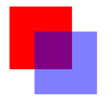
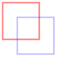
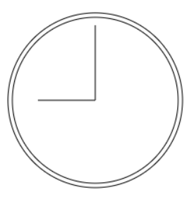
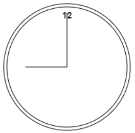
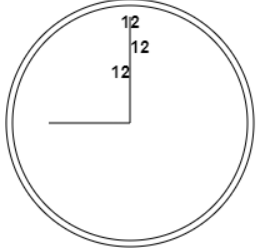
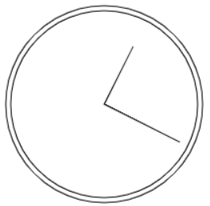

- [使用requestAnimationFrame](#使用requestanimationframe)
	- [早期定时动画](#早期定时动画)
		- [事件间隔的问题](#事件间隔的问题)
		- [requestAnimationFrame](#requestanimationframe)
		- [cancelAnimationFrame](#cancelanimationframe)
		- [通过requestAnimationFrame节流](#通过requestanimationframe节流)
- [基本的canvas](#基本的canvas)
- [2D绘图上下文](#2d绘图上下文)
	- [填充和描边](#填充和描边)
	- [绘制矩形](#绘制矩形)
	- [绘制路径](#绘制路径)
	- [绘制文本](#绘制文本)
	- [变换](#变换)
	- [绘制图像](#绘制图像)
	- [阴影](#阴影)
	- [渐变](#渐变)
		- [线性渐变](#线性渐变)
		- [放射性渐变](#放射性渐变)
	- [图案](#图案)
	- [图形数据](#图形数据)
	- [合成](#合成)
# 使用requestAnimationFrame
## 早期定时动画
早期是使用setInterval()来控制动画的执行。 下面的例子展示了使用setInterval()的基本模式。
``` js
(function () {
	function updateanimations() {
		doAnimation1()
		doAnimation2()
		// ... 其他任务
	}
	setInterval(updateanimations, 100);
})()
```
这种定时动画的问题在于无法准确知晓循环之间的延时。定时间隔必须足够短，这样才能让不同的动画类型都能平滑顺畅，但又要足够长，以便产生浏览器可以渲染出来的变化。

因此，实现平滑动画最佳的重绘间隔为1000毫秒/60(因为计算机显示器的屏幕刷新率一般都是60Hz),大约是17秒。以这个速度重绘可以实现最平滑的动画。这个速度重绘可以实现最为平滑的动画。 如果同时运行多个动画，可能需要加以限流。

虽然使用setInterval()的定时动画比使用多个setTimeout()实现循环效率更高，但也不是没有问题。因为这两个方法都是不能保证事件精度的。
### 事件间隔的问题
随着canvas的流行和HTML5游戏的兴起，开发者发现setInterval()和setTimeout()的不精确是个大问题。

浏览器自身计时器的精度让这个问题雪上加霜。浏览器的计时器精度不足毫秒。每个浏览器的计时器精度都不相同。
### requestAnimationFrame
requestAnimationFrame()方法接受一个参数，此参数是一个要在重绘屏幕前调用的函数。这个函数就是修改DOM样式以反映下一次重绘有什么变化的地方。为了实现多个requestAnimationFrame()调用串联起来，就像以前使用setTimeout()时一样。
``` html
	<style>
		#status {
			width: 10px;
			height: 100px;
			background-color: red;
		}
	</style>
	<div id="status"></div>

	<script>
		function updateProgress() {
			const div = document.getElementById('status')
			const divRule = document.styleSheets[0].cssRules[0]
			divRule.style.width = (parseInt(divRule.style.width, 10) + 5) + '%'
			console.log(divRule.style.width);
			if (divRule.style.width != '100%') {
				requestAnimationFrame(updateProgress)
			}
		}
		requestAnimationFrame(updateProgress)
	</script>
```
通过requestAnimationFrame()只会调用一次传入的函数，所以每次更新用户界面时需要再手动调用一次。同时也需要控制动画何时停止。 结果就会得到非常平滑的动画。

目前为止，requestAnimationFrame()已经解决了浏览器不知道Javascript动画何时开始的问题(手动调用就开始，运行结束就会继续??是这样吗?)，以及最佳间隔是多少的问题。但是，不知道自己的代码何时实际执行的问题呢？这个方案同样也给出了解决方案。

传给requestAnimationFrame()的函数实际上可以接受一个参数，此参数是一个DOMHighRes-TimeStamp的实例(比如performance.now()返回的值),表示下次重绘的时间。这一点非常重要：requestAnimationFrame()实际上已经把重绘任务安排在一个未来一致的时间点上，而且通过这个参数告诉了开发者。基于这个参数就可以更好的决定如何调优动画了。
### cancelAnimationFrame
与setTimeout()类似，requestAnimationFrame()也返回一个请求ID，可以用于通过另一个方法cancelAnimationFrame()来取消重绘任务。下面的例子展示了刚把一个任务加入队列又立即将其取消
``` js
let requestID = window.requestAnimationFrame(() => {
	console.log('Repaint !');
})
window.cancelAnimationFrame(requestID)
```
### 通过requestAnimationFrame节流
在支持该方法的浏览器中会暴露出作为钩子的回调队列。钩子，hook也就是浏览器执行下一次重绘之前的一个点。这个回调队列是一个可修改的函数列表，包含应该在重绘之前调用的函数。每次调用requestAnimationFrame()都会在队列上推入一个回调函数，队列的长度没有限制。

这个回调队列的行为不一定和动画有关。 不过，通过requestAnimationFrame()递归地向队列中加入回调函数，可以保证每次重绘最多只调用一次回调函数。这是一个非常好的节流工具。 在频繁执行影响页面外观的代码时(比如滚动事件监听器),可以利用这个回调队列进行节流。

如下，在滚动时事件会不断被触发：
``` js
function expensiveOperation() {
	console.log('Invoked at', Date.now());
}
window.addEventListener('scroll', () => {
	expensiveOperation()
})
```
因为重绘是非常频繁的操作，所以配合一个计时器可以来限制操作执行的频率，如下：
``` js
let enqueued = true;
function expensiveOperation() {
	console.log('Invoked at', Date.now());
}
window.addEventListener('scroll', () => {
	if (enqueued) {
		enqueued = false
		window.requestAnimationFrame(expensiveOperation)
		window.setTimeout(() => enqueued = true, 50)
	}
})
```
# 基本的canvas
创建canvas元素至少要设置width和height属性，这样才能告诉浏览器在多大面积上绘图。 在标签之间的内容会在浏览器不支持canvas时显示。比如：
``` js
<canvas id="drawing" width="200" height="200">A drawing of something.</canvas>
```
与其他元素一样，width和height属性也可以在DOM节点上设置，因此可以随时修改。整个元素还可以通过CSS添加样式，并且元素在添加样式或实际绘制内容前是可不见的。

要在画布上绘制图形，首先要取得绘图上下文。使用getContext()方法可以获取对绘图上下文的引用。 对于平面图形，需要给这个方法参数"2d",表示要获得2D上下文对象：
``` js
const drawing = document.getElementById('drawing')
if (drawing.getContext) {
	let context = drawing.getContext('2d')
}
```
可以使用toDataURL()方法导出<canvas\>元素上的图像。 这个方法接受一个参数：要生成图形的MIME类型(与用来创建图形的上下文无关)。例如，要从画布上导出一张PNG格式的图片，可以这样做：
``` js
const drawing = document.getElementById('drawing')
if (drawing.getContext) {
	const imgURI = drawing.toDataURL("image/png")
	const image = document.createElement("img")
	image.src = imgURI
	document.body.appendChild(image)
}
```
浏览器默认将图形编码为PNG格式，除非另外指定。Firefox和Opera还支持"image/jpeg"进行JEPG编码。
> 如果画布中的图像是其他域绘制过来的，toDataURL()方法就会抛出错误。
# 2D绘图上下文
2D绘图上下文提供了绘制2D图形的方法，包括矩形、弧形和路径。2D上下文的左边原点(0,0)在<cavas\>元素的左上角。所以坐标值都相对于该点计算，因此x坐标向右增大，y坐标向下增长。默认情况下，width和heigth表示两个方向上像素的最大值。
## 填充和描边
2D上下文有两个基本的绘制操作：填充和描边。 显示效果取决于两个属性:fillStyle和strokeStyle.

这两个属性可以是字符串、渐变对象或图案对象，默认值为"#000000"。字符串表示颜色值，可以是CSS支持的任意格式。如下
``` html
<canvas id="drawing"></canvas>
<script>
	let drawing = document.getElementById('drawing')
	if (drawing.getContext) {
		let context = drawing.getContext("2d")
		context.strokeStyle = 'red'
		context.fillStyle = "#0000ff"
	}
</script>
```
## 绘制矩形
矩形是唯一一个可以直接在2D绘图上下文中直接绘制的形状。 与绘制矩形相关的方法有3个:fillRect(),strokRect()和clearRect()。这些方法都接受4个参数：矩形x坐标、矩形y坐标、矩形宽度和矩形高度。这4个参数的单位都是像素。

fillRect()方法用于指定颜色在canvas上绘制并填充矩形。 填充的颜色使用fillStyle属性指定。如下面代码，绘制两个矩形


``` html
	<canvas id="drawing"></canvas>
	<script>
		let drawing = document.getElementById('drawing')
		if (drawing.getContext) {
			const context = drawing.getContext("2d")
			context.fillStyle = "#ff0000"
			context.fillRect(10, 10, 50, 50)
			context.fillStyle = "rgba(0,0,255,0.5)"
			context.fillRect(30, 30, 50, 50)
		}
	</script>
```
> 通过给 canvas设置宽高会影响到内部图形的显示,就会导致上文的两个矩形，并不是正方形的

下面代码则绘制了如下矩形,只绘制了边框


``` html
	<canvas id="drawing1"></canvas>
	<script>
		const drawing1 = document.querySelector('#drawing1')
		if (drawing1.getContext) {
			const context = drawing1.getContext("2d")
			context.strokeStyle = '#ff0000'
			context.strokeRect(10, 10, 50, 50)
			context.strokeStyle = "rgba(0,0,255,0.5)"
			context.strokeRect(30, 30, 50, 50)
		}
	</script>
```
> 描边宽度又lineWidth属性控制，它可以是任意整数值。类似地，lineCap属性控制线条断点地形状["butt","round","square"],而lineJoin属性控制线条交点地形状["round","bevel","miter"]

使用clearRect()方法可以擦除画布中地某个区域。该方法用于把绘图上下文中的某个区域变透明。如下
``` html
	<canvas id="drawing2"></canvas>
	<script>
		const drawing2 = document.getElementById('drawing2')
		if (drawing2.getContext) {
			const context = drawing2.getContext("2d")
			context.fillStyle = "#ff0000"
			context.fillRect(10, 10, 50, 50)
			context.fillStyle = "rgba(0,0,255,0.5)"
			context.fillRect(30, 30, 50, 50)
			context.clearRect(40, 40, 10, 10)
		}
	</script>
```
##  绘制路径
要绘制路劲，必须首先调用beginPath()方法以表示开始绘制新路劲。然后调用下列方法绘制路劲。
+ arc(x,y,radius,startAngle,endAngle,counterlockwise): 以坐标(x,y)为圆心，以radius为半径绘制一条弧线，起始角度为endAngel。 最后一个参数counterclockwise表示是否逆时针计算其实角度和结束角度(默认为顺时针)
+ arcTo(x1,y1,x2,y2,radius): 以给定半径，经由(x1,y1)绘制一条从上一点到(x2,y2)的弧线。
+ bezierCurveTo(c1x,c1y,c2x,c2y,x,y)： 以(c1x,c1y)和(c2x,c2y)为控制点，绘制一条从上一点到(x,y)的弧线(三次贝塞尔曲线).
+ lineTo(x,y): 绘制一条从上一点到(x,y)的直线。
+ moveTo(x,y): 不绘制线条，只绘制光标移动到(x,y)
+ quadraticCurveTo(cx,cy,x,y): 以(cx,cy)为控制点，绘制一条从上一点到(x,y)的弧线(二次贝塞尔曲线)
+ rect(x,y,width,height): 以给定宽度和高度在坐标点(x,y)绘制一个矩形。 这个方法域stokkeRect()和fillRect()的区别在于，它创建的是一条路劲而不是独立的图形。

创建路劲之后，可以使用closePath()方法绘制一条返回起点的先。 如果路径已经完成，则可以通过设置fillStyle属性并用fill()填充路径，或者指定strokeStyle属性并调用stroke()方法来描画路劲，还可以调用clip()方法基于已有路径创建一个新剪切区域。

下面例子绘制一个不带数字的表盘。


``` html
	<canvas id="drawing3" width="400px" height="400px"></canvas>
	<script>
		const drawing3 = document.getElementById('drawing3')
		if (drawing3.getContext) {
			const context = drawing3.getContext("2d")
			context.beginPath()
			context.arc(100, 100, 99, 0, 2 * Math.PI, false)
			// 这里若是不移动的话，内圈到外圈会有一条直线
			context.moveTo(194, 100)
			context.arc(100, 100, 94, 0, 2 * Math.PI, false)

			context.moveTo(100, 100)
			context.lineTo(100, 15)
			context.moveTo(100, 100)
			context.lineTo(35, 100)
			context.stroke()
		}
	</script>
```
路径是2D上下文的主要绘制机制，为绘制结果提供了很多控制。因为路径经常被使用，所以也有一个isPointPath()方法，接受x轴和y轴坐标作为参数。这个方法用于确定指定的点是否在路径上，可以在关闭路径前随时调用，比如：
``` js
	console.log(`Point (100,100) is in the path ? ${context.isPointInPath(100, 100)}`);
```
2D上下文的路径非常可靠，可用于创建涉及各种填充样式，描述样式等的复杂图像。
## 绘制文本
绘制2D文本提供了fillText()和strokeText()两个方法，二者都接受4个参数:要绘制的字符串、x坐标、y坐标和可选的最大像素宽度。 而且，这两个方法最终绘制的结果都取决于以下3个属性。
+ font: 以CSS语法指定的字体样式、大小、字体族等
+ textAlign: 指定文本的对齐方式，可能的值包括"start","end","left","right"和"center"
+ textBaseLine: 指定文本的基线， 可能的值包括"top","hanging","middle","alphabetic","ideographic"和"bottom"

这些属性都有默认值。 另外fillText()会使用fillStyle属性绘制文本，而storkeText()会使用stokeStyle绘制文本。通常fillText()方法使用最多，因为它模拟了在网页中渲染文本，例如，下面例子会在前面的表盘例子顶部绘制数字"12",并会得到以下图：


``` js
	context.font = "bold 14px Arial"
	context.textAlign = "center"
	context.textBaseline = "middle"
	context.fillText("12", 100, 20)
```
通过设置textAlign可以在不同的位置绘制文本，如下代码（接前例），会生成如下图像


``` js
	context.textAlign = "start"
	context.fillText("12", 100, 40)
	context.textAlign = "end"
	context.fillText("12", 100, 60)
```
因为绘制文本很发杂，特别是要将文本绘制到指定位置的时候，因此可通过measureText()方法辅助确定文本大小。 该方法接受一个参数，即要绘制的文本，然后返回一个TextMetrics对象。这个返回的对象目前只有一个width属性

measureText()方法使用font、textAlign和textBaseline属性当前的值计算绘制指定文本后的大小。如下将"hello world!"文本放置到140像素宽的矩形中。通过判断字体大小，并不断修改，知道文本大小合适
``` html
	<canvas id="drawing4"></canvas>
	<script>
		const drawing4 = document.getElementById('drawing4')
		if (drawing4.getContext) {
			const context = drawing4.getContext("2d")
			context.strokeRect(10, 0, 140, 20)
			let fontSize = 100
			context.font = fontSize + 'px Arial'
			while (context.measureText('hello world!').width > 140) {
				fontSize--
				context.font = fontSize + 'px Arial'
			}
			context.fillText('hello world!', 10, 20)
			context.fillText(`Font size is ${fontSize}px`, 10, 50)
		}
	</script>
```
## 变换
上下文变换用于操作绘制在canvas上的图像。2D绘图上下文支持所有常见的绘制变换。在创建绘制上下文时，会以默认值初始化变化矩阵，从而让绘制操作如是应用到绘制结果上。 对绘制上下文应用变换，可以导致以不同的变换矩阵应用绘制操作，从而产生不同的效果。 <--????

以下方法可用于改变绘制上下文的变化矩阵：
+ rotate(angle)： 围绕原点把图像旋转angle弧度。
+ scale(scaleX,scaleY): 通过在x轴乘以scaleX、在y轴乘以scaleY来缩放图像,二者的默认值都是1.0
+ translate(x,y): 把原点移动到(x,y). 执行这个操作后，坐标(0,0)就会变成(x,y)
+ transform(m1_1,m1_2,m2_1,m2_2,dx,dy): 向下面这样通过矩阵乘法直接修改矩阵。
$$ \left\{\begin{matrix}
	m1_1 & m1_2 \\
	m2_1 & m2_2 \\
	0 & 0
\end{matrix}\right\}
\left\{\begin{matrix}
	dx \\
	dy \\ 
	1
\end{matrix}\right\}$$
+ setTransform(m1_1, m1_2, m2_1, m2_2, dx, dy):把矩阵重置为默认值，再以传入的参数调用transform()

如之前表盘的例子，也可以通过translate来做。通过移动原点至表盘中心，绘制指针就不用计算了,会变得更加简单
``` html
	<canvas id="drawing5" height="200px"></canvas>
	<script>
		const drawing5 = document.getElementById('drawing5')
		{
			const context = drawing5.getContext("2d")
			context.beginPath()
			context.arc(100, 100, 99, 0, 2 * Math.PI, false)
			// 这里若是不移动的话，内圈到外圈会有一条直线
			context.moveTo(194, 100)
			context.arc(100, 100, 94, 0, 2 * Math.PI, false)

			// 移动原点至表盘中心
			context.translate(100, 100)
			context.moveTo(0, 0)
			context.lineTo(0, -85)
			context.moveTo(0, 0)
			context.lineTo(-65, 0)
			context.stroke()
		}
	</script>
```
当然还可以使用rotate旋转坐标轴,如下代码,会生成如下图像


``` html
	<canvas id="drawing6" height="200px"></canvas>
	<script>
		const drawing6 = document.getElementById('drawing6')
		{
			const context = drawing6.getContext("2d")
			context.beginPath()
			context.arc(100, 100, 99, 0, 2 * Math.PI, false)
			// 这里若是不移动的话，内圈到外圈会有一条直线
			context.moveTo(194, 100)
			context.arc(100, 100, 94, 0, 2 * Math.PI, false)

			// 移动原点至表盘中心
			context.translate(100, 100)
			context.rotate(90)
			context.moveTo(0, 0)
			context.lineTo(0, -85)
			context.moveTo(0, 0)
			context.lineTo(-65, 0)
			context.stroke()
		}
	</script>
```
所有这些变换，包括fillStyle和strokeStyle属性，会一直保留在上下文中，知道再次修改它们。 虽然没有办法明确的将所有值都重置为默认值，但有两个方法可以帮助跟踪变化。 可以调用save()方法将这一时刻的设置放到暂存栈中(这个是保存的所有状态)。在修改上下文之后，可以通过调用restore()方法去除之前保存的设置。 这两个方法都可以多次调用。如下代码
``` html
	<canvas id="drawing7" height="200px"></canvas>
	<script>
		{
			const drawing7 = document.getElementById('drawing7')
			const context = drawing7.getContext("2d")
			context.fillStyle = "#ff0000"
			context.save()

			context.fillStyle = "#00ff00"
			context.translate(100, 100)
			context.save()

			context.fillStyle = "#0000ff"
			context.fillRect(0, 0, 100, 200)

			context.restore()
			context.fillRect(10, 10, 100, 200)

			context.restore()
			context.fillRect(10, 10, 100, 200)
		}
	</script>
```
## 绘制图像
2D绘图上下文内置支持操作图像。通过drawImage()方法。这个方法可以接受3组不同的参数，并产生不同的结果。最简单的调用传入一个HTML的元素，以及表示绘制目标的x和y坐标，结果是把图像绘制到指定位置。比如：

代码中绘制了两个图像， 根据不同的参数显示了不同的效果。 可以直接绘制整个图像，也可以通过传入更多的参数实现更加精细的控制。
``` html
	
	<canvas id="drawing" width="400px" height="400px"></canvas>
	<script>
		{
			window.addEventListener('load', () => {
				const image = document.querySelector('img')
				const drawing = document.querySelector('#drawing')
				const context = drawing.getContext('2d')
				context.drawImage(image, 10, 10)
				context.drawImage(image, 0, 10, 50, 50, 0, 100, 40, 60)
			})
		}
	</script>
```
> 需要注意的是，使用image进行绘图时，需要等待图片load完毕后canvas才会进行绘图，否则会绘制出空的图像。 另外drawImage的第一个参数，还可以使用另一个canvas来进行绘图。

drawImage()方法除了可以绘制img元素，也可以绘制另一个canvas元素。 结合一些其他方法drawImage可以实现常见的图像操作。操作的结果可以使用toDataURL()方法获取(这里要咋获取呀)，不给若是绘制的图形来自其他域而非当前页面时，则不能获取其数据。 此时调用toDataURL()将抛出错误。
## 阴影
2D上下文可以根据以下属性的值自动为已有形状或路径生成阴影。
+ shadowColor: CSS颜色值
+ shadowOffsetX: 阴影相对x坐标的偏移量
+ shadowOffsetY: 阴影相对y坐标的偏移量
+ shadowBlur: 像素，标识阴影的模糊量

这些属性都可以通过context对象读写。只要在绘制图形或路劲前给这些设置好适当的值，阴影就会生成。
``` html
  <canvas id="drawing" width="200px" height="200px"></canvas>
  <script>
    {
      const drawing = document.getElementById('drawing')
      const context = drawing.getContext('2d')
      context.shadowColor = "#231242"
      context.shadowBlur = 4
      context.fillStyle = '#ff0000'
      context.fillRect(10, 10, 50, 50)
      context.fillStyle = "#0000ff"
      context.fillRect(30, 30, 50, 50)
    }
  </script>
```
## 渐变
### 线性渐变
渐变通过CanvasGradient的实例表示，在2D上下文中创建和修改都非常简单。 要创建一个新的线性渐变，通过调用上下文createLinearGradient()方法。 这个方法接受4个参数：起点x坐标，起点y坐标，终点x坐标和终点y坐标。 调用之后，该方法会以指定大小创建一个新的CanvasGradient对象并返回实例。

有gradient对象后，使用addColorStop()方法为渐变指定色标。 这个方法接受两个参数：色标位置和CSS颜色字符串。 色标位置通过0~1范围内的值表示，0是第一种颜色，1是最后一种颜色。 比如
``` html
  <canvas id="drawing" width="200px" height="200px"></canvas>
  <script>
    {
      const drawing = document.getElementById('drawing')
      const context = drawing.getContext('2d')
      const gradient = context.createLinearGradient(30, 30, 70, 70)
      gradient.addColorStop(0, "white")
      gradient.addColorStop(1, "black")
      context.fillStyle = "#ff0000"
      context.fillRect(10, 10, 50, 50)
      context.fillStyle = gradient
      context.fillRect(30, 30, 50, 50)
    }
  </script>
```
如果矩形没有绘制到渐变的范围，则只会显示部分渐变
``` js
const gradient1 = context.createLinearGradient(100, 100, 130, 130)
gradient1.addColorStop(0, "white")
gradient1.addColorStop(1, "black")
context.fillStyle = gradient1
context.fillRect(110, 110, 50, 50)
```
为了保持渐变与形状的一致性，可以使用以下函数计算相应的坐标：
``` html
  <canvas id="drawing1"></canvas>
  <script>
    function createLinearGradient(context, x, y, width, height) {
      return context.createLinearGradient(x, y, x + width, y + width)
    }
    {
      const drawing1 = document.getElementById('drawing1')
      const context = drawing1.getContext('2d')
      const gradient = createLinearGradient(context, 30, 30, 50, 50)
      gradient.addColorStop(0, "white")
      gradient.addColorStop(1, "black")
      context.fillStyle = gradient
      context.fillRect(30, 30, 50, 50)
    }
  </script>
```
### 放射性渐变
通过createRadialGradient()方法来创建。 该方法接受6个参数,分别表示两个圆形圆心的坐标和半径。
``` html
<canvas id="drawing2"></canvas>
<script>
  {
    const drawing = document.getElementById('drawing2')
    const context = drawing.getContext('2d')
    const gradient = context.createRadialGradient(55, 55, 10, 55, 55, 30);
    gradient.addColorStop(0, 'white');
    gradient.addColorStop(1, 'black');
    context.fillStyle = '#ff000';
    context.fillRect(10, 10, 50, 50);
    context.fillStyle = gradient;
    context.fillRect(30, 30, 50, 50);
  }
</script>
```
## 图案
通过调用createPattern()方法创建新pattern，两个参数： 一个HTML元素和一个表示该如何重复图形的字符串. 第二个参数与background-repeat属性是一样的
``` html
  <canvas id="canvas" width="1000" height="1000"></canvas>
  <script>
    const img = document.createElement('img')
    img.src = './smile.png'
    window.addEventListener('load', () => {
      const canvas = document.getElementById('canvas')
      const context = canvas.getContext('2d')
      const pattern = context.createPattern(img, "repeat");
      context.fillStyle = pattern;
      context.fillRect(10, 10, 400, 400);
    })
  </script>
```
传给createPattern()方法的第一参数也可以是<video\>元素或者另一个<canvas\>
## 图形数据
通过getImageData()方法可以获取原始图形数据. 该方法接受4个参数： 左上角坐标，以及像素宽度和高度。 例如在将上例中的图片取出
``` js
const data = context.getImageData(10, 10, 400, 400); // 因为跨域所以无法取出
```
返回的对象是一个ImageData的实例，其包含3个属性：width，height，data。 其实data属性包含图形的原始像素信息的数组。 每个像素在data数组中都由4个值表示，分别为红，绿，蓝和透明度。如下表示的是第一个像素的四个值
``` js
let data = imageData.data,
	red = data[0],
	green = data[1],
	blue = data[2],
	alpha = data[3]
```
取得原始图像数据后可以进行操作。如下,会得到一个图片的黑白版
``` html
  <canvas id="canvas" width="400" height="200"></canvas>
  
  <script>
    const canvas = document.getElementById('canvas')
    const context = canvas.getContext('2d')
    const img = document.querySelector('img')
    window.addEventListener('load', () => {
      context.drawImage(img, 0, 0);
      let imageData, data, i, len, average, red, green, blue, alpha;
      imageData = context.getImageData(0, 0, img.width, img.height);
      data = imageData.data
      for (i = 0, len = data.length; i < len; i += 4) {
        red = data[i]
        green = data[i + 1]
        blue = data[i + 2]
        alpha = data[i + 3]
        average = Math.floor((red + green + blue) / 3)

        data[i] = average
        data[i + 1] = average
        data[i + 2] = average
      }
      // 这里需要将数据写回去，并且应用到画布上
      imageData.data = data
      context.putImageData(imageData, 0, 0);
    })
  </script>
```
## 合成
2D上下文绘制的所有内容都会应用两个属性:globalAlpha和globalComposition Operation, 其中，globalAlpha属性是一个范围在0~1的值，用于指定所有绘制内容的透明度，默认值为0,如下
``` html
  <canvas id="drawing"></canvas>
  <script>
    {
      const drawing = document.getElementById('drawing')
      const context = drawing.getContext('2d');
      context.fillStyle = '#ff0000';
      context.fillRect(10, 10, 50, 50);
      context.globalAlpha = 0.5;
      context.fillRect(60, 10, 50, 50);
    }
  </script>
```
globalCompositionOperation属性表示新绘制的形状如何与上下文中以后的形状融合。 这里属性是字符串，可以取以下值：
+ source-over:默认值，新图形绘制在原有图形上
+ source-in: 只绘制出于原有图形重叠的部分，画布上其余部分全部透明
+ source-out: 新图形只绘制出不与原始图形重叠的部分，画布上其余部分均透明
+ source-atop: 新图形只绘制出原有图形重叠的部分，原有图形不受影响
+ destination-over: 新图形绘制在原有图形下面，重叠部分只有原图形透明像素下的部分可见
+ destination-in: 新图形绘制在原有图形的下面，画布上只剩下二者重叠的部分，其余部分完全透明
+ destination-out: 新图形与原有图形重叠的部分完全透明，新图形其余部分不受影响
+ destination-atop: 新图形绘制在原有图形下面，原有图形和新图形不重叠的部分完全透明
+ lighter:新图形与原有图形重叠部分的像素相加，使该部分变亮
+ copy: 新图形将擦除并完全取代原有图形
+ xor: 新图形与原有图形重叠部分的像素执行"异或"计算
``` js
const drawing = document.getElementById('drawing1')
const context = drawing.getContext('2d');
context.fillStyle = '#ff0000';
context.fillRect(10, 10, 50, 50);
context.fillStyle = '#0000ff';
context.globalCompositeOperation = 'xor';
context.fillRect(30, 30, 50, 50);
```
