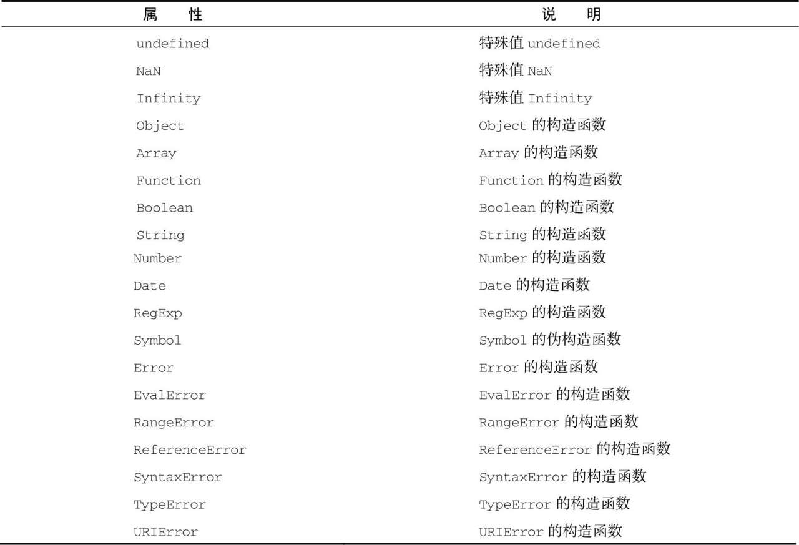
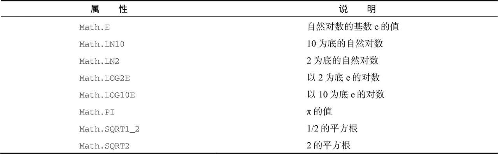

- [对象](#对象)
- [Date](#date)
  - [Date.parse()](#dateparse)
  - [Date.UTC()](#dateutc)
  - [Date.now()](#datenow)
  - [继承的方法](#继承的方法)
  - [日期格式化方法](#日期格式化方法)
- [RegExp](#regexp)
  - [表示](#表示)
  - [RegExp构造函数](#regexp构造函数)
  - [RegExp的实例属性](#regexp的实例属性)
  - [RegExp的实例方法](#regexp的实例方法)
    - [exec()](#exec)
    - [test()](#test)
  - [继承的方法](#继承的方法-1)
  - [RegExp构造属性](#regexp构造属性)
- [原始值包装类型](#原始值包装类型)
  - [Boolean](#boolean)
  - [Number](#number)
    - [toFixed()](#tofixed)
    - [toExponential()](#toexponential)
    - [toPrecision()](#toprecision)
    - [isInteger()](#isinteger)
    - [isSafeInterger()](#issafeinterger)
  - [String()](#string)
    - [字符码元](#字符码元)
    - [normalize()](#normalize)
    - [字符串操作方法](#字符串操作方法)
    - [字符串位置方法](#字符串位置方法)
    - [字符串包含方法](#字符串包含方法)
    - [trim()](#trim)
    - [repeate()](#repeate)
    - [padStrat()和padEnd()](#padstrat和padend)
    - [字符串的迭代与解构](#字符串的迭代与解构)
    - [字符串大小写转换](#字符串大小写转换)
    - [字符串模式匹配方法](#字符串模式匹配方法)
      - [replace()](#replace)
    - [localeCompare()](#localecompare)
    - [HTML方法](#html方法)
- [单例内置对象](#单例内置对象)
  - [Global](#global)
    - [URL编码方法](#url编码方法)
    - [**eval()**](#eval)
    - [Global对象属性](#global对象属性)
  - [Windows](#windows)
  - [Math](#math)
    - [内置对象](#内置对象)
    - [min() max()](#min-max)
    - [舍入方法](#舍入方法)
    - [random()](#random)
    - [其他Math方法](#其他math方法)
# 对象
+ 对象：某个引用类型的实例. 
+ 引用类型：也被称为对象定义,描述对象应该有的属性和方法。
# Date
Date类型将日期保存为UTC(Universal Time Coordinated),从1970年1月1日至今所经过的毫秒数。

创建日期对象
``` js
let now = new Date()
```
## Date.parse()
转换为毫秒数,Date.parse,接受格式.若是无法转换会返回NaN
``` js
let date = Date.parse('5 / 23 / 2019')
let date1 = Date.parse('May 23,2019')
let date2 = Date.parse('Tue May 23,2019 00:00:00 GMT-0700')
let date3 = Date.parse('2019-5-23 00:00:00')
```
new Date()
``` js
// new Date(),会自动调用Date.parse()
// 下面两段代码是等价的
let date = new Date('2020-6-5 ')
let date = new Date(Date.parse('2020-6-5'))
```
> 不同的Date类型，在某些Date的处理不一样，如参数为越界日期时，不同函数的处理就不同。
## Date.UTC() 
类似parse，但是参数表示方法是不不同的.其中月(0-11)和时(0-23)
``` js
let date = new Date(Date.UTC(2020, 6, 5, 10, 10, 30))
console.log(date); //2020-07-05T10:10:30.000
```
Date.UTC也会被new Date(),隐式调用，不过隐式调用时创建的是本地日期(本时区，而不是GMT日期)
## Date.now()
返回执行时间的毫秒数，可以很方便的计算函数执行时间
``` js
let s = Date.now()
doSomething()
let e = Date.now()
console.log(e - s); 
```
## 继承的方法
``` js
let date = new Date('2019-2-1')
console.log(date.toLocaleString()); //2019/2/1 上午12:00:00 本地环境一致的日期和时间,不带时区信息
console.log(date.toString());//Fri Feb 01 2019 00:00:00 GMT+0800 (中国标准时间)  带时区信息
console.log(date.valueOf()); //1548950400000 返回日期的毫秒数
```
## 日期格式化方法
``` js
let date = new Date('2019-2-1')
console.log(date.toDateString()); //Fri Feb 01 2019
console.log(date.toUTCString()); //Thu, 31 Jan 2019 16:00:00 GMT
// ...
```
# RegExp
## 表示
``` js
let expresion  = /pattern/flags
```
flags:
+ g:全局模式
+ i：不去分大小写
+ m:多行模式
+ y：黏附模式，只查找lastIndex开始之后的字符串
+ u：Unicode模式?
+ s：dotAll模式，表示元字符，匹配任何字符？

在模式中，所有元字符都需要进行转义。转义符 \
## RegExp构造函数
使用构造函数，普通的字符串没有太大区别，但是一些元字符，需要进行二次转义。如:
+ \n 需要表示为 \\n
+ \\ 则需要表示愿 \\\\
## RegExp的实例属性
通过RegExp可以了解正则表达式的信息，但一般不常用，因为声明就可以直接看清楚了
``` js
let pattern = /\[bc\]at/gi
console.log(pattern.global);  //true 是全局模式
console.log(pattern.ignoreCase); // true 忽略大小写匹配
console.log(pattern.multiline); // false 不是多行模式
console.log(pattern.lastIndex); // 0 下一次搜索的开始位置是0
console.log(pattern.source); // \[bc\]at 正则表达式的字面量字符串
console.log(pattern.flags); // gi 
```
## RegExp的实例方法
### exec()
matches是数组，第一个元素匹配整个模式的字符串，其他元素是与表达式中的匹配的字符串。
``` js
let text = 'mon and dad and baby'
let pattern = /mon (and dad (and baby)?)?/gi
let matches = pattern.exec(text)
console.log(matches.index); //0 字符串中匹配模式的起始位置
console.log(matches.input); //'mon and dad and baby'
console.log(matches[0]); // 'mon and dad and baby'
console.log(matches[1]); // 'and dad and baby'
console.log(matches[2]); // 'and baby'
```
如果没有设置global，则exex(),每次的index都是从0开始的,二设置了则会向前搜索下一个匹配项
### test()
只测试模式是否匹配
``` js
let text = "000-00-0000"
let pattern = /\d{3}-\d{2}-\d{4}/
console.log(pattern.test(text)); //true
```
## 继承的方法
``` js
let pattern = new RegExp('\\[dat\\]', 'gi')
// 下面三者都是返回   /\[dat\]/gi
console.log(pattern.toString()); // 返回正则字面量形式
console.log(pattern.toLocaleString()); //字面量形式
console.log(pattern.valueOf()); //返回正则表达式本身,和字面量形式有什么区别嘛
```
## RegExp构造属性
RegExp构造函数本身有几个属性,适用于作用域内所有正则表达式。 有简写,但是简写可不大好记呢
``` js
let text = 'this has been a short summer'
let pattern = /(.)een/
if (pattern.test(text)) {
  // 输入，左边文本，右边文本，最后匹配，最后匹配的捕获组
  console.log(RegExp.input, RegExp['$_']); // this has been a short summer
  console.log(RegExp.leftContext, RegExp['$`']); // this has 
  console.log(RegExp.rightContext, RegExp["$'"]); //  a short summer
  console.log(RegExp.lastMatch, RegExp["$&"]); // been
  console.log(RegExp.lastParen, RegExp["$+"]); // b
}
```
RegExp可以使用RegExp$1~RegExp$9来访问，最多9个捕获组。
> RegExp的所有属性因为没有Web标准,因此不要再生产环境中使用
# 原始值包装类型
当用到某个原始值的方法或属性是，后台都会创建一个相应原始包装类型的对象。
``` js
let s1 = 'some text'
let s2 = s1.substring(2)
```
s1逻辑上是没有方法的，但以读模式访问字符串的任何时候，后台会执行以下三步：
1. 创建一个String类型的实例
2. 调用实例上的特定方法
3. 销毁实例
``` js
// 上面三步的后台执行过程
let s1 = new String('some text')
let s2 = s1.substring(2)
s1 = null
```
原始值包装类型和引用类型(直接new)的区别主要是生命周期，原始值包装类型只存在与在其那段代码执行期间,而直接new则存在与其所在作用域

可以显示使用Boolean，Number，String原始值包装对象，但应该在确实必要的时候做
``` js
// 存在混淆问题
let s1 = 'some text'
let s2 = new String('some text')
console.log(typeof s1); // string
console.log(typeof s2); // object
```
使用new调用包装类型的构造函数，与调用同名的转型函数是不一样的
``` js
// 与转型函数的区别
let value = '25'
let number = Number(value)
console.log(typeof number); // number
let obj = new Number(value)
console.log(typeof obj); // object
```
Object构造函数，会根据传入值的类型返回相应原始包装的实例
``` js
let obj = new Object('29')
console.log(obj instanceof String); // true
console.log(obj instanceof Number); // flase
```
## Boolean
Boolean实例会重现valueOf()、toLocaleString()和toString(),返回原始值或者字符串的ture，false。但是因为实例仍是对象，在进行布尔表达式时会出现与预期相悖的结果
``` js
let falseObj = new Boolean(false)
let res = falseObj && true
console.log(res); // true
```
> 强烈建议永远不要使用Boolean() ヾ(≧▽≦*)o
## Number
同Boolean一样，重写了valueOf(),toLocaleString(),toString()。其中toString()方法接受一个表示基数的参数。
``` js
let num = 31
console.log(num.toString()) // 31
console.log(num.toString(2)); // 11111
console.log(num.toString(8)); // 37
console.log(num.toString(10)); // 31
console.log(num.toString(16)); // 1f
console.log(num.toString(32)); // v
```
### toFixed()
格式化方法,显示后面的小数位,toFixed会自动舍入
``` js
let num = 10
console.log(num.toFixed(2)); //10.00

let num = 0.1 + 0.2 // 0.30000000000000004
console.log(num.toFixed(2)); // 0.3
```
### toExponential()
格式化方法，科学计数法表示，参数为结果中的小数位数
``` js
let num = 10
console.log(num.toExponential(2)); //1.00e+1
```
### toPrecision()
根据情况返回最合理的输出，后面参数一般为0~21
``` js
let num = 99
console.log(num.toPrecision(1)); // 1e+2 100因为99无法一位表示
console.log(num.toPrecision(2)); // 99
console.log(num.toPrecision(3)); // 99.0
```
### isInteger()
isInterger() ES6新增,用于辨别一个数是否保存在整数
``` js
console.log(Number.isInteger(1)); //true
console.log(Number.isInteger(1.00)); //true
console.log(Number.isInteger(1.01)); //fasle
console.log(Number.isInteger(1.01e+2)); //fasle
```
### isSafeInterger()
整数有一个安全范围$-2^{53}+1$~$2^{ 53 } -1$,超过这个范围的整数，无法正确表示。isSafeInterger()判断一个数是不是在安全范围内。
``` js
let num = (2 ** 53)
console.log(Number.isSafeInteger(-num)); //false
console.log(Number.isSafeInteger(-num + 1)); // true
console.log(Number.isSafeInteger(num)); //fasle
console.log(Number.isSafeInteger(num - 1)); //true
```
## String()
三个常规继承方法(valueOf(),toLocaleString(),toString())，返回对象的原始字符串值。
### 字符码元
对多数字符来说，16位表示一个码元
``` js
let message = 'abcde'
// 根据索引获取char
console.log(message.charAt(2)); //c
// 根据索引获取指定码元的字符编码
console.log(message.charCodeAt(2)); //99
// 根据字符编码返回字符串
console.log(String.fromCharCode(0x61, 0x62, 0x63, 0x64, 0x65)); //abcde
console.log(String.fromCharCode(97, 98, 99, 100, 101)); //abcde
```
32位码元的字符
``` js
let message = 'ab😊de'
console.log(message.charAt(1)); // b
console.log(message.charAt(2)); // �
console.log(message.charAt(3)); // �
console.log(message.charCodeAt(1)); //98
console.log(message.charCodeAt(2)); // 55357  
console.log(message.charCodeAt(3)); // 56842
console.log(String.fromCodePoint(0x1f60a)); // 😊
console.log(String.fromCharCode(98, 55357, 56842)); //b😊
```
codePointAt() && fromCodePoint()
``` js
let message = 'ab😊de'
console.log(message.codePointAt(1));
console.log(message.codePointAt(2)); //128522  --> 0x1f60a 也就是笑脸的32位编码,说明其可以识别完整的码点
// 虽然可以识别完整码点，当若索引不是代理对开头就会返回错误的码点
console.log(message.codePointAt(3)); // 56842
console.log(String.fromCharCode(28522)); //  

// formCodePoint(),可以接受任意数量的码点，返回字符串
console.log(String.fromCharCode(128522)); // 
console.log(String.fromCodePoint(128522)); // 😊
```
### normalize()
``` js
let a1 = String.fromCharCode(0x00c5),
  a2 = String.fromCharCode(0x212b),
  a3 = String.fromCharCode(0x0041, 0x030a)
console.log(a1, a2, a3); // Å Å Å
console.log(a1 == a2); // false
console.log(a1 == a3); // false
console.log(a2 == a3); // false
// 尽管字符是一样的，但是编码不同，所以互不相等，需要进行表转化处理
// 四种规范化形式 NFD,NFC,NFKD,NFKC
console.log(a1 === a1.normalize('NFD')); //false
console.log(a1 === a1.normalize('NFC')); //true
console.log(a1 === a1.normalize('NFKD')); //true
console.log(a1 === a1.normalize('NFKC')); //true
// 通过同一种规范化形式，可以使比较操作符返回正确的结果
console.log(a1.normalize("NFC") === a2.normalize('NFC')); // true
console.log(a1.normalize("NFC") === a3.normalize('NFC')); // true
console.log(a2.normalize("NFC") === a3.normalize('NFC')); // true
```
### 字符串操作方法
concat(),拼接字符串。但一般使用+
``` js
let message = 'hello'
let result = message.concat(' ', 'world ', '!')
console.log(result); // hello world ！
```
提取子字符串 slice(),substr(),substring()
``` js
let str = "hello world"
console.log(str.slice(3)); // lo world
console.log(str.substring(3));// lo world
console.log(str.substr(3));// lo world
console.log(str.slice(3, 7)); // lo w
console.log(str.substring(3, 7));// lo wo
console.log(str.substr(3, 7));// lo worl 这里不同是因为，第二个参数，表示截取7个字符串

// 负参数值
console.log(str.slice(-3)); // rld  -3 --> 8
console.log(str.substring(-3));// hello world  -3 --> 0
console.log(str.substr(-3));// rld  -3 --> 8
console.log(str.slice(3, -4)); // lo w  -4 --> 7  -4+长度=7
console.log(str.substring(3, -4));// hel -4 --> 0  (3,0) -->(0,3)
console.log(str.substr(3, -4));// '' -4 --> 0

console.log(str.slice(3, -1)); // lo worl
console.log(str.substring(3, -1));// hel
console.log(str.substr(3, -1));// ''

console.log(str.slice(-3, -1)); // rl
console.log(str.substring(-3, -1));// ''  (0,0)
console.log(str.substr(-3, -1));// ''  (0,0)
// 总结 后两个遇到负数都会转成0
```
### 字符串位置方法
indexOf(),lastIndexOf()
``` js
let str = 'hello world'
console.log(str.indexOf('o')); // 4
console.log(str.lastIndexOf('o')); // 7
// 第二个参数
console.log(str.indexOf('o', 6)); // 7 从6向后找
console.log(str.lastIndexOf('o', 6)); // 4 从6向前前找
```
利用第二个参数，可以在字符串中找到所有的目标子字符串
``` js
let str = 'lorem ipsum sit amet,consectetur adipiscing elit'
let positions = []
let pos = str.indexOf('e')
while (pos > -1) {
  positions.push(pos)
  pos = str.indexOf('e', pos + 1)
}
console.log(positions);
```
### 字符串包含方法
startWith()开头，endWith()结尾，includes()包含
``` js
let message = 'foobarbaz'
console.log(message.startsWith('foo')); // true
console.log(message.startsWith('bar')); // false
console.log(message.endsWith('baz')); // true
console.log(message.endsWith('bar')); // false
console.log(message.includes('bar')); // true
console.log(message.includes('oba')); // true
```
### trim()
去空格
``` js
let str = '   hello value   '
console.log(str.trim()); // hello value
```
### repeate()
接受整数，重复并拼接
``` js
// repeate()
let str = 'na '
console.log(str.repeat(16) + 'batman');
```
### padStrat()和padEnd()
填充空格，第二个参数表示可选的填充字符串
``` js
let str = 'foo'
console.log(str.padStart(6));  //   foo
console.log(str.padStart(6, '.')); // ...foo
console.log(str.padEnd(6)); // foo   
console.log(str.padEnd(6, '.')); // foo...
```
第二个参数也可以是字符串，会切割字符串来满足长度
``` js
console.log(str.padStart(7, 'bar')); // barbfoo
console.log(str.padEnd(7, 'bar')); // foobarb
```
### 字符串的迭代与解构
``` js
let message = 'abc'
let strIterator = message[Symbol.iterator]()
console.log(strIterator.next()); // { value: 'a', done: false }
console.log(strIterator.next()); // { value: 'b', done: false }
console.log(strIterator.next()); // { value: 'c', done: false }
console.log(strIterator.next()); // { value: undefined, done: true }
```
可以通过for-of循环来使用这个迭代器
``` js
for (const v of 'hello') {
  console.log(v);
}
```
通过结构操作符进行解构
``` js
console.log([...'hello']); // [ 'h', 'e', 'l', 'l', 'o' ]
```
### 字符串大小写转换
Locale和本地区相关，在cn是没有差别的
``` js
let str = 'Hello World'
console.log(str.toLocaleUpperCase()); //HELLO WORLD
console.log(str.toUpperCase());
console.log(str.toLocaleLowerCase()); //hello world
console.log(str.toLowerCase());
```
### 字符串模式匹配方法
正则匹配,match()
``` js
let text = 'cat,bat,sat,fat'
let pattern = /.at/
// 等价于pattern.exec(text),还是不一样的,如flags就用不了
let matches = text.match(pattern)
console.log(matches.index); // 0
console.log(matches[0]); // cat
console.log(pattern.lastIndex); // 0
```
search()
``` js
// search()，参数正则，返回第一个字符在字符串中的位置
let text = 'cat,bat,sat,fat'
pos = text.search(/bat/)
console.log(pos); // 4
```
split(),根据参数，将字符串拆分为数组
``` js
let colorText = 'red,blue,green,yellow'
const colors1 = colorText.split(',') // [ 'red', 'blue', 'green', 'yellow' 
const colors2 = colorText.split(',', 2) // [ 'red', 'blue' ]
const colors3 = colorText.split(/[^,]+/) // [^,]+ 匹配除了，的字符串
console.log(colors3);// [ '', ',', ',', ',', '' ]
```
#### replace()
第一个参数接受正则或者字符串(因此字符串不会被转换为正则),第二个参数可以是字符串和函数
``` js
let text = 'cat,bat,sat,fat'
let result1 = text.replace(/.at/, 'foo')
let result2 = text.replace('.at', 'foo')
let result3 = text.replace(/.at/g, 'foo') //全局flag
console.log(result1); // foo,bar,sat,fat 只替换了第一个子字符串
console.log(result2); // cat,bar,sat,fat 因为字符串没有转换为正则所以匹配
console.log(result3); // foo foo foo foo 全局替换
```
在第二个参数是字符串的情况下，类似之前正则的特殊字符如：$$,$& $n等来访问匹配的字符串
``` js
let text = 'cat,bat,sat,fat'
const result = text.replace(/(.at)/g, "word($1)")
console.log(result); // word(cat),word(bat),word(sat),word(fat)
```
第二个参数是函数时
``` js
function changeChar(text) {
  // 第二个参数是函数时，此函数有三个参数：匹配的字符串，匹配字符串的开始位置，整个字符串
  return text.replace(/[<>"&]/g, (match, pos, originalText) => {
    switch (match) {
      case '<':
        return '&lt'
      case '>':
        return '&rt'
      default:
        return '☺'
    }
  })
}
console.log(changeChar('<1> " <2> & <3> " <4>'));// &lt1&rt ☺ &lt2&rt ☺ &lt3&rt ☺ &lt4&rt
```
### localeCompare()
根据字母排序，进行判断
``` js
let str = 'yellow'
console.log(str.localeCompare('black')); // 1
console.log(str.localeCompare('yellow')); //0
console.log(str.localeCompare('zoo')); // -1
console.log(str.localeCompare('Yellow')); // -1 ,跟地区相关，不一定是-1
```
### HTML方法
这些方法基本上已经没有人使用了，因为结果通常不是语义化的标记
# 单例内置对象
## Global
在全局作用域中定义的变量和函数都会变成Global对象(其实可以理解成全局对象)的属性
### URL编码方法
encodeURI() && encodeURIComponent()
``` js
let uri = 'http://www.localhost:9000/illeagel value.js#start'
// http://www.localhost:9000/illeagel%20value.js#star  只编码不属于URL组件的特殊字符
console.log(encodeURI(uri)); 
// http%3A%2F%2Fwww.localhost%3A9000%2Filleagel%20value.js%23star  编码所有发现的非标准字符
console.log(encodeURIComponent(uri));
```
decodeURI() && decodeURIComponent()
``` js
let url = 'http%3A%2F%2Fwww.localhost%3A9000%2Filleagel%20value.js%23star'
// http%3A%2F%2Fwww.localhost%3A9000%2Filleagel value.js%23sta
console.log(decodeURI(url));
// http://www.localhost:9000/illeagel value.js#star
console.log(decodeURIComponent(url));
```
### **eval()**
eval(),可以接受一个ECMAscript的字符串，并进行解释执行。
``` js
let msg = 'hello world'
eval('console.log(msg);') // 进行了打印
```
在eval()中定义的任何变量和函数都不会被提升，因为解析代码是，他们是被包含在字符串中的，只有在eval()执行的时候才会被创建
``` js
eval("function sayHi() {console.log('hi');}")
sayHi() // hi

eval("let msg = 'hello'") // let 块级作用域，不会在eval外部访问到
console.log(msg); // Reference Error


console.log(msg); // Reference Error  没有进行提升
eval("var msg = 'hello'") // let 块级作用域，不会在eval外部访问到
console.log(msg); // hello
```
严格模式下eval()内部创建的变量和函数无法被外部访问，因此上面的代码全会报错。同时严格模式下给eval赋值也报错
``` js
"use strict"
eval = 'hi' // SyntaxError
```
### Global对象属性

## Windows
浏览器将Window对象实现为Global对象的代理
``` js
var color = 'red'
function sayColor() {
  console.log(window.color);
}
window.sayColor() //red Node环境并没有window对象
```
同时也可以通过this访问window对象。 若是一个函数在没有明确指定this的情况下(某个对象的方法，或者call()/apply())，this等于Global对象
``` js
console.log(this.toString()); // [object window] 浏览器环境下
```
## Math
### 内置对象

### min() max()
``` js
const numbers = [3, 2, 3, 4, 5, 67, 29, 1, 0.1]
let max = Math.max(...numbers) //67
let min = Math.min(...numbers) //0.1
```
### 舍入方法
+ Math.ceil() 向上
+ Math.floor() 向下
+ Math.round() 四舍五入
+ Math.fround() 数值最接近的单精度(32位)浮点值表示
``` js
console.log(Math.ceil(25.9)); //26
console.log(Math.ceil(25.5)); //26
console.log(Math.ceil(25.1)); //26
console.log(Math.floor(25.9)); //25
console.log(Math.floor(25.5)); //25
console.log(Math.floor(25.1)); //25
console.log(Math.round(25.9)); //26
console.log(Math.round(25.5)); //26
console.log(Math.round(25.1)); //25
console.log(Math.fround(.4)); //0.4000000059604645
console.log(Math.fround(.5));  // 0.5
console.log(Math.fround(25.1)); // 25.100000381469727
```
### random()
Math.random() 返回一个0~1范围内的随机数，其中包含0不包含1
``` js
公式： 
number = Math.floor(Math.random() * total_number_of_choices + first_possible_value)

let num = Math.floor(Math.random() * 10 + 1) //1-10的随机整数
console.log(num);
```
获取范围的随机数
``` js
function selectRange(lowerValue, upperValue) {
  let choices = upperValue - lowerValue + 1
  return Math.floor(Math.random() * choices + lowerValue)
}
console.log(selectRange(2, 10));// 2-10
```
### 其他Math方法
``` js
console.log(Math.abs(-1)); // 1
console.log(Math.exp(0));  // 1 e^x  
console.log(Math.expm1(0)); // 0 e^x-1
console.log(Math.log(Math.E)); // 0 
console.log(Math.log1p(0)); // 0  Math.log(x+1)
console.log(Math.pow(2, 3)); // 8 2^3
const nums = [2, 4, 4]
console.log(Math.hypot(...nums)); //6 nums的平方和的平方根 
console.log(Math.clz32(12)); //28  返回32位整数x的前置零的数量
console.log(Math.sign(-10000)); // -1 表示x的符号 1,0,-0,-1
console.log(Math.trunc(100.293)); // 100 返回整数部分，删除小数部分
console.log(Math.sqrt(4)); //2  平方根
console.log(Math.cbrt(2)); //8  立方根
console.log(Math.acos(Math.cos(2))); //2 反余弦与余弦
console.log(Math.tan(Math.PI / 4)); // 0.999999999 1 ?
console.log(Math.sin(Math.PI / 2));// 1
```