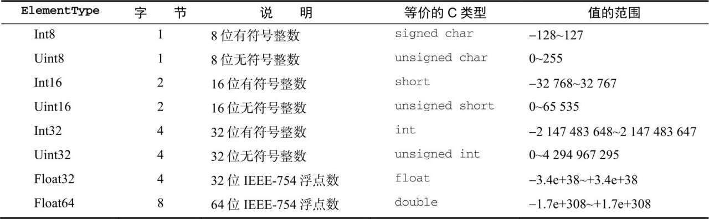

- [Object](#object)
  - [创建Object的两种方法](#创建object的两种方法)
  - [使用属性的两种方法](#使用属性的两种方法)
- [Array](#array)
  - [创建数组](#创建数组)
    - [Array.from() 将类数组结构转换为数组实例，第一个参数是一个类数组对象。](#arrayfrom-将类数组结构转换为数组实例第一个参数是一个类数组对象)
    - [Arrayof()](#arrayof)
  - [数组空位](#数组空位)
  - [数组索引](#数组索引)
  - [检测数组](#检测数组)
  - [迭代器方法](#迭代器方法)
  - [复制和填充方法](#复制和填充方法)
    - [fill()](#fill)
    - [copyWithin()](#copywithin)
  - [转换方法](#转换方法)
  - [栈方法](#栈方法)
  - [队列方法](#队列方法)
  - [排序方法](#排序方法)
  - [操作方法](#操作方法)
  - [搜索和位置方法](#搜索和位置方法)
    - [严格相等](#严格相等)
    - [断言函数](#断言函数)
  - [迭代方法](#迭代方法)
  - [归并方法](#归并方法)
- [定型数组](#定型数组)
  - [ArrayBuffer](#arraybuffer)
  - [DataView](#dataview)
    - [DataView组件](#dataview组件)
      - [ElementType](#elementtype)
      - [字节序](#字节序)
      - [边界情形](#边界情形)
  - [定型数组](#定型数组-1)
    - [定型数组行为](#定型数组行为)
      - [合并、复制和修改定型数组](#合并复制和修改定型数组)
    - [上溢和下溢](#上溢和下溢)
- [Map](#map)
  - [基本API](#基本api)
  - [顺序与迭代](#顺序与迭代)
  - [Object和Map的选择](#object和map的选择)
- [WeakMap](#weakmap)
  - [相关API](#相关api)
  - [弱键](#弱键)
  - [不可迭代键](#不可迭代键)
  - [使用弱映射](#使用弱映射)
    - [私有变量](#私有变量)
    - [DOM节点元数据](#dom节点元数据)
- [Set](#set)
  - [基本API](#基本api-1)
  - [顺序与迭代](#顺序与迭代-1)
  - [定义正式集合操作](#定义正式集合操作)
- [WeakSet](#weakset)
  - [基本Api](#基本api-2)
  - [弱值](#弱值)
  - [不可迭代值](#不可迭代值)
  - [使用弱集合](#使用弱集合)
- [迭代于扩展操作](#迭代于扩展操作)
# Object
## 创建Object的两种方法
``` js
// 构造函数
let person = new Object()
person.name = 'Niko'
// 字面量
const person = {
  name: 'Nico',
  age: 18
}
```
> 在使用对象字面量表示法定义对象时，并不会调用Object构造函数

字面量表示法中，属性名可以是字符串或数值
``` js
let person = {
  name: 'Noki',
  5: '五'
}
console.log(person[5]); // 五
```
> 对必选参数使用命名参数，通过对象字面量来封装多个可选参数？
## 使用属性的两种方法
点语法和中括号,中括号的适用性更广一点(如空格和变量)
# Array
## 创建数组
Array构造函数
> 使用Array时可以省略new关键字
``` js
let colors = new Array() //空数组
let keys = new Array(20) //建立初始length20的空数组

let colors = new Array('green', 'blue', 'shift') // [ 'green', 'blue', 'shift' ]
```
数组字面量

> 字面量也不会调用Array构造函数
``` js
let colors = ['red','blue','green']
```
### Array.from() 将类数组结构转换为数组实例，第一个参数是一个类数组对象。
``` js
console.log(Array.from('Matt')); // [ 'M', 'a', 't', 't' ]

const m = new Map().set(1, 2).set(3, 4)
const s = new Set().add(1).add(2).add(3).add(4)
console.log(Array.from(m)); // [ [ 1, 2 ], [ 3, 4 ] 
console.log(Array.from(s)); // [ 1, 2, 3, 4 ]

// 数组浅复制
const a1 = [1, 2, 3, 4, 5]
const a2 = Array.from(a1)
console.log(a2); // [1,2,3,4,5]
console.log(a1 == a2); // false
// 迭代对象
const iter = {
  *[Symbol.iterator]() {
    for (let i = 0; i < 5; i++) {
      yield i
    }
  }
}
console.log(Array.from(iter)); // [0, 1, 2, 3, 4]

// 存在必要属性的自定义对象
const arrayLikeObj = {
  0: 1,
  1: 2,
  2: 3,
  length: 3
}
console.log(Array.from(arrayLikeObj)); // [1, 2, 3]
```
Array.from()的第二个可选的映射参数
``` js
// Array.from的第二个参数
const a1 = [1, 2, 3, 4]
const a2 = Array.from(a1, x => x ** 2) // [1, 4, 9, 16]
const a3 = Array.from(a1, function (x) {
  return x ** 2
})
console.log(a3); // [1, 4, 9, 16]
```
> Array.from还接受第三个参数，用于指定映射函数中的this值，当然箭头函数不能使用
``` js
const a1 = [1,2,3,4]
const a3 = Array.from(a1, function (x) {
  console.log(this); //[1,2,3,4]
  return x ** 2
}, a1)
```
### Arrayof()
将一组参数转换为数组，用于替代Array.prototype.slice.call(arguments)
``` js
// 不过直接使用Array()不行嘛，为什么要使用这个？
console.log(Array.of(2, 3, 4));
console.log(Array(undefined));
console.log(Array.of(undefined));
```
## 数组空位
中间创建的空位会被当作undefined，但是在不同的方法中的处理不一样，因此避免使用数组空位。若需要空位，显示的使用undefined
``` js
const options = [1, , , , 5]
console.log(options.length); //5
for (const value of options) {
  console.log(value);
}
// 1
// undefined
// undefined
// undefined
// 5

// for-in的行为就不同
for (const value in options) {
  console.log(value);
}
// 5
// 0
// 4
```
## 数组索引
``` js
let colors = ['blue', 'red', 'yellow']
// 超过最大索引，会自动扩张到该索引,中间补空
colors[5] = 'pink'
console.log(colors); //[ 'blue', 'red', 'yellow', <1 empty item>, 'pink' ]
```
> 数组最多可以包含42949967295
## 检测数组
+ instanceof() 一个全局作用域时是够用的
+ isArray()：若是网页中有多个框架，可能会有不同版本的Array构造函数，因此可能无法使用instanceof
``` js
let value = [1]
console.log(value instanceof Array); // true
console.log(Array.isArray(value)); // true
```
## 迭代器方法
keys(),values(),entries()
``` js
const a = ['foo', 'bar', 'buz', 'qux']
const aKeys = Array.from(a.keys())
const aValues = Array.from(a.values())
const aEntries = Array.from(a.entries())
console.log(aKeys); // [0, 1, 2, 3]
console.log(aValues);// ['foo', 'bar', 'buz', 'qux']
console.log(aEntries); // [[0, 'foo'], [1, 'bar'], [2, 'buz'], [3, 'qux']]
```
利用ES6解构可以很容的在循环中使用键/值,这个结构很有意思
``` js
const a = ['foo', 'bar', 'buz', 'qux']
for (const [index, value] of a.entries()) {
  console.log(index, value);
}
// 0 foo
// 1 bar
// 2 buz
// 3 qux
```
## 复制和填充方法
### fill()
可接受三个参数
``` js
const zeroes = [0, 0, 0, 0, 0]
zeroes.fill(5)
console.log(zeroes); // [ 5, 5, 5, 5, 5 ]

zeroes.fill(0)
zeroes.fill(6, 3) // >=3
console.log(zeroes); //[ 0, 0, 0, 6, 6 ]

zeroes.fill(0)
zeroes.fill(7, 1, 3) // >=1 && <3
console.log(zeroes); // [ 0, 7, 7, 0, 0 ]


zeroes.fill(0)
zeroes.fill(8, -4, -1) // --> -4+length   -1+length
console.log(zeroes); // [ 0, 8, 8, 8, 0 ] 
```
自动忽略超出数组边界、零长度及方向相反的索引范围
``` js
const zeroes = [0, 0, 0, 0, 0]
zeroes.fill(8, 3, 2) //忽略
zeroes.fill(8, 5, 10) //忽略
zeroes.fill(8, -10, -6) //忽略
``` 
### copyWithin()
在array中浅复制，并进行插入。类似fill()
``` js
let ints = [],
  reset = () => { ints = [0, 1, 2, 3, 4, 5, 6, 7, 8] }

reset()
// 复制0开始，从索引5插入
ints.copyWithin(5)
console.log(ints);// [0, 1, 2, 3, 4, 0, 1, 2, 3]

reset()
// 从5开始复制，从索引0位置插入
ints.copyWithin(0, 5)
console.log(ints);// [5, 6, 7, 8, 4, 5, 6, 7, 8]

reset()
// 从0开始复制至2(3不包括和fill一样)，在4位置插入
ints.copyWithin(4, 0, 3)
console.log(ints); // [0, 1, 2, 3, 0, 1, 2, 7, 8]

reset()
// JavaScript在查之前，会完整复制，不存在重写的问题
ints.copyWithin(2, 0, 6)
console.log(ints); // [0, 1, 0, 1, 2, 3, 4, 5, 8]

//对负索引的处理和fill是一样的
reset()
ints.copyWithin(2, -8, -3)
console.log(ints); // [0, 1, 1, 2, 3, 5, 6, 7, 8]
```
## 转换方法
``` js
let color = ['green', 'blue', 'yellow']
console.log(color.toString()); //green,blue,yellow
console.log(color.valueOf()); //[ 'green', 'blue', 'yellow' ]
```
toString()和toLocaleString()的区别
``` js
let person1 = {
  toString() {
    return 'Niko'
  },
  toLocaleString() {
    return 'NNNNNN'
  }
}
let person2 = {
  toString() {
    return 'Gero'
  },
  toLocaleString() {
    return 'GGGG'
  }
}
let persons = [person1, person2]
alert(persons) // Niko,Gero
console.log(persons.toString());
console.log(persons.toLocaleString());
```
Join(), split()的对应功能，将数组连接成字符串
``` js
let colors = ['green', 'red', undefined, 'yellow'] 
let colorsStr = colors.join('|')// 若是没参数，则默认使用','
console.log(colorsStr);// green|red||yellow  undefined被当作空字符处理了
```
## 栈方法
push(), pop()
``` js
let names = ['wu', 'nico']
console.log(names.push('gero', 'sks')); //4 返回数组长度
console.log(names.pop()); // sks
```
## 队列方法
shift() unshift()
``` js
let names = ['wu', 'nico']
console.log(names.shift()); //wu
console.log(names.unshift('gero')); //2,返回数组长度
```
## 排序方法
sort() reverse()
``` js
let values = [0, 1, 5, 10, 15]
values.reverse()
console.log(values); // [15, 10, 5, 1, 0]
values.sort()
console.log(values); // [0, 1, 10, 15, 5] 转换为string，由字符串来决定顺序
```
sort() 接受一个比较函数
``` js
// 比较函数接受两个参数,value1需要排在value2之前，就返回-1 反之返回1 .相等返回0
function compare(value1, value2) {
  if (value1 > value2) {
    return 1
  } else if (value1 < value2) {
    return -1
  } else {
    return 0
  }
}
let values = [0, 1, 5, 10, 15]
values.sort(compare)
console.log(values);
```
## 操作方法
concat(),创建新数组。
``` js
// 操作方法
let colors = ['green', 'red', 'blue']
let colors2 = colors.concat('black', colors)
console.log(colors2); // ['green', 'red', 'blue', 'black', 'green', 'red', 'blue']
```
阻止concat()打平数组的行为
``` js
// 重写concat的flat行为
let nums = [1, 2, 3, 4]
let newNums = [5, 6, 7]
newNums[Symbol.isConcatSpreadable] = false // true则打平数组，false不打平
console.log(nums.concat(newNums));  // [ 1, 2, 3, 4, [ 5, 6, 7 ] ]
```
slice(),开头index和结尾index
``` js
let nums = [1, 2, 3, 4, 5, 6]
let nums2 = nums.slice(1) // [2, 3, 4, 5, 6]
let nums3 = nums.slice(1, 3) // [2, 3]
```
**splice()**删除，插入，替换。改变原数组
``` js
let nums = [0, 1, 2, 3, 4, 5]
console.log(nums.splice(0, 2)); //[0,1]  返回被删除的值组成的数组
console.log(nums); // [2,3,4,5]  

nums = [0, 1, 2, 3, 4, 5]
console.log(nums.splice(1, 0, 'fist', 'second'));  // []
console.log(nums); // // [0,'first','second',1,2,3,4,5] 在指定位置前插入

nums = [0, 1, 2, 3, 4, 5]
console.log(nums.splice(1, 1, 'first', 'second')); // [1]
console.log(nums);// [0,'first','second',2,3,4,5] // 删除同时指定位置前插入
```
## 搜索和位置方法
### 严格相等
indexOf(), lastIndexOf(),includes() 接受两个参数，要查找的元素和从一个起始位置
``` js
let nums = [1, 2, 3, 4, 5, 4, 3, 2, 1]
console.log(nums.indexOf(4)); // 3 返回4所在位置的索引
console.log(nums.lastIndexOf(4)) // 5
console.log(nums.includes(4)); // true
console.log(nums.indexOf(4, 4)); // 5
console.log(nums.lastIndexOf(4, 4)) // 3
console.log(nums.includes(4, 7)); // false
```
严格相等
``` js
let person = { name: 'Nico' }
let people = [{ name: 'Nico' }]
let people2 = [person]
console.log(people.indexOf(person));  // -1
console.log(people2.indexOf(person)); // 0
console.log(people.includes(person)); // false
console.log(people2.includes(person)); // true
```
### 断言函数
断言函数接受三个参数：元素，索引和数组本身,断言返回针织。表示是否匹配

find(),findIndex(),参数：[断言函数[指定this值]]
``` js
const people = [
  { name: 'Nico', age: 17 },
  { name: 'Gero', age: 20 }
]
const judgeAge = (element, index, array) => element.age <= 18
console.log(people.find(judgeAge)); // [{ name: 'Nico', age: '17' }]
console.log(people.findIndex(judgeAge)); // 0
```
找到匹配后，两个方法都不再继续搜索
``` js
const num = [0, 1, 2, 3, 4]
const result = num.find((element, index, array) => {
  console.log(element, index, array);
  return element === 2
})
// 0 0 [ 0, 1, 2, 3, 4 ]
// 1 1 [ 0, 1, 2, 3, 4 ]
// 2 2 [ 0, 1, 2, 3, 4 ]
console.log(result); // [2]
```
## 迭代方法
以下五个方法不改变原数组
+ every()
+ filter()
+ forEach()
+ map()
+ some()

every()都需要满足条件,some()一项满足条件
``` js
let num = [1, 2, 3, 4, 5, 4, 3, 2, 1]
let everyResult = num.every((item, index, array) => item > 2) // false
let someResult = num.some((item, index, array) => item > 2) // true
console.log(num.includes(2));// true,不能使用断言函数
```
filter()
``` js
let nums = [1, 2, 3, 4, 3, 2, 1]
let filterResult = nums.filter((item, index, array) => item < 2)
console.log(filterResult); //[1, 1]
```
map()
``` js
let nums = [1, 2, 3, 4, 5, 4, 3, 2, 1]
let mapRes = nums.map((item, index, array) => item ** 2)
console.log(mapRes);[1, 4, 9, 16] // [1, 4, 9, 16, 25, 16, 9, 4, 1]
```
forEach(),本质上相当与for循环遍历数组
``` js
let nums = [1, 2, 3, 4]
console.log(nums.forEach((item, index, array) => item > 2)); //返回undefined
```
## 归并方法
reduce()
``` js
let values = [1, 2, 3, 4, 5]
let sum = values.reduce((pre, cur, index, array) => pre + cur) // 15
```
reduceRight(),和reduce()区别不大，只是从末尾到开头而已。
``` js
let values = [1, 2, 3, 4, 5]
let sum = values.reduceRight((pre, cur, index, array) => {  // 15
	console.log(index); // 3,2,1,0
	return pre + cur
})
```
# 定型数组
## ArrayBuffer
用于在内存中分配特定数量的字节空间。所以buffer就是一段单位为字节的内存空间。
``` js
const buf = new ArrayBuffer(16)  // 在内存中分配16字节
console.log(buf.byteLength); //16
// ArrayBuffer一经创建就不能再调整大小了，但可以调整大小
const buf2 = buf.slice(4, 12)
console.log(buf2.byteLength); //8
```
和C++里的malloc()的区别。
+ malloc()分配失败时会返回一个null指针。ArrayBuffer则会抛出错误
+ malloc()利用虚拟内存，以此最大可分配尺寸只受可寻址系统内存限制。ArrayBuffer则不能超过safe_integer($2^{53}-1$)字节
+ malloc()调用成功不会初始化实际的地址，而ArrayBuffer会将所有二进制位初始化0.
+ malloc()分配的堆内存除非调用free()或程序退出，否则无法使用。ArrayBuffer则是会进行垃圾回收。
> 不能仅通过对ArrayBuffer的引用就读取或写入内容。要读取或者写入ArrayBuffer，就必须通过视图。视图有不同的类型，但引用的都是ArrayBuffer中存储的二进制数据。
## DataView
视图DataView,这个视图专门为文件I/O和网络I/O设计，API支持对缓冲数据的高度控制，但比起于其他类型的视图的性能也差一点。DataView对缓冲内容没有任何预设，也不能迭代。
``` js
const buf = new ArrayBuffer(16)
const fullDataView = new DataView(buf)
console.log(fullDataView.byteLength)  //16
console.log(fullDataView.byteOffset); //0
console.log(fullDataView.buffer === buf); //true
const firstDataView = new DataView(buf, 0, 8)
console.log(firstDataView.byteOffset); // 0 
console.log(firstDataView.byteLength); // 8
console.log(firstDataView.buffer === buf); // true
const secondDataView = new DataView(buf, 8)
console.log(secondDataView.byteLength); // 8
console.log(secondDataView.byteOffset); // 8
console.log(secondDataView.buffer === buf); // true 
```
### DataView组件
通过DataView读取缓冲，还需要几个组件
+ 需要读或者写的字节偏移量。可以看成DataView中的某种“地址”
+ 使用ElementType来实现JavaScript的Number类型到缓冲内二进制格式的转换。
+ 最后是内存中值的字节序。默认为大端字节序。高字节在保存内存的低地址。
#### ElementType

``` js
const buf = new ArrayBuffer(2)
const view = new DataView(buf)
console.log(view.getInt8(0)); // 0
console.log(view.getInt8(1)); // 0
console.log(view.getInt16(0)); // 0
view.setUint8(0, 255)
console.log(view.getInt8(0)); // -1,   减一后取反，得到1，添负号
console.log(view.getInt16(0)); // -256	 11111111 00000000 -(减1取反)->0000000 100000000 (256)
view.setUint8(1, 0xFF)
console.log(view.getInt16(0)); // -1
```
#### 字节序
+ 大端：最高有效位保存在第一个字节。 -->可按照正常的二进制阅读方式 
+ 小端：最高有效位保存在最后一一个字节。
``` js
// 将第二个参数设为true则使用小端字节序
const buf = new ArrayBuffer(2)
const view = new DataView(buf)
view.setUint16(0, 0x8001) // 1000 0000 0000 0001
console.log(view.getUint16(0)); // 32769  
console.log(view.getUint16(0, true)); //384

// 写入
view.setUint16(0, 0X0004) //大端写入
console.log(view.getInt8(0)); // 0
console.log(view.getInt8(1)); // 4
view.setUint16(0, 0X0004, true) // 小端写入
console.log(view.getInt8(0)); // 4
console.log(view.getInt8(1)); // 0
```
#### 边界情形
完成读写需要有充足的缓冲区，否则抛出RangeError
``` js
const buf = new ArrayBuffer(6)
const view = new DataView(buf)
console.log(view.getInt32(4)); // RangeError
view.getInt32(-1) // RangeErro
view.setInt32(4, 123) // RangeError

const buf = new ArrayBuffer(6)
const view = new DataView(buf)
console.log(view.getInt32(3)); // 需要32位可以读取，offset=3时，只有3*8=24位了
```
DataView会将一个值尽量转换位适当类型，后备为0.无法转换则抛出错误。
``` js
const buf = new ArrayBuffer(1)
const view = new DataView(buf)
view.setInt8(0, 1.5)
console.log(view.getInt8(0)); // 1
view.setInt8(0, [4])
console.log(view.getInt8(0)); // 4
view.setInt8(0, 'f')
console.log(view.getInt8(0)); // 0
view.setInt8(0, 'string')
console.log(view.getInt8(0)); // 0
view.setInt8(0, Symbol()) // TypeError
```
## 定型数组
类似DataView，不过特定于一种ElementType
``` js
const buf = new ArrayBuffer(12)
const ints = new Int32Array(buf)
console.log(ints.length); //3,因为指定Int32Type，所以四字节为一个元素
const int2 = new Int32Array(6)
console.log(int2.buffer.byteLength); //24  6个4字节，共24字节
const int3 = new Int32Array([2, 4, 6, 8])
console.log(int3.length); // 4
console.log(int3.buffer.byteLength); // 16
console.log(int3[2]); // 6

const ints4 = new Int16Array(int3)
// ints会分配自己的缓冲，int3中每个值会相应转换为新格式（如果超过了表示怎么办呢？）
console.log(ints4.length); // 4
console.log(ints4.buffer.byteLength); // 8
console.log(ints4[2]); //6
```
也可以使用 <ElementType>.from() <ElementType>.of()创建定型数组
``` js
const ints5 = Int16Array.from([2, 4, 6, 8]) // ArrayLike
console.log(ints5.length);
console.log(ints5.buffer.byteLength);
console.log(ints5[2]);
const floats = Float32Array.of(3.14, 2.928, 1.92)  // [...items]
console.log(floats.length); // 3
console.log(floats.buffer.byteLength); // 12
```
构造和函数所拥有的一个*BYTES_PER_ELEMENT*属性
``` js
console.log(Int16Array.BYTES_PER_ELEMENT); // 2
console.log(Int32Array.BYTES_PER_ELEMENT); // 4
const ints = new Int32Array(1),
	float = new Float64Array(1)
console.log(ints.BYTES_PER_ELEMENT); //4
console.log(float.BYTES_PER_ELEMENT); // 8
```
### 定型数组行为
类似普通数组，有copyWithin(),entries()等
返回新数组的方法同样是原先的类型
``` js
const ints = new Int16Array([1, 2, 3])
const doubleInts = ints.map(x => 2 * x)
console.log(doubleInts instanceof Int16Array); // true
```
定型数组有一个Symbol.iterator符号属性
``` js
for (const value of ints) {
	console.log(value);
}
```
#### 合并、复制和修改定型数组
因为ArrayBuffer无法修改大小，因此下列方法不适用于定性数组：
+ concat()
+ pop()
+ push()
+ shift()
+ splice()
+ unshift()

> 因此提供了set()和subarray()来快速向外或向内复制数据

set()
``` js
const container = new Int16Array(8)
container.set([1, 2, 3, 4])
console.log(container);  // Int16Array(8)[1, 2, 3, 4, 0, 0, 0, 0]
container.set(Int8Array.of(4, 5, 6, 7), 4)
console.log(container); // Int16Array(8)[1, 2, 3, 4, 4, 5, 6, 7]
```
subarray()
``` js
const container = new Int16Array([1, 2, 3, 4])
const fullCopy = container.subarray() //[1,2,3,4]
const halfCopy = container.subarray(1) // [2,3,4]
const partCopy = container.subarray(1, 3) // [2,3]
```
定型数组原生没有拼接能力,定性数组拼接方法
``` js
function typeArrayConcat(typeArrayContructor, ...typeArrays) {
	const typeArrayLength = typeArrays.reduce((pre, cur) => (pre.length || pre) + cur.length)
	const resultArray = new typeArrayContructor(typeArrayLength)
	let offset = 0
	typeArrays.forEach(x => {
		resultArray.set(x, offset)
		offset += x.length
	})
	return resultArray
}

const typeArray = typeArrayConcat(Int16Array,
	Int8Array.from([1, 2, 3, 4]),
	Int16Array.from([5, 6, 7, 8]),
	Int32Array.of(9, 10, 11)
)
console.log(typeArray);// Int16Array(11)[1, 2, 3, 4, 5, 6, 7, 8, 9, 10, 11]
```
### 上溢和下溢
``` js
const ints = new Int8Array(2)

const unsignedInts = new Uint8Array(2)
// 索引只取最低有效位的8位，不会影响到相邻索引
unsignedInts[0] = 256 // 0001 0000 0000 
unsignedInts[1] = 511 // 0001 1111 1111	
console.log(unsignedInts); // [0,255]
unsignedInts[0] = -1
console.log(unsignedInts); // [255,255]
ints[0] = 128  // 1000 0000
ints[1] = 255 // 1111 1111 
console.log(ints); // [-128,-1]  负数补码
```
"夹板"数组类型：Unit8ClampedArray. 大于255向下舍入255，小与0向上舍入为0
``` js
const clampedInts = new Uint8ClampedArray([-1, 0, 255, 256])
console.log(clampedInts); // [0,0,255,255]
```
> Unit8ClampedArray是历史留存，除非cavas相关开发，否则不要使用
# Map
真正的键/值存储
## 基本API
``` js
const m1 = new Map([ //初始化
	['key1', 'val1'],
	['key2', 'val2'],
	['key3', 'val3'],
])
console.log(m1.size); // 3
const m2 = new Map({ // 这算是初始化的第二种方式嘛
	[Symbol.iterator]: function* () { 
		yield ["key1", 'val1']
		yield ["key2", 'val2']
		yield ["key3", 'val3']
	}
})
console.log(m2.size); //3
const m3 = new Map([[]]) //[] 为空undefined
console.log(m3.has(undefined)); // true
console.log(m3.get(undefined)); // undefined
```
+ 添加：set()
+ 查询：get(),has()
+ 删除：delete() ,clear()
``` js
const m = new Map()
console.log(m.has(undefined)); // false 
console.log(m.get('firstName')); // undefined
console.log(m.size); //0

m.set('firstName', 'Matt').set('firstName', 'Niko').set('lastName', 'jerry')
console.log(m.has('firstName'));
console.log(m.get('firstName')); // 覆盖啦
console.log(m.size); // 2

m.delete('firstName')
console.log(m.has('fistName')); // false
console.log(m.has('lastName')); // true
console.log(m.size); // 1
m.clear() // 删除所有键值对
console.log(m.size); // 0
```
set()返回的是映射实例，所以可以连缀使用
``` js
const m = new Map().set('key1', 'val1')
m.set('key2', 'val2').set('key3', 'key3')
console.log(m); // Map(3) { 'key1' => 'val1', 'key2' => 'val2', 'key3' => 'key3' }
```
object只能使用数值，字符串和符号作为键。Map可以使用任何Javascript数据类型作为键。Map内部使用SameValueZero比较。
``` js
const m = new Map()
const functionKey = function () { }
const symbolKey = Symbol()
const objectKey = new Object()
m.set(functionKey, 'functionKey').set(symbolKey, 'symbolKey').set(objectKey, 'objectKey')
console.log(m.get(functionKey)); // 'functionKey'
console.log(m.get(symbolKey)); // 'symbolKey'
console.log(m.get(objectKey)); // 'objectKey'
// SameValueZero比较  实例不同
console.log(m.has(function () { })); // false
```
作为键和值的对象和其他集合，内部改变时，仍保持不变。 --> 数组和对象果然一样。
``` js
const m = new Map()
const objKey = {}, objVal = {}, arrKey = [], arrVal = []
m.set(objKey, objVal).set(arrKey, arrVal)
objKey.bar = 'bar'
objVal.foo = 'foo'
arrKey.push('buz')
arrVal.push('qux')
console.log(m.get(objKey)); // {foo:'foo'}
console.log(m.get(arrKey)); // ['qux']
```
SamValueZero的一些想不到的bug
``` js
const m = new Map()
const a = 0 / "", b = 0 / 'a', pz = +0, nz = -0
console.log(a === b); // flase
console.log(pz === nz); // true
m.set(a, 'foo').set(pz, 'bar')
console.log(m.get(b)); // foo NaN等于NaN？ ☺
console.log(m.get(nz)); // bar 
```
## 顺序与迭代
Map可以根据插入顺序，执行迭代操作。Symbol.iterator，引用entries()方法
``` js
const m = new Map([
	['key1', 'value1'],
	['key2', 'value2'],
	['key3', 'value3'],
])
// 以下三者是一样的
console.log(m.entries === m[Symbol.iterator]); // true
for (const pair of m) {
	console.log(pair);
}
// [ 'key1', 'value1' ]
// [ 'key2', 'value2' ]
// [ 'key3', 'value3' ]
for (const pair of m.entries()) {
	console.log(pair);
}
for (const pair of m[Symbol.iterator]()) {
	console.log(pair);
}

```
keys() values()
``` js
const m = new Map([
	['key1', 'value1'],
	['key2', 'value2'],
	['key3', 'value3'],
])
m.forEach((key, value) => console.log(`${key}--> ${value}`))
// value1--> key1
// value2--> key2
// value3--> key3

for (const key of m.keys()) {
	console.log(key);
}
// key1
// key2
// key3
for (const value of m.values()) {
	console.log(value);
}
// value1
// value2
// value3
```
键和值的改变
``` js
const m1 = new Map([
	['key1', 'value1']
])
for (let key of m1.keys()) {
	key = 'newKey';
	console.log(key);// 'newKey'
	// 作为键的字符串的原始值是不能修改的
	console.log(m1.get('key1')) // value1
	console.log(m1.get(key)) //undefined
	console.log(m1.get('newKey')); // undefined
}
// 当然对象内部的属性是可以修改的
const keyObj = { id: 1 }
const m2 = new Map([
	[keyObj, 'value2']
])
for (let key of m2.keys()) {
	key.id = 2
	console.log(key);
	console.log(m2.get(key)); // value2
}
console.log(m2.get(keyObj)); // value2
```
## Object和Map的选择
1. 内存占用：Map大约可以比Object多存储50%的键值对
2. 插入性能：插入新键值对的消耗相当，不过Map会稍微快点。若是涉及大量插入操作，则Map性能更好
3. 查找速度：大型Object和Map中查找的性能差异很小，但少量键值对时，Object速度更快。若是涉及大量查找操作，Object更好一点。
4. 删除性能：delete删除Object属性的性能很差。 Map的delete()操作比插入和查找更快。如果代码设计大量删除操作，应该选择Map
# WeakMap
WeakMap是Map的'兄弟'类型，其Api是Map的子集。 Weak是指JavaScript垃圾回收程序对待"弱映射"中键的方式
## 相关API
``` js
const wm = new WeakMap()
// 弱映射中的键只能是Object或者继承自Object的类型,使用非对象设置键会抛出TypeError错误
const key1 = { id: 1 }
const key2 = { id: 2 }
const key3 = { id: 3 }
const wm1 = new WeakMap([
	[key1, 'val1'],
	[key2, 'val2'],
	[key3, 'val3']
])
console.log(wm1.get(key1)); // val1
console.log(wm1.get(key2)); // val2
console.log(wm1.get(key3)); // val3

const wm2 = new WeakMap([ // TypeError
	[key1, 'val1']
	['badKey', 'val2']
])

const strKey = new String('key1')
const wm3 = new WeakMap([
	[strKey, 'value1']
])
console.log(wm3.get(strKey)); // value1
```
set() 
``` js
const key1 = { id: 1 }
const key2 = { id: 2 }
const key3 = { id: 3 }
const wm = new WeakMap().set(key1, 'value1').set(key2, 'value2').set(key3, 'value3')
console.log(wm.get(key1)); // value1
console.log(wm.get(key2)); // value2
console.log(wm.get(key3)); // value3
```
## 弱键
weak表示，这些键不属于正式的引用，不会阻止垃圾回收.但若是这些键被引用，就不会被当作垃圾回收
``` js
// 初始化了一个新对象作为一个字符串的键。因为没有指向这个对象的其他引用,所以这行代码执行后，这个对象就会被当作垃圾回收。之后这个键值对就从弱映射中消失了，称为一个空映射。又因为值没有被引用，所以值本身也会称为垃圾回收的目标
const wm = new WeakMap()
wm.set({}, 'val')
```
``` js
// 这个例子中container维持着key的引用，因此对象键不会称为垃圾回收的目标。但若是调用removeReference则会摧毁键对象的最后一个引用，垃圾回收程序就会把这个键值对清理掉。
const wm = new WeakMap()
const container = {
	key: {}
}
wm.set(container.key, 'val')
function removeReference() {
	container.key = null
}
```
其实若是没有引用的话，你也无法调用其内部的value，因此被回收是很正常的做法
## 不可迭代键
WeakMap的键值对随时可能被销毁，所以没有提供迭代键值对的能力。所以也没有clear()方法。

WeakMap实例 之所以限制只能使用对象作为键，是为了保证只有通过键对象的引用才能取得值。如果允许原始值，就无法区分是否是一个实例
## 使用弱映射
### 私有变量
弱映射实现了JavaScript中实现私有变量的一种新方式。前提很明确：私有变量存储在弱映射中，以对象实例为键，以私有成员的字段为值。
``` js
const wm = new WeakMap()
class User {
	constructor(id) {
		this.idProperty = Symbol('id')
		this.setId(id)
	}
	setPrivate(property, value) {
		const privateMember = wm.get(this) || {}
		privateMember[property] = value
		wm.set(this, privateMember)
	}
	getPrivate(property) {
		return wm.get(this)[property]
	}
	setId(id) {
		this.setPrivate(this.idProperty, id)
	}
	getId() {
		return this.getPrivate(this.idProperty)
	}
}
const user = new User(123)
console.log(user.getId());
user.setId(456)
console.log(user.getId());
// 不是真正的私有，外部也能访问。
console.log(wm.get(user[user.idProperty])); //456
```
通过闭包，让外部无法访问
``` js
const User = (() => {
	const wm = new WeakMap()
	class User {
		constructor(id) {
			this.idProperty = Symbol('id')
			this.setId(id)
		}
		setPrivate(property, value) {
			const privateMember = wm.get(this) || {}
			privateMember[property] = value
			wm.set(this, privateMember)
		}
		getPrivate(property) {
			return wm.get(this)[property]
		}
		setId(id) {
			this.setPrivate(this.idProperty, id)
		}
		getId() {
			return this.getPrivate(this.idProperty)
		}
	}
	return User
})()
const user = new User(123)
console.log(user.getId()); //123
user.setId(456)
console.log(user.getId()); // 456
console.log(wm.get(user[user.idProperty])); // ReferenceError
```
### DOM节点元数据
WeakMap实例不会妨碍垃圾会后，所以非常适合保存关联元数据
``` js
// #login按钮移除后，由于映射中保存按钮的引用，所以除非明确冲map中移除，否则不会被回收程序处理
const m = new Map()
const btn = document.querySelector('#login')
m.set(btn, { disable: true })

// 若是使用WeakMap。当节点从DOM树中移除后，若是这个btn没有被其他东西引用的话,垃圾回收程序就可以对其进行回收。
const wm = new WeakMap()
const loginBtn = document.querySelector('#login')
wm.set(loginBtn,{disable:true})
```
# Set
Set是一种新集合类型,Set像是加强的Map，二者大多数Api和行为是共有的。
## 基本API
``` js
const s1 = new Set(['val1', 'val2', 'val3'])
console.log(s1.size); // 3

const s2 = new Set({
	[Symbol.iterator]: function* () {
		yield 'val1',
			yield 'val2',
			yield 'val3'
	}
})
console.log(s2.size); // 3
```
has() add()
``` js
const s = new Set()
console.log(s.has('Matt'));
console.log(s.size); // 0
s.add('Matt').add('firstAdd')
console.log(s.size); // 2
console.log(s.has('firstAdd')); // true
s.clear()
console.log(s.has('Matee')); // false 
console.log(s.has('firstAdd')); // false 
console.log(s.size); // 0
```
Set可以包含任何Javascript数据类型作为**值**。集合也是用SameValueZero进行比较
``` js
const s = new Set()
const functionVal = function () { }
const symbolVal = Symbol()
const objectVal = new Object()
s.add(functionVal).add(symbolVal).add(objectVal)
console.log(s.has(functionVal)); // true
console.log(s.has(symbolVal)); // true
console.log(s.has(objectVal)); // true
const anotherObj = new Object()
console.log(s.has(anotherObj)); // false
console.log(s.has(function () { })); // false
```
add() delete()
``` js
const s = new Set()
s.add('foo')
console.log(s.size); // 1
// delete()返回一个bool值，表示集合中是否存在要删除的值。
console.log(s.delete('bar')); // false
console.log(s.delete('foo')); // true
```
## 顺序与迭代
Set会维护值插入的顺序，因此支持顺序迭代。通过values()，keys()
``` js
const s = new Set(['val1', 'val2', 'val3'])
console.log(s.values === s[Symbol.iterator]); // true
console.log(s.keys === s[Symbol.iterator]); // true
for (let value of s.values()) {
	console.log(value);
}
// val1
// val2
// val3
for (let value of s[Symbol.iterator]()) {
	console.log(value);
}
// val1
// val2
// val3
console.log([...s]); // [ 'val1', 'val2', 'val3' ]
```
entries
``` js
const s = new set(['val1', 'val2', 'val3'])
for (let pair of s.entries()) {
	console.log(pair);
}
// [ 'val1', 'val1' ]
// [ 'val2', 'val2' ]
// [ 'val3', 'val3' ]
```
forEach()
``` js
const s = new Set(['val1', 'val2', 'val3'])
s.forEach((val, dupVal) => {
	console.log(`${val} --> ${dupVal}`);
});
// val1 --> val1
// val2 --> val2
// val3 --> val3
```
修改原始值不可，修改集合内部值可。
``` js
const s1 = new Set(['val1'])
// 原始值作为值不会被修改
for (let value of s1.values()) {
	value = 'newValue'
	console.log(value);
	console.log(s1.has('val1')); // true
	console.log(s1.has('newValue')); // false
}

// 修改值对象的属性，对象仍然存在于集合中
const valObj = { id: 1 }
const s2 = new Set([valObj])
for (let value of s2.values()) {
	value.id = 'newValue'
	console.log(value); // {id:'newVal'}
	console.log(s2.has(valObj)); // true
}
```
## 定义正式集合操作
子类化set
``` js
class XSet extends Set {
	union(...sets) {
		return XSet.union(this, ...sets)
	}
	intersection(...sets) {
		return XSet.intersection(this, ...sets)
	}
	different(set) {
		return XSet.different(this, set)
	}
	symmertricDifference(set) {
		return XSet.symmertricDifference(this, set)
	}
	cartesianProduct(set) {
		return XSet.cartesianProduct(this, set)
	}
	powerSet() {
		return XSet.powerSet(this)
	}
	// 返回多个集合的并集
	static union(a, ...bSets) {
		const unionSet = new XSet(a)
		for (const b of bSets) {
			for (const bValue of b) {
				unionSet.add(bValue)
			}
		}
		return unionSet
	}
	// 返回两个或更多集合的交集
	static intersection(a, ...bSets) {
		const intersectionSet = new Set(a)
		for (const aValue of intersectionSet) {
			for (const b of bSets) {
				if (!b.has(aValue)) {
					intersectionSet.delete(aValue)
				}
			}
		}
		return intersectionSet
	}
	// 返回两个集合的差集
	static different(a, b) {
		const differentSet = new Set(a)
		for (const bValue of b) {
			if (a.has(bValue)) {
				differentSet.delete(bValue)
			}
		}
		return differentSet
	}
	// 返回两个集合的对称差集
	static symmertricDifference(a, b) {
		return a.union(b).different(a.intersection(b))
	}
	// 返回两个集合的笛卡尔积
	// 必须返回数组集合，因为笛卡尔积可能包含相同值的对。
	static cartesianProduct(a, b) {
		const cartesianProductSet = new XSet()
		for (const aValue of a) {
			for (const bValue of b) {
				cartesianProductSet.add([aValue, bValue])
			}
		}
	}
	// 返回一个集合的幂集 --> 一个集合的全部子集构成的集合
	static powerSet(a) {
		const powerSet = new XSet().add(new XSet()) // 这是一个空集
		for (const aValue of a) {
			for (const set of new XSet(powerSet)) { // powerSet的每一个set都进行一次添加，然后再添加到powerSet中。
				powerSet.add(new Set(set).add(aValue))
			}
		}
		return powerSet
	}
}
```
# WeakSet
类似WeakMap
## 基本Api
创建
``` js
const val1 = { id: 1 }
const val2 = { id: 2 }
const val3 = { id: 3 }
const ws1 = new WeakSet([val1, val2, val3])
// const ws2 = new WeakSet([val1, 'badValue']) // TypeError
const str = new String('valu1')
const ws3 = new WeakSet([str])
console.log(ws3.has(str)); // true
```
add() has() delete()
``` js
const ws = new WeakSet()
const val1 = { id: 1 }
const val2 = { id: 2 }
// add操作可以连缀使用。
ws.add(val1).add(val2)
console.log(ws.has(val1)); // true
console.log(ws.has(val2)); // false
ws.delete(val1)
console.log(ws.has(val1)); // false
```
## 弱值
类似WeakMap，但不存在引用时，会被垃圾回收程序回收
``` js
const ws = new WeakSet()
ws.add({})
```
当存在引用时，不会称为垃圾回收程序标记。若是执行removeReference则引用消失，那么垃圾回收程序就会清理WeakSet里的值了
``` js
const ws = new WeakSet()
const container = {
	val : {}
}
ws.add(container.val)
function removeReference() {
	container.val = null
}
```
## 不可迭代值
如WeakMap,必须使用引用才能获取值
## 使用弱集合
WeakSet的作用没那么大，但在给对象打标签还是有价值的。DOM的处理,其实WeakMap也可以做到
``` js
// 加入Set后，通过has可以判断btn是否被禁用了,但若btn被移除，仍然保持着引用。
const diableElement = new Set()
const btn = document.querySelector('#btn')
diableElement.add(btn)
// WeakSet则可以在移除后，交给垃圾回收程序直接处理
const disableElement = new WeakSet()
const btn = document.querySelector('#btn')
disableElement.add(btn)
```
# 迭代于扩展操作
