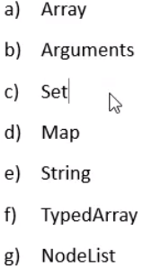
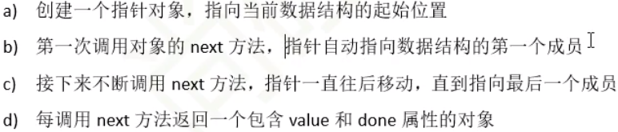

# 1.Symbol 
表示独一无二的值，类似字符串
## 特点
1. Symobol的值是唯一的，可以用来解决命名冲突问题
2. Symbol值不能与其他数据进行运算
3. Symbol定义的对象属性不能使用 for...in循环遍历，但可以使用Reflect.ownKeys来获取对象的所有键名 
## Symbol的使用
``` javascript
  //给对象添加属性的方法
  let game = {
    name: "pubg",
    up() {
      console.log("up");
    },
    down() {
      console.log("dwon");
    },
  };
  game[Symbol()] = () => {
    console.log("up");
  };
  game[Symbol()] = () => {
    console.log("down");
  };
  console.log(game);
  let game1 = {
    name: "dota",
    [Symbol("up")]: () => {
      console.log("up");
    },
  };
  console.log(game1);
```
# 2.Symbol内置属性
1. Symbol.hasInstance
``` javascript
  class Person {
    //当其他对象使用instanof运算符时,判断是否属于这个类的时候，会调用这个方法
    static [Symbol.hasInstance](params) {
      console.log(params);
      console.log("检测类型?");
      return true;
    }
  }
  let a = new Person();
  console.log(a instanceof Person);
```
2. Symbol.isConcatSpreadable
``` javascript
  const a = [1, 2, 3];
  const b = [4, 5, 6];
  b[Symbol.isConcatSpreadable] = false; //数组内部与Symbol还有关系吗？
  console.log(a.concat(b));
```
3. ...还有许多呢，可以用于扩展数组功能哦
# 2.迭代器（iterator）
是一种接口，为各种不同的数据结构提供统一的访问机制。只要部署迭代器，就可以完成遍历操作

ES6 使用 for ... of 来进行遍历


## 工作原理

``` javascript
  const xiyou = ["monmon", "wukong", "八戒", "沙僧"];
  for (let i of xiyou) {
    console.log(i);
  }
  //包含Symobol.interator属性 就可以通过 for .. of 遍历
  //通过调用iterator函数，来创建iterator对象
  const iterator = xiyou[Symbol.iterator]();
  console.log(iterator);
  //next 函数每次都会返回两个值，一个value 和 done，来获取值和判断是否到结尾
  console.log(iterator.next());
```
## 迭代器的应用
自定义遍历数据
``` javascript
  //遍历banji内的stus,但不能直接通过banji.sus获取
  const banji = {
    name: "电子信息二班",
    stus: ["xiaohong", "xiaoming", "tian", "lwx"],
    [Symbol.iterator]() {
      let index = 0;
      //需要返回一个指针对象
      return {
        //返回的是一个由value和done的对象
        next: () => {
          //对value和done进行处理,确定合适done,注意下面的this，如果不是箭头函数，所指向的this是return的空数组
          console.log(this);
          if (index < this.stus.length) {
            const result = { value: this.stus[index], done: false };
            index++;
            return result;
          } else {
            return { value: undefined, done: true };
          }
        },
      };
    },
  };
  for (let v of banji) {
    console.log(v);
  }
```