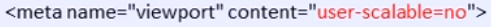
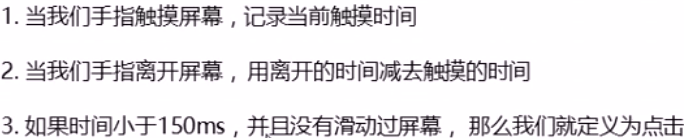

# 1.触屏事件
兼容性较好，不用考虑兼容性问题。

``` javascript
    div.addEventListener('touchstart',()=> {
        console.log('开始触摸');
    })
    div.addEventListener('touchmove',()=> {
        console.log('触摸移动');
    })
    div.addEventListener('touchend',()=> {
        console.log('结束触摸');
    })
``` 
## 1.1 touch事件的一些属性
touches： 触摸屏幕的所有手指的列表,包括坐标等信息

targetTounches: 正在触摸当前DOM元素的列表

changedTounches: 手指状态发生改变的列表，从无到有，或者从有到无
## 1.2 拖动元素
值得注意的是，需要阻止屏幕滚动的默认行为。
``` javascript
      const box = document.querySelector(".box");
      let startPos = {
        x: 0,
        y: 0,
      };
      let pos = {
        x: 0,
        y: 0,
      };
      box.addEventListener("touchstart", (e) => {
        //这里的this 还挺有意思的
        console.log(this);
        startPos.x = e.targetTouches[0].pageX;
        startPos.y = e.targetTouches[0].pageY;
        pos.x = box.offsetLeft;
        pos.y = box.offsetTop;
      });
      box.addEventListener("touchmove", (e) => {
        let moveX = e.targetTouches[0].pageX - startPos.x;
        let moveY = e.targetTouches[0].pageY - startPos.y;
        box.style.left = pos.x + moveX + "px";
        box.style.top = pos.y + moveY + "px";
        e.preventDefault(); //阻止默认滚动行为，防止跳一下});
```
# 1.3 移动端轮播图
1. 引入js的时候记得load
2. transition 滚动
3. transitionend事件 过渡完成后
> classList 属性:可以返回类名
``` javascript
    box.classList.add('one') //添加类名，不会覆盖类名
    box.classList.remove('one') //删除特定类名
    box.classList.toggle('switch') //切换类名 有到无 无到有
```
4. 小圆点，选出来后去掉current类名,再添加目前index的类名
5. Math.abs(value) 取绝对值 
# 1.4 回到顶部
# 1.5 click延时解决方案
因为要双击会缩放的功能,所有存在300ms的延迟

解决方案

1. 禁用缩放。

2. touch事件封装这个时间解决300ms延迟

3. [fast click](https://github.com/ftlabs/fastclick)
# 1.6 swiper
[swiper](https://www.swiper.com.cn/)
四步走
1. 引入css和js文件
2. 复制黏贴css样式
3. html代码复制黏贴
4. js代码复制黏贴

# 1.7 插件的总结
1. touchSlide.js
2. isScroll.js
3. zy.media.js 视频插件

# 框架