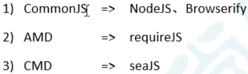

# 模块化
将大的程序文件，拆分为许多小的文件，然后将小文件组合起来。

## 优点
1. 防止命名冲突
2. 代码复用
3. 高维护性
## 模块化规范产品
 
# ES6模块化语法
1. export 规定模块的对外接口
2. import 输入其他模块提供的功能
## 基本使用
``` javascript
<script type="module">        //在html文件中
  import * as m1 from "./common.js";
  console.log(m1);
</script>

//分别暴露
export let school = 'fzu'     //在js文件中
export function rule() {
  console.log('you can\'t go outside');
}
```
### expose的语法
1. 统一暴露
``` javascript
let school = 'fzu'
function findJob() {
  console.log('找工作');
}

export { school, findJob }
```
2. 默认暴露 
``` javascript
export default {
  school: 'huaqaio',
  change: function () {
    console.log('已经发生了改变');
  }
}

//使用
m3.defualt.change()//输出：已经发生了改变
```
3. 分别暴露 在基本使用中的写法
### import的语法
1. 通用的导入方式
``` javascript
import * as m1 from "./common.js";
```
2. 结构赋值的形式
``` javascript
import { school, rule } from "./common.js";
console.log(school, rule);
//别名的使用
import { school as fzu, findJob } from "./expose2.js";
console.log(fzu, findJob);
//导入默认到处的模块
import { default as huaqiao } from "./expose3.js";
console.log(huaqiao);
```
3. 简便形式
``` javascript
import huaqiao from "./expose3.js";
console.log(huaqiao);
```
## 模块化的使用
### 在html页面中使用<br>
就是script标签，不是很复杂
### 在项目中使用
>babel: JavaScript编译器
``` javascript
// 1.安装工具 babel-cli babel-preset-env browserify(webpack)
// 分别对应： 命令行工具  预设包：将新的语法转换为ES5的语法 打包工具
$ npm i babel-cli babel-preset-env browserify -D     
//2.编译 本地使用babel编译js文件夹下的所有js文件
$ npx babel js -d dist/js --presets=babel-preset-env //3.打包
$ npx browserify dist/js/app.js -o dist/bundle.js
```
### 模块化和NPM的结合使用
```
$ npm i jquery
```