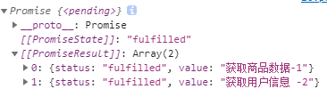

# ES7
## inclueds
``` javascript
//includes(返回的是bool)  indexOf(返回的是下标)
const language = ["java", "c++", "javascript"];
console.log(language.includes("java")); //true
console.log(language.includes("askd")); //false
```
## 幂运算
``` javascript
//** Math.pow() 二者好像没有区别
console.log(2 ** 10); //1024
console.log(Math.pow(2, 10)); //1024
```
# ES8
## async和await
异步编程的解决方案
### async
1. async函数返回一个promise对象
``` javascript
async function fn() {
  //1.若返回的结果不是promise的对象，则返回结果一定是一个成功的promise,值为返回的值
  return "aaa";
  // 2. 抛出错误,返回的是一个失败的promise，值为返回的对象。
  throw new Error("出错了");
  //3.返回的是promise对象
  return new Promise((reslove, reject) => {
    reslove("成功的数据");
    reject("失败的错误");
  });
}
const result = fn();
console.log(result);
```
2. await
> 1. await必须卸载async函数中
> 2. await右侧的表达式一般为promise对象
> 3. 返回的是promise成功的值
> 4. await的promise失败了，就会抛出异常，使用try..cathch捕获处理
``` javascript
const p = new Promise((resolve, reject) => {
  // resolve("成功执行了");
  reject("执行失败");
});
//await 放在 async函数中
async function main() {
  try {
    let result = await p;
    console.log(result);
  } catch (err) {
    console.log(err);
  }
}
main();
```
### async和await的结合，异步编程
``` javascript
const fs = require('fs')
function read1() {
  return new Promise((resolve, reject) => {
    fs.readFile('./file/text1.md', (err, data) => {
      if (err) reject(err)
      resolve(data)
    })
  });
}
function read2() {
  return new Promise((resolve, reject) => {
    fs.readFile('./file/text2.md', (err, data) => {
      if (err) reject(err)
      resolve(data)
    })
  });
}
function read3() {
  return new Promise((resolve, reject) => {
    fs.readFile('./file/text3.md', (err, data) => {
      if (err) reject(err)
      resolve(data)
    })
  });
}

async function main() {
  let text1 = await read1()
  let text2 = await read2()
  let text3 = await read3()
  let text = text1 + text2 + text3
  console.log(text);
}
main()
```
## 对象方法拓展
``` javascript
const school = {
  name: "fzu",
  major: ["a", "b", "c"],
  xueke: ["d", "e", "f"],
};
//1.返回数组,内部为school的键
console.log(Object.keys(school));
//2.返回数组,内部为school的值
console.log(Object.values(school));
//3.entries 返回数组，数组内还有数组[键，值]
const a = Object.entries(school);
//可以很好的构建MAp
const m = new Map(a);
console.log(m);
//4.对象属性的描述对象
console.log("getOwn :>> ", Object.getOwnPropertyDescriptors(school));
//第一个参数：原型对象，第二参数描述对象
const obj = Object.create(null, {
  name: {
    //设置值
    value: "wuug",
    //设置属性特性
    writable: true, //是否可写
    configurable:true, //是否可删除
    enumberable:true //是否可枚举
  },
});
```
# ES9
## 对象展开
``` javascript
//多余的参数，会进到user的对象里
function connect({ host, port, ...user }) {
  console.log(host);
  console.log(port);
  console.log(user);
}
connect({
  host: "122.12.21.3",
  port: 1231,
  userName: "root",
  password: "root",
  type: "get",
});
//rest参数在对象上的使用
const user1 = {
  name: "user",
  age: 10,
  hight: 182,
};
const user2 = {
  name: "wuug",
  age: 19,
  major: "tch",
};
//对象合并，同属性覆盖(后面的覆盖前面的)
const user = { ...user1, ...user2 };
console.log("user :>> ", user);
```
# ES9
## 正则拓展
>  进行匹配识别
### 正则命名分组
``` javascript
let str = '<a href="www.baidu.com">百度</a>';
//提取url与标签文本
const reg = /<a href="(.*)">(.*)<\/a>/;
const result = reg.exec(str);
console.log(result);
console.log(result[2]);
const reg1 = /<a href="(?<url>.*)">(?<text>.*)<\/a>/;
const res = reg1.exec(str);
//url和text都放到res.groups当中了
console.log(res.groups);
```
### 反向断言
断：判断.
``` javascript
let str = "JSW512323这是立刻就我3412了几块";
//正向断言
const reg = /\d+(?=了)/;
const result = reg.exec(str);
console.log(result);
//反向断言
const reg1 = /(?<=我)\d+/;
const result1 = reg1.exec(str);
console.log(result1);
```
### dotAll模式
dot  . 元字符 除换行符外的任意单个字符

正则还是要去看看的，也太复杂了
# ES 10
## Object.fromEntries
``` javascript
//将二位数组转换为对象
let result = Object.fromEntries([
  ["name", "尚硅谷"],
  ["major", ["a", "b", "c", "d"]],
]);
console.log(result);
//将Map转换为对象
const m = new Map();
m.set("name", "wuug");
console.log(m);
let result1 = Object.fromEntries(m);
console.log(result1);
```
## trimStart trimEnd
清楚前后空格
``` javascript
let str = "  kjwee ksd kqwe   ksd         ";
console.log(str.trimStart());
console.log(str.trimEnd());
```
## 数组方法拓展
``` javascript
const arr = [12, 31, 23, 1, 2, [23, 23]];
const arr2 = [1, 2, 3, 4, [5, 6, [7, 8]]];
//将数组从二维转换成一维
console.log(arr.flat());
//三维 => 二维
console.log(arr2.flat());
//三维 => 一维  降两维
console.log(arr2.flat(2));
const arr3 = [1, 2, 3, 4];
//将返回的数组降维
const result = arr3.flatMap((item) => [item * 10]);
console.log(result);
```
## Symbol.description
获取Symbol的描述
``` javascript
let s = Symbol("描述");
console.log(s.description);
```
# ES11
## 私有属性
``` javascript
class Person {
  //共有属性
  name;
  //私有属性
  #age;
  #weight;
  constructor(name, age, weight) {
    this.name = name;
    this.#age = age;
    this.#weight = weight;
  }
  intro() {
    console.log(this.#age);
  }
}
const girl = new Person("chenjr", 19, "50kg");
console.log(girl);
// console.log(girl.#age); //报错 无法直接查看私有属性
girl.intro(); //内部函数时可以使用私有属性的
```
## promise.allSettled()
参数为一个数组，数组内部放promise对象,返回的是promise对象，值为数组对象{status,value},
不管内部的promiser对象是否成功，此函数的返回值一定是成功的.

> 此方法和promiser.all很像，很有意思
``` javascript
const p1 = new Promise((resolve, reject) => {
  setTimeout(() => {
    resolve("获取商品数据-1");
  }, 1000);
});
const p2 = new Promise((resolve, reject) => {
  setTimeout(() => {
    reject("无法获取用户数据");
  }, 1000);
});
const result = Promise.allSettled([p1, p2]);
console.log(result);
//返回的若有错误的promiser，则函数返回的promise对象状态为错误,则其值为错误的promiser对象的值（在此例中为p2）,若成功则返回成功的promise对象，返回值为成功的promise对象的值。
const result1 = Promise.all([p1, p2]);
console.log(result1);
```
## string.matchAll()
这个真的不会，正则还是要去学学的
## 可选链操作符
?.&nbsp;&nbsp;&nbsp;用于层层判断，防止没传报错
``` javascript
function main(config) {
  //之前的写法
  // const dbHost = config && config.db && config.db.host;
  const dbHost = config?.dn?.host;
  console.log(dbHost);
}
main({
  db: {
    host: "123.123.123.123",
    username: "wuug",
  },
  catch: {
    host: "123.232.123.123",
    username: "lwx",
  },
});
```
## 动态import （懒加载）
``` javascript
//懒加载返回promise对象
const a = import('./hello.js')
const btn = document.querySelector('#btn')

btn.addEventListener('click', res => {
  a.then(res => res.hello())
})
```
## BigInt
``` javascript
let n = 521n;
console.log(n, typeof n);
//函数 bigInt() 转换为大整型 只能转换整数
let n1 = 123;
console.log(BigInt(n1));
//用于大数值运算
//在最大安全数后，再相加2以上就会出现错误（算出来的数值不准确）
let max = Number.MAX_SAFE_INTEGER;
console.log(max + 1);
//大整数只能和大整数进行运算
console.log(BigInt(max) + BigInt(3));
```
## globalThi
``` javascript
//golbal始终指向全局对象
console.log(globalThis);
```